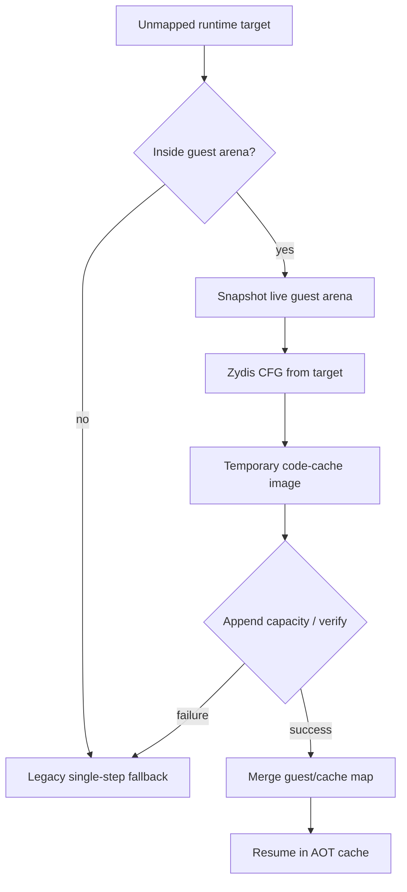

# Runtime AOT on-demand translation 설계

## 목표

정적 LE image에 포함되지 않은 runtime-generated/copied code target을 처음 관찰할 때 범용적으로 변환해 AOT cache로 복귀합니다. 기존 `legacy` backend와 AOT의 legacy fallback은 그대로 유지합니다.

## 정책

* planner에 임의 entry 주소를 받는 API를 추가하되 기존 기본 entry API를 보존합니다.
* Win32 placement는 초기 image보다 큰 예약 용량을 가지며 실제 사용 크기를 별도로 기록합니다.
* 동적 변환은 현재 guest arena의 live bytes를 snapshot하여 원본 파일이 아닌 실행 중 코드를 분석합니다.
* 임시 image 내부 fixup은 append offset 이동에도 rel32가 유지됩니다. 외부 direct target은 기존 전체 map에서 추가 해결을 시도합니다.
* append 중에만 cache를 RW로 바꾸고, 복사·patch 후 RX로 되돌리고 instruction cache를 flush합니다.
* 실패하면 기존 legacy single-step를 사용하며 실행을 중단하거나 특정 executable 주소를 분기하지 않습니다.

## 검증

PIU의 첫 미매핑 target `0x040FB6B5`는 관찰 증거로만 사용하고 코드 상수로 넣지 않습니다. 5초 실행에서 dynamic append/re-entry 계수와 single-step 감소를 legacy 및 정적 AOT 결과와 비교합니다.

# Runtime AOT On-Demand Translation Design

Translate runtime-generated or copied targets on first observation by snapshotting live guest-arena bytes, planning a CFG from the arbitrary target, emitting a temporary cache image, and merging it into a reserved Win32 cache. Existing legacy execution remains the default and the fail-closed fallback. No executable-specific target is hard-coded.
