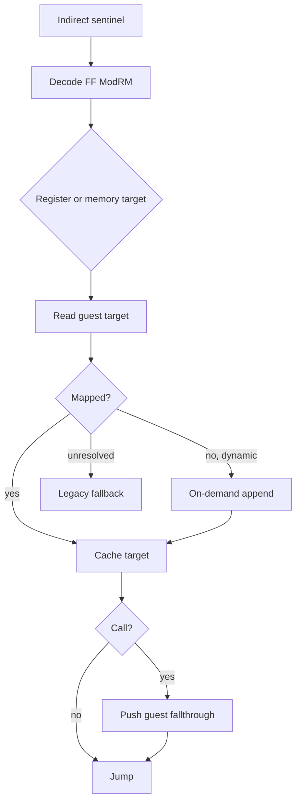

# AOT indirect transfer dispatcher 설계

## 목표

cache sentinel에서 `FF /2` near indirect call과 `FF /4` near indirect jump의 target을 원본 명령 실행 전에 계산하고 guest/cache 주소로 dispatch합니다.

register와 32-bit ModRM memory operand 및 `C3/C2` return을 지원합니다. memory target과 return stack은 기존 guest range read helper를 사용합니다. call은 guest fallthrough 주소를 guest stack에 push하며, return은 stack target을 실행 전에 guest/cache mapping합니다. far transfer와 해석 실패는 legacy fallback을 유지합니다.

# AOT Indirect Transfer Dispatcher Design

Resolve `FF /2` near indirect calls and `FF /4` near indirect jumps before executing the original instruction. Support register and 32-bit ModRM memory operands, map or dynamically translate the target, push the guest fallthrough for calls, and retain legacy fallback for far or unresolved forms.
