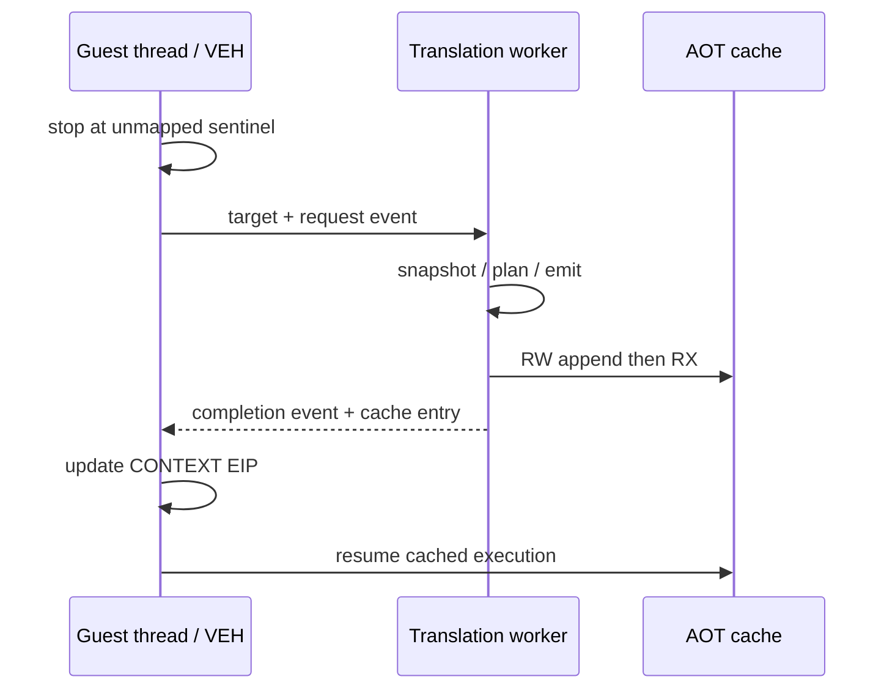

# Host-stack AOT translation worker 설계

## 목표

`aot-dynamic`의 live snapshot, CFG planning, heap allocation, cache mutation을 VEH/guest stack 밖의 전용 Win32 worker에서 수행합니다.

## 동기화 정책

* guest 실행은 단일 thread이므로 동시에 하나의 translation request만 허용합니다.
* VEH는 heap을 사용하지 않고 pre-created request/completion event만 조작합니다.
* worker가 cache를 변경하는 동안 guest thread는 VEH 안에서 대기하므로 실행 page와 map에 동시 접근하지 않습니다.
* request에는 guest target만 기록하고 결과는 고정된 context-owned 구조에 저장합니다.
* timeout/종료 시 guest thread 정리 후 worker shutdown event를 보내고 join합니다.
* worker 생성이나 요청이 실패하면 기존 legacy fallback을 사용합니다.

# Host-Stack AOT Translation Worker Design

Move live snapshots, CFG planning, heap allocation, and cache mutation out of VEH and off the guest stack. A pre-created Win32 worker receives one serialized target request, updates the cache while the guest is stopped in VEH, signals completion, and lets VEH resume at the returned cache entry. Failure retains legacy fallback.
