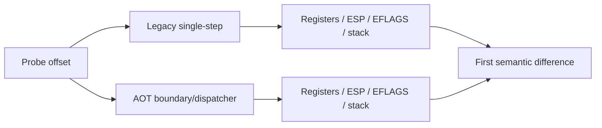

# AOT/legacy differential execution probe 설계

## 목표

특정 executable 주소를 코드에 하드코딩하지 않고 `REPIU_EXECUTION_PROBE_OFFSET`으로 guest runtime offset을 지정해 legacy와 AOT의 동일 instruction 진입 상태를 비교합니다.

probe는 최초 hit만 고정 저장하며 실행 의미를 변경하지 않습니다. legacy는 single-step 진입에서, AOT는 cache sentinel을 guest 주소로 복원한 직후 기록합니다. 결과에는 GPR, EFLAGS, guest EIP, ESP와 8개 stack dword를 포함합니다.

# AOT/Legacy Differential Execution Probe Design

Add a general environment-configured guest-offset probe that captures the first matching instruction-entry registers, flags, ESP, and eight stack dwords in both legacy single-step and AOT sentinel paths without changing execution semantics or hard-coding an executable address.
