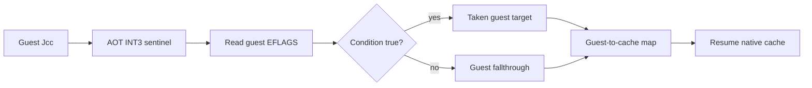

# AOT 조건 분기 dispatcher

## 목적

AOT 캐시에서 실행하는 x86 조건 분기를 호스트 CPU에 그대로 맡기지 않고, 게스트 원본 명령어와 게스트 EFLAGS를 기준으로 판정한 뒤 캐시 주소로 다시 매핑합니다. 이는 `E8`/`E9`/`RET` dispatcher와 같은 경계 모델을 조건 분기까지 확장합니다.

지원 범위는 short `70..7F`와 near `0F 80..8F`의 16개 Jcc 조건입니다. prefix를 포함하는 비정형 형식이나 `LOOP`/`JCXZ` 계열은 기존 재진입·fallback 경로에 남깁니다.

## 검증

`aot-dynamic`으로 PIU를 제한 시간 실행하고 조건 분기 대상이 cache 또는 동적 append로 정상 매핑되는지 확인합니다. 레거시 backend의 probe snapshot은 비교 기준으로 유지합니다.

# AOT Conditional Transfer Dispatcher

## Purpose

Execute x86 conditional branches from the AOT cache through a dispatcher that evaluates the original guest instruction against guest EFLAGS, then maps the selected guest address back into the cache. This extends the existing `E8`/`E9`/`RET` boundary model to conditional branches.

The supported forms are the sixteen short `70..7F` and near `0F 80..8F` Jcc conditions. Prefixed uncommon encodings and `LOOP`/`JCXZ` stay on the existing re-entry/fallback path.

## Verification

Run PIU with `aot-dynamic` for a bounded interval and confirm that selected conditional targets map to the cache or dynamic append path. Keep the legacy probe snapshot as the comparison baseline.
