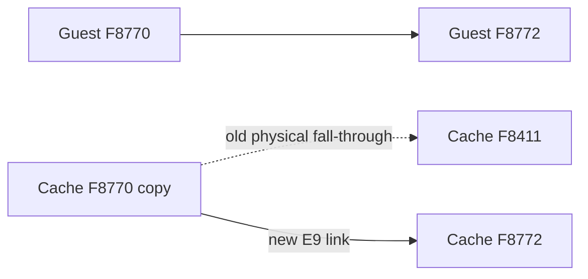

# AOT 기본 블록 fall-through 연결

## 문제

캐시는 서로 다른 guest 기본 블록을 한 배열에 배치합니다. 블록의 마지막 명령어가 일반 copy 명령어이면 x86은 물리적으로 다음 cache 바이트를 실행하지만, 그 바이트가 guest의 다음 선형 주소에 속한다는 보장은 없습니다.

PIU에서 `0x000F8770`의 `sub edx,eax` cache entry 바로 뒤에는 `0x000F8411` 블록이 배치되었습니다. 원래 다음 주소 `0x000F8772`로 연결하지 않아, 실행이 다른 함수의 prologue로 떨어졌고 두 번째 `RET`가 잘못된 stack value `1`을 읽었습니다.

## 설계

각 AOT basic block의 마지막 record가 `kCopy`이면, 그 record 뒤에 `E9 rel32` block-fallthrough link를 추가합니다. fixup은 guest의 `address + length`를 가리키며 image 안의 address map으로 해석합니다. 이 link는 source instruction map에 포함하지 않으므로 breakpoint mapping과 guest instruction 경계는 변하지 않습니다.

외부 target은 plan이 불완전하다는 뜻이므로 image build를 실패시켜 legacy fallback을 유지합니다. 임의의 cache 인접성에 의존하지 않습니다.

# AOT Basic-Block Fall-through Linking

## Problem

The cache places independent guest basic blocks in one byte array. When a block ends in a normal copied instruction, the processor physically executes the next cache byte, which is not guaranteed to belong to the next linear guest address.

At PIU `0x000F8770`, the cache entry for `sub edx,eax` was immediately followed by the block for `0x000F8411`, not guest `0x000F8772`. Execution therefore entered another function prologue and the second `RET` read the invalid stack value `1`.

## Design

When an AOT basic block ends in `kCopy`, append an `E9 rel32` block-fallthrough link to guest `address + length`, resolved through the image address map. The link is outside the source instruction map, so breakpoint mapping and guest instruction boundaries do not change.

An external target means the plan is incomplete; image construction fails and preserves legacy fallback instead of depending on accidental cache adjacency.
