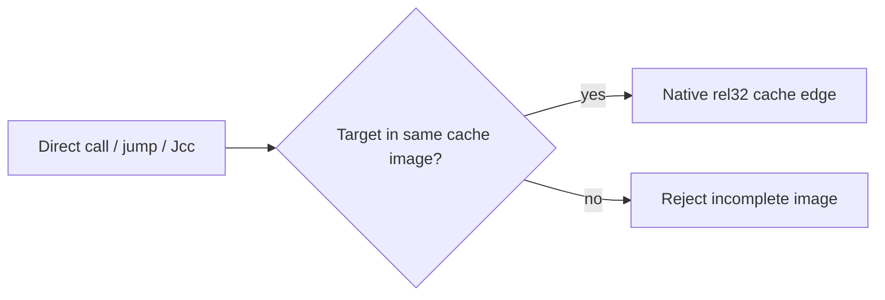

# AOT 내부 직접 edge 연결

## 목적

정적 AOT plan 안에서 target을 찾을 수 있는 direct call, jump, Jcc는 `INT3` dispatcher를 거치지 않고 cache `rel32` edge로 연결합니다. cache-to-cache call은 guest fallthrough 주소를 stack에 넣어 기존 return dispatcher가 guest/cache 어느 주소도 처리할 수 있게 유지합니다.

이는 profile이나 특정 EXE 주소에 의존하지 않습니다. 이전의 block-fallthrough link와 함께 모든 기본 블록 전이를 명시적으로 만듭니다.

# AOT Internal Direct Edge Linking

## Purpose

Direct calls, jumps, and Jcc whose targets are in the static AOT plan use native cache `rel32` edges instead of the `INT3` dispatcher. Cache-to-cache calls push the guest fallthrough address so the existing return dispatcher continues to accept guest or cache addresses.

If a direct target is outside the image, construction rejects the incomplete image and retains legacy fallback. This is profile- and executable-independent. Together with block-fallthrough links, it makes every basic-block transition explicit.
