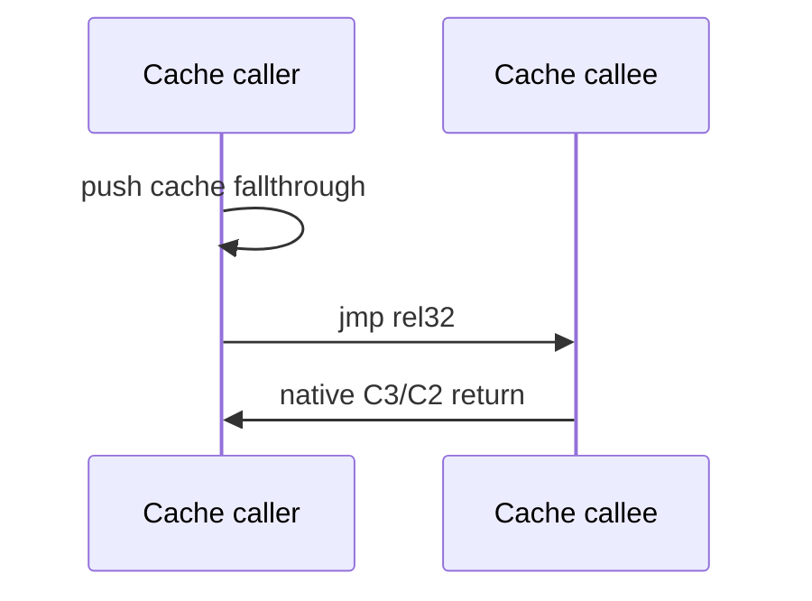

# AOT native return continuation

## 목적

AOT cache 내부 call의 stack return value를 guest 주소가 아닌 cache 주소로 기록하고, `C3/C2`를 원본 명령어로 실행합니다. 이전에는 모든 return이 `INT3` dispatcher를 거쳤습니다.

direct call의 push immediate는 cache placement 시 절대 cache 주소로 patch합니다. `FF /2` dispatcher도 target을 cache로 해석한 뒤 같은 방식으로 cache fallthrough를 push합니다. 따라서 target이 가변적이어도 call target 검증은 dispatcher에 남고, return만 안전하게 native화합니다.

## 범위와 fallback

cache return address를 만들 수 없는 경우 해당 transfer는 기존 dispatcher/fallback으로 남깁니다. 이 단계는 speculative indirect target inline cache가 아니라, 그 cache의 안전한 return continuation 기반입니다.

# AOT Native Return Continuation

## Result: not adopted

The prototype stored cache return addresses for AOT calls and executed `C3/C2` natively. PIU immediately raised an `ntdll` access violation on a path with mixed guest/cache return addresses. Native `RET` cannot safely handle guest return values introduced before AOT entry or across HLE boundaries.

The implementation was reverted. The subsequent inline-cache design retains the return dispatcher and native-optimizes only stable indirect call/jump hit paths.

## Reason

Guest and cache return addresses coexist on the current HLE path. A uniform native return scheme would require a complete stack-provenance model, which is outside this performance task.
