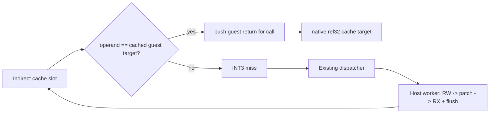
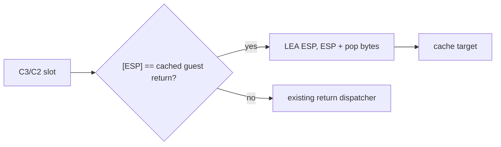

# AOT worker 기반 indirect inline cache

## 목적

반복되는 `FF /2` near indirect call과 `FF /4` near indirect jump를 매번 `INT3`/VEH dispatcher로 보내지 않고, 원래 operand가 이전에 확인한 guest target과 같은 경우 cache target으로 직접 이동합니다. target이 바뀌면 기존 dispatcher로 돌아가 다시 해석합니다.

## 코드 슬롯

지원되는 legacy-32 `FF /2`와 `FF /4` record는 다음 구조로 발행합니다.

1. `pushfd`
2. 원래 register/memory operand와 cached guest target 비교
3. 불일치 시 miss sentinel로 분기
4. `popfd`
5. call이면 기존 규칙대로 guest fallthrough push
6. cache target으로 `jmp rel32`
7. miss에서 `popfd; int3`

초기 guard는 항상 miss하는 동일 길이의 branch로 발행합니다. worker는 target immediate와 cache jump를 먼저 기록한 뒤 guard를 마지막에 활성화합니다. guest thread는 worker 완료 event를 기다리므로 반쯤 patch된 슬롯을 실행하지 않습니다.

첫 구현은 prefix 없는 32-bit register operand와 일반 ModRM/SIB memory operand를 대상으로 합니다. `ESP` 기반 주소는 `pushfd`가 stack을 4바이트 이동시키므로 displacement를 보정합니다. 안전하게 변환할 수 없는 prefix, 16-bit operand/address, far transfer는 기존 1-byte sentinel을 유지합니다.

## 메모리 보호

cache는 평소 `PAGE_EXECUTE_READ`입니다. translation/patch worker만 `VirtualProtect`로 전체 cache를 잠시 `PAGE_READWRITE`로 바꾸고, patch 후 `PAGE_EXECUTE_READ` 복원과 `FlushInstructionCache`를 수행합니다. RWX 상태는 사용하지 않습니다.

## 정확성 정책

* hit/miss 모두 원래 EFLAGS를 복원합니다.
* call은 guest fallthrough 주소를 push하므로 기존 return dispatcher ABI를 유지합니다.
* operand가 바뀌면 guard miss가 발생하며 worker가 새 target으로 재학습합니다.
* 특정 executable 주소, 함수명 또는 profile을 사용하지 않습니다.

## Guarded return 확장

`C3/C2`는 무조건 native로 실행하지 않습니다. 대신 `[ESP]`의 guest return 값이 worker가 학습한 target과 같은 경우에만 `LEA ESP,[ESP+pop]`으로 원래 pop을 재현하고 cache target으로 이동합니다. 값이 guest/cache 어느 형태로든 바뀌면 miss sentinel과 기존 return dispatcher가 처리합니다. `LEA`는 EFLAGS를 바꾸지 않습니다.

# Worker-backed AOT Indirect Inline Cache

## Purpose

Avoid an `INT3`/VEH round trip for every repeated `FF /2` near indirect call or `FF /4` near indirect jump. A guarded cache slot jumps directly to the cache target when the live operand still equals the learned guest target; a changed target returns to the existing dispatcher.

The host worker alone performs the RW-to-patch-to-RX transition and instruction-cache flush. The guest thread waits for completion, the guard is activated last, calls continue to push guest fallthrough addresses, and unsupported encodings retain the existing sentinel path.

Returns use the same guarded model: native cache continuation is allowed only when `[ESP]` equals the learned guest return. A changed or cache-form return falls back to the existing return dispatcher.
