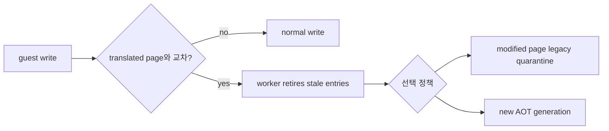
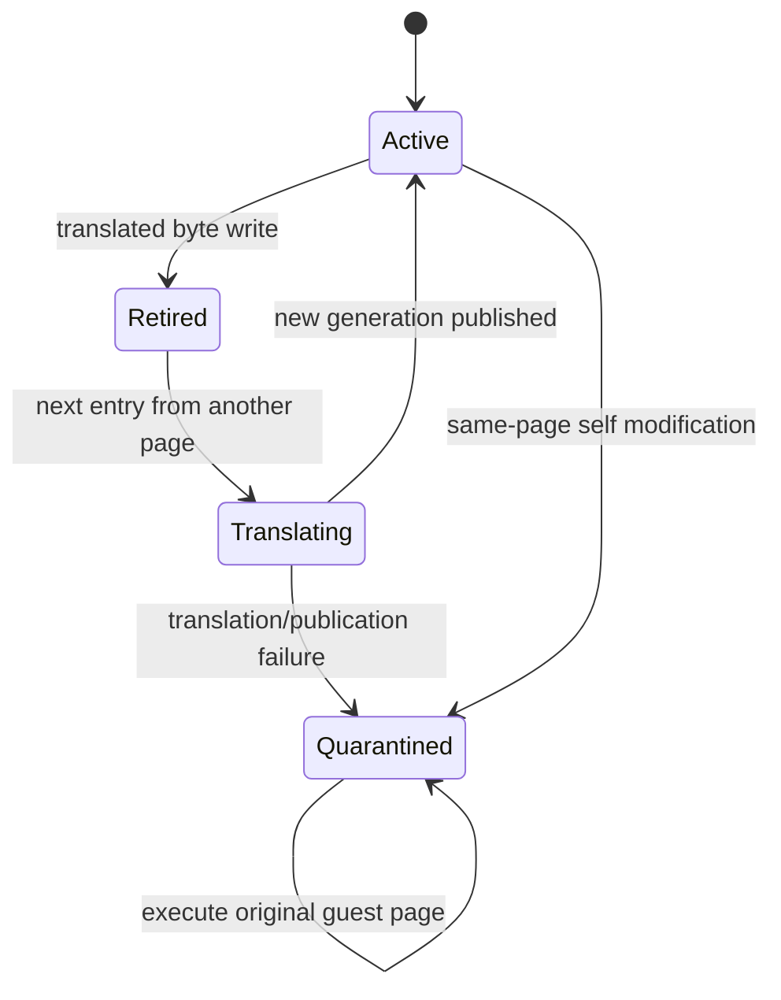
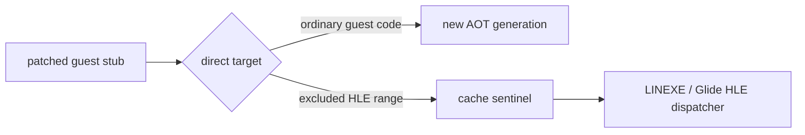
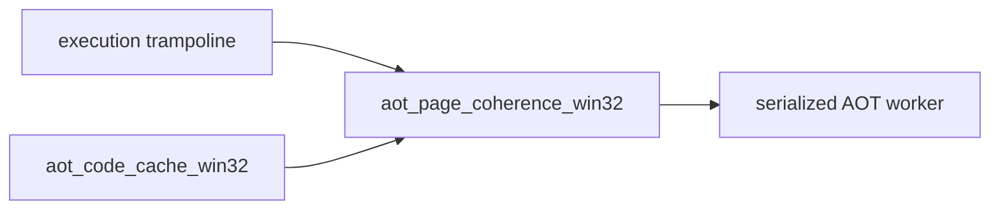
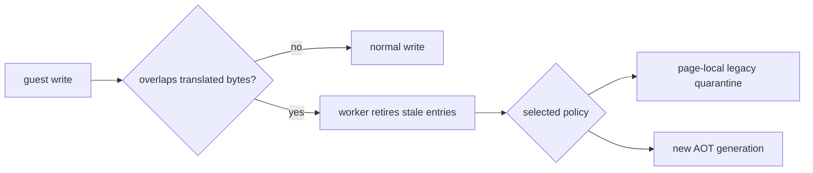
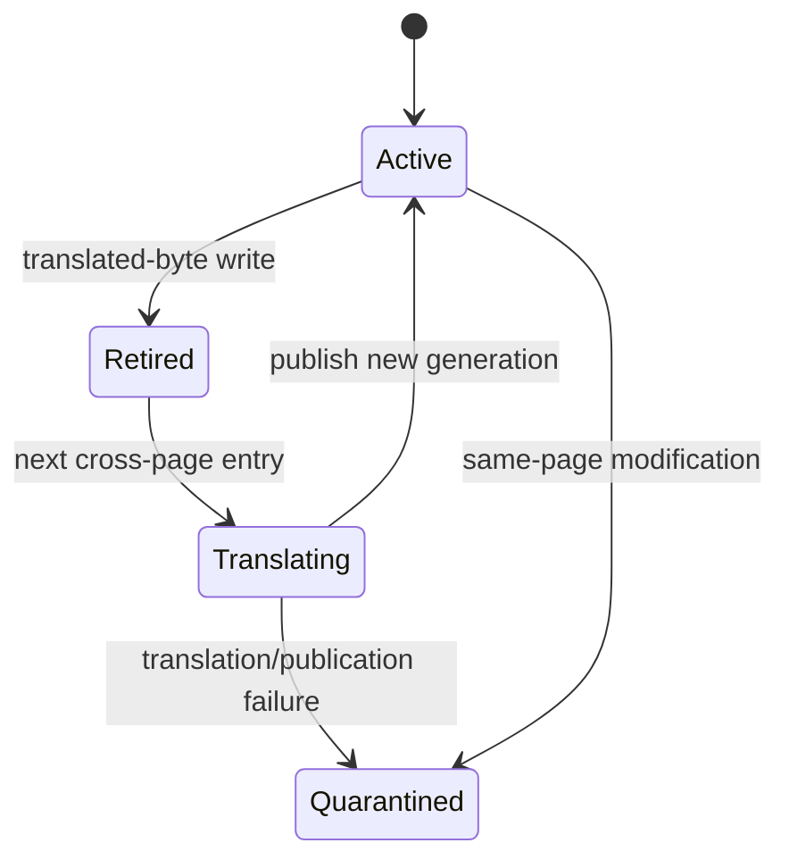

# AOT self-modifying page 일관성 설계 선택지

## 문제

guest code write가 성공해도 기존 AOT entry는 변환 당시 byte를 계속 실행합니다.
직접 edge와 학습된 inline cache가 모두 stale entry를 가리킬 수 있으므로 단순히
guest→cache lookup 하나만 바꾸는 것으로는 충분하지 않습니다.

## 공통 기반

두 일반 해법 모두 다음 기반을 공유합니다.

1. AOT address map이 덮는 guest page 집합을 추적합니다.
2. native fault-emulated store와 `WriteGuest*` HLE write가 이 page와 교차하면
   code-write event를 생성합니다.
3. serialized worker만 RX cache를 RW로 바꿔 stale entry를 publish-safe하게
   retire합니다.
4. cache→guest mapping은 오래된 sentinel의 provenance를 위해 유지하고,
   guest→cache lookup은 retired entry를 제외합니다.
5. 특정 executable 주소, opcode sequence 또는 Glide 이름에 의존하지 않습니다.

## 선택 1: 수정 page를 legacy-only로 격리

worker가 해당 page의 모든 cache entry 첫 byte를 `INT3`로 바꾸고 active lookup에서
제외합니다. 이후 그 page는 원본 guest byte를 TF 기반으로 실행하며, page 밖의
정상 target에 도달하면 AOT로 돌아갑니다.

장점:

* 수정 중인 instruction stream을 다시 번역하지 않아 가장 fail-closed합니다.
* 여러 번 또는 부분적으로 쓰는 patch도 최종 byte를 자연스럽게 봅니다.
* 변경량과 검증 범위가 작고, PIU처럼 작은 import-stub page에 적합합니다.

단점:

* hot self-modifying/JIT page는 계속 single-step 비용을 냅니다.
* PIU Glide stub page는 각 API call마다 추가 VEH 경계를 거칠 수 있습니다.
* 동적 append도 quarantined page entry를 활성화하지 않도록 후처리해야 합니다.

## 선택 2: page generation과 재번역

write 시 기존 entry를 retire하고 page generation을 증가시킵니다. 수정 완료 후
worker가 live guest byte에서 새 translation을 발행하며 guest→cache lookup은 최신
generation을 우선합니다. 오래된 direct/inline edge는 retired sentinel에서 최신
entry로 재연결됩니다.

장점:

* patch 이후 hot code가 다시 native cache 속도로 실행됩니다.
* JIT 또는 자주 호출되는 self-patched stub에 장기적으로 유리합니다.

단점:

* `C6` opcode와 뒤이은 `89` displacement처럼 여러 store로 이루어진 patch의
  완료 시점을 판정해야 합니다.
* 실행 중인 page가 자기 자신을 수정할 때 안전한 re-entry 지점이 필요합니다.
* generation별 map, stale direct edge, inline-cache target, cache capacity와
  reclamation을 함께 관리해야 하므로 변경량과 회귀 위험이 큽니다.

## 선택된 정책: generation 우선, quarantine fallback

사용자 결정에 따라 **선택 2를 주 실행 경로**로 구현합니다. 선택 1은 버리지
않고 재번역 안전성을 보장할 수 없는 page의 fail-closed fallback으로 유지합니다.

write가 translated instruction byte와 교차하면 worker는 해당 guest page에서
파생된 active cache entry의 첫 byte를 `INT3`로 바꾸고 retired 상태로 전환합니다.
cache→guest lookup은 retired entry의 provenance를 계속 제공하지만 guest→cache
lookup은 active entry만, 같은 주소가 여러 개면 가장 최근 generation을
선택합니다.

재번역은 첫 store 직후가 아니라 retired page로 다음에 진입할 때 수행합니다.
단일 guest thread에서 다른 page가 target page를 여러 번 수정한 뒤 control을
넘기는 일반적인 patch는 이 지연 publication으로 완성된 byte를 snapshot합니다.
현재 실행 page가 자기 자신을 수정하거나, live translation/용량/보호 복원이
실패하면 그 page는 quarantine되어 원본 guest byte를 single-step으로 실행합니다.

### 불변식

* 특정 executable 주소, Glide 이름 또는 patch signature를 사용하지 않습니다.
* worker만 code cache를 수정하고 code cache는 RX와 RW 사이에서만 전환합니다.
  guest write-watch page는 faulting store 한 명령 동안만 RWX가 될 수 있습니다.
* 길이가 5바이트 이상인 retired entry는 새 generation 발행 시 `E9 rel32`로
  재연결하고, 짧은 entry만 `INT3` provenance trap으로 남깁니다.
* partial patch를 즉시 재번역하지 않습니다.
* legacy backend와 기존 static-AOT fallback은 유지합니다.

## guest write-watch

translated instruction이 있는 guest page는 평상시 RX로 감시합니다. native
guest/cache store가 write fault를 일으키면 Zydis로 store 폭을 구하고 관련 page만
RWX로 전환해 한 명령을 실행합니다. Trap Flag 완료에서 RX를 복원한 뒤 실제
translated instruction 범위와 겹치는 page를 retire합니다. `WriteGuest*` HLE
helper는 보호 복원까지 성공한 다음 같은 정책에 통지합니다.

page 단위 보호 때문에 code와 data가 섞인 page의 data-only write도 AV/TF 비용을
낼 수 있습니다. REP/string store의 여러 page write와 multi-thread publication은
후속 일반화 범위입니다.

## HLE 게이트 제외 정책

동적 재번역의 CFG가 원본 코드에서 합성 HLE 게이트로 직접 이어지더라도 게이트
바이트는 AOT 코드로 복사하지 않습니다. 플랫폼 계층은 LINEXE/Glide 게이트처럼
HLE가 소유한 guest 주소 범위를 플랫폼 공용 번역 계획에 제외 범위로 전달합니다.
번역 계획은 제외 target을 `INT3` cache sentinel로 만들고, 실행 시 원본 guest
주소로 나와 기존 HLE dispatcher가 처리하도록 합니다.

이 정책은 특정 export 이름이나 PIU 주소를 검사하지 않고, HLE 하위 시스템이
예약한 범위라는 소유권만 사용합니다.

## 파일 책임

page index, generation state, retirement, write-watch 보호 전환은 독립적인
`aot_page_coherence_win32` 하위 시스템이 소유합니다. `aot_code_cache_win32`는
cache placement/append/relink를 조율하고, execution trampoline은 예외를 guest
write event와 worker 요청으로 연결하는 adapter만 유지합니다.

# AOT Self-modifying Page Coherency Design Options

## Problem and Common Foundation

Guest code writes do not automatically change bytes already emitted into the AOT
cache. Both candidate policies therefore index translated guest pages, report
native and `WriteGuest*` stores, let only the serialized worker retire cache
entries under RX/RW protection, preserve cache-to-guest provenance, and exclude
retired entries from active guest lookup. No executable address, opcode signature,
or Glide export name is used as a condition.

Option 1 permanently quarantines a modified page to legacy single-step execution.
It is the smallest fail-closed policy and naturally observes partial patches, but
a hot self-modifying page keeps paying VEH cost. Option 2 retires the old page
generation and publishes a translation from completed live bytes. It restores
native cache speed, but must define the publication boundary, stale-edge behavior,
capacity failure, and same-page modification fallback.

## Selected Policy: Generation First, Quarantine Fallback

The selected policy uses new AOT generations as the primary path and retains
legacy-page quarantine as a fail-closed fallback. A translated-byte write retires
all active entries derived from that guest page. Retranslation is delayed until
the next entry into the retired page so a single guest thread can complete a
multi-store patch before live bytes are snapshotted. Same-page self modification,
translation failure, cache exhaustion, or unsafe publication quarantines only
that page. Retired cache addresses preserve provenance, active guest lookup
prefers the newest generation, only the worker mutates RX cache pages, and no
executable-specific signature is used. Retired entries of at least five bytes
are forwarded to the newest generation with `E9 rel32`; shorter entries remain
`INT3` provenance traps.

## Guest Write Watch

Guest pages containing translated instructions are normally watched as RX. A
native guest/cache store fault is decoded with Zydis to estimate its width, only
the affected pages become RWX for one instruction, and Trap Flag completion
restores RX before overlap retirement is reported. Successful `WriteGuest*` HLE
writes report to the same policy after restoring protection. The code cache itself
is never RWX; only its worker changes it between RX and RW. Mixed code/data pages
can incur AV/TF cost for data-only writes. Cross-page REP/string stores and
multi-thread publication remain follow-up work.

## HLE Gate Exclusion Policy

Dynamic retranslation must not copy synthetic HLE gate bytes into the native
cache even when the reachable CFG contains a direct edge from original code to
such a gate. The platform layer passes guest ranges owned by HLE, including the
LINEXE/Glide gate arena, to the platform-neutral translation planner as excluded
ranges. The planner represents an excluded target with an `INT3` cache sentinel
so execution returns to the original guest address and the existing HLE
dispatcher handles it. The policy uses range ownership rather than a PIU address
or export name.

## File Responsibilities

The dedicated `aot_page_coherence_win32` subsystem owns page indices,
generation state, retirement, and guest write-watch protection transitions.
`aot_code_cache_win32` orchestrates placement, append, and relinking, while the
execution trampoline remains an adapter from exceptions to guest-write events
and serialized worker requests.

