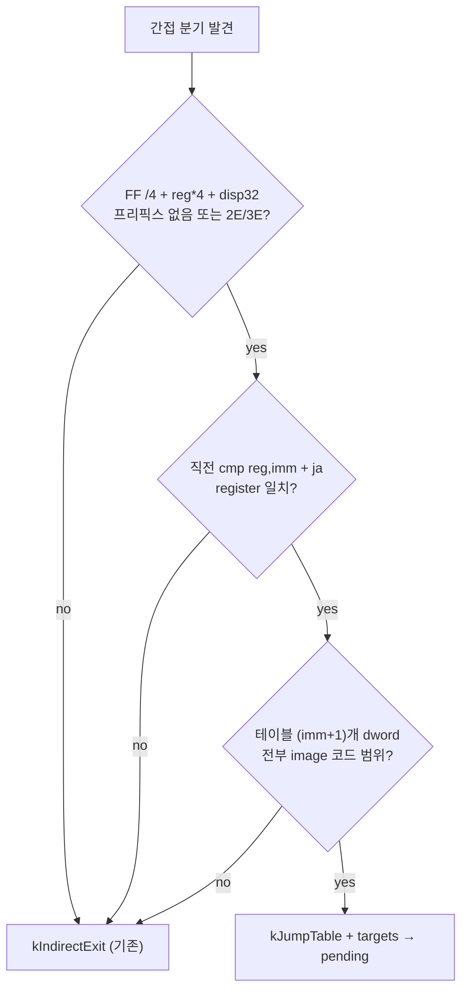

# AOT Bounded Jump Table 번역 설계
# AOT Bounded Jump Table Translation Design

## 개요 (Overview)

120초 관찰과 정적 디스어셈블리로 현재 실행 frontier가 **code-segment 점프 테이블 간접 분기의 AOT 처리량 병목**임을 확정했습니다 (`docs/analysis/current-execution-frontier.md` 2026-07-14 항목).

PIU의 자산 디코드 루프는 Watcom switch문이 생성한 다음 형태의 분기를 레코드마다 실행합니다.

```asm
cmp  eax, 0x0A          ; case 갯수 - 1
ja   default_case
jmp  dword ptr cs:[eax*4 + table]   ; 2E FF 24 85 disp32
```

현재 AOT 파이프라인의 처리 (구현 중 확인·정정):

1. `BuildAotTranslationPlan`(`src/runtime/aot_translation_plan.cpp`)의 `IsHleBoundary`가 `ZYDIS_ATTRIB_HAS_SEGMENT` 속성을 가진 모든 명령을 HLE boundary로 취급하므로, CS override(`0x2E`)가 붙은 이 명령은 `kIndirectExit`에 도달하기 전에 **`kHleBoundary`로 분류**되어 `0xCC`(INT3)로 방출됩니다.
2. 프리픽스 없는 형태였다면 `kIndirectExit`로 분류되고, `EmitIndirectInlineCacheSlot`(`src/runtime/aot_code_cache.cpp`)의 단일 target compare inline cache가 시도되지만 이 역시 11개 target을 오가는 switch에는 hit률을 보장할 수 없습니다.
3. 결과적으로 65,536-레코드 디코드 루프가 레코드마다 dispatcher를 왕복하여 사이클당 약 62초가 소요됩니다. 실기에서는 밀리초 단위 작업입니다.

The current frontier is an AOT throughput bottleneck on Watcom switch jump tables (`jmp dword ptr cs:[eax*4 + table]`, bytes `2E FF 24 85 disp32`). Because `IsHleBoundary` treats any instruction with `ZYDIS_ATTRIB_HAS_SEGMENT` as an HLE boundary, the CS-prefixed form is classified `kHleBoundary` (before ever reaching `kIndirectExit`) and emitted as an INT3 dispatcher exit; the unprefixed form would reach the single-target inline cache, which cannot guarantee hits across an 11-way switch. The 65,536-record decode loop therefore round-trips the dispatcher once per record (~62 s per cycle for millisecond-scale original work).

---

## 설계 목표 (Goals)

1. 위 canonical switch 패턴을 AOT 번역 단위 안에서 **완전 네이티브로 실행**하여 dispatcher 탈출을 제거합니다.
2. 패턴이 검증 조건을 만족하지 않으면 기존 `kIndirectExit` 경로로 **안전하게 후퇴**합니다 (fail-closed).
3. 원본 코드 수정 없이 번역 계층에서만 처리합니다 (프로젝트 원칙 준수).

---

## 접근 방식 비교 (Approach Comparison)

| 방식 | 내용 | 장점 | 한계 |
| --- | --- | --- | --- |
| A. 프리픽스 허용 inline cache | `EmitIndirectInlineCacheSlot`이 `0x2E`/`0x3E` 프리픽스를 건너뛰도록 확장 | 변경 최소 | 단일 cached target이므로 태그가 섞인 레코드 스트림에서 miss 시 여전히 dispatcher 왕복 |
| B. bounded jump table 네이티브 번역 (권장) | 계획 단계에서 `cmp/ja/jmp cs:[reg*4+disp32]` 패턴을 인식해 테이블 엔트리를 planning target으로 등록하고, 방출 단계에서 네이티브 분기 테이블 생성 | 태그 분포와 무관하게 이 사이트의 dispatcher 탈출 전량 제거 | plan/emit 양쪽 확장 필요 |

**선택: B.** 관찰된 레코드 스트림은 11개 태그를 오가므로 단일 엔트리 cache(A)는 hit률을 보장할 수 없습니다. B는 결정적으로 병목을 제거하며, 동일 패턴인 `+0xDDDDA`의 4-엔트리 테이블 등 다른 switch에도 그대로 적용됩니다.

**Chosen: B.** The record stream alternates across 11 tags, so a single-entry cache cannot guarantee hit rate. Native bounded-table translation removes all dispatcher exits at such sites deterministically and generalizes to other Watcom switches (e.g., the 4-entry table at `+0xDDDDA`).

---

## 세부 설계 (Detailed Design)

### 1. 계획 단계: kJumpTable 분류 (Planning: kJumpTable classification)

`BuildAotTranslationPlan`에서 간접 분기를 `kIndirectExit`로 분류하기 전에 다음 조건을 모두 검사합니다.

1. 명령 형태가 `jmp dword ptr [reg*4 + disp32]`이며 프리픽스는 없거나 `0x2E`/`0x3E`뿐이다 (`FF /4`, SIB scale=4, base 없음, mod=00).
2. 같은 블록의 직전 두 record가 `cmp reg, imm` + `ja target` 형태이고, `cmp`의 register가 index register와 일치한다. 테이블 크기는 `imm + 1`.
3. relocated image에서 `disp32`부터 `(imm+1)`개 dword를 읽을 수 있고, 모든 엔트리가 image 코드 범위 안이다.

조건을 만족하면 record를 `kJumpTable`로 분류하고 `table_targets`(엔트리 목록)를 보존하며, 각 엔트리를 `pending`에 추가해 reachable CFG에 포함시킵니다. 하나라도 실패하면 기존 분류(`kHleBoundary` 또는 `kIndirectExit`) 그대로 둡니다.

추가로, 분기 블록이 guard(cmp/ja) 블록보다 먼저 방문되는 경우(예: 동적 번역 entry가 분기 자체인 경우)를 위해, walk 종료 후 guard가 알려진 주소의 `kHleBoundary`/`kIndirectExit` record를 재검사해 `kJumpTable`로 승격하고 새 target을 `pending`에 추가하는 재분류 스윕을 수렴할 때까지 반복합니다.

A reclassification sweep also runs after each walk: records already classified `kHleBoundary`/`kIndirectExit` whose address gained a guard are re-decoded and promoted to `kJumpTable`, with their targets enqueued, repeating until stable. This keeps the optimization independent of block visit order (e.g., when a dynamic-translation entry is the branch itself).



### 2. 방출 단계: 네이티브 분기 테이블 (Emission: native branch table)

`kJumpTable` record에 대해 code cache에 다음을 방출합니다.

1. cache 내부에 `(imm+1)`개 엔트리의 **native pointer table**을 예약합니다.
2. 명령 위치에는 `jmp dword ptr [index_reg*4 + native_table]`을 방출합니다. 원본의 bounds check(`cmp`/`ja`)는 직전 명령으로 이미 네이티브 복사되므로 재검사가 불필요합니다.
3. 각 native table 엔트리는 대응 guest target의 번역 블록 시작으로 fixup합니다. 대응 블록이 없으면 그 엔트리만 INT3 stub으로 채워 dispatcher로 후퇴합니다 (부분 fail-closed).

CS override는 flat 보호 모드에서 의미 변화가 없으므로 방출 시 제거합니다.

### 3. Self-modifying code 정합성 (SMC coherency)

guest 점프 테이블은 write-protect된 코드 object 안에 있으며, 기존 AOT page-generation 감시가 테이블 페이지 쓰기를 감지하면 해당 번역 단위가 무효화되므로 (기존 메커니즘 재사용) 별도 처리가 필요 없습니다. 테이블을 읽는 시점은 relocation 완료 후의 계획 단계이므로 값은 최종 linear 주소입니다.

### English Summary

Planning recognizes the canonical Watcom shape — `cmp reg, imm; ja default; jmp dword ptr [reg*4 + disp32]` with at most a `2E`/`3E` prefix — validates that all `(imm+1)` relocated table dwords lie inside the image code range, classifies the record as `kJumpTable` with its target list, and enqueues each target into the reachable CFG. Emission reserves an `(imm+1)`-entry native pointer table in the code cache, replaces the instruction with `jmp dword ptr [index_reg*4 + native_table]` (bounds already guaranteed by the natively copied `cmp`/`ja`), and fixes each entry up to the translated target block, filling untranslated entries with INT3 dispatcher stubs. The guest table lives in a write-protected code object, so the existing AOT page-generation invalidation covers self-modification; any validation failure falls back to the existing `kIndirectExit` path.

---

## 기대 효과 및 검증 (Expected Impact & Verification)

* 디코드 루프의 사이클당 약 65,536회 dispatcher 왕복이 제거되어 사이클 시간이 약 62초에서 밀리초~초 단위로 단축될 것으로 기대합니다.
* 검증: win32_x86_debug 빌드 후 `repiu_supervisor_win32.exe pumpit1 120000` 구동에서 (1) `0x03086DAA` 디스패치 집중 소멸, (2) 초기화 사이클 통과 가속, (3) 새 예외 부재를 텔레메트리로 확인합니다. `repiu_aot_probe`로 planning 통계에서 `indirect_exit_count` 감소와 신규 `jump_table_count`를 확인합니다.
