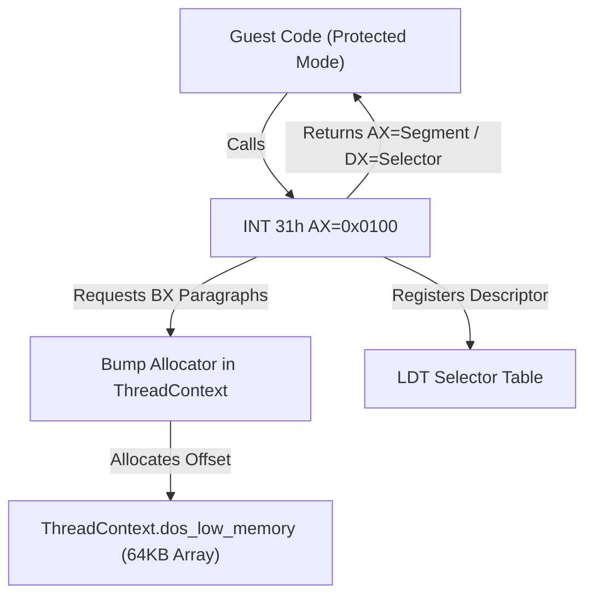

# DPMI Real Mode Memory Block HLE 설계
# DPMI Real Mode Memory Block HLE Design

## 개요 (Overview)

원본 x86 게임 로직이 구동되는 과정에서 DOS 16비트 리얼 모드 메모리 영역(1MB conventional memory 이하)을 할당받아 하드웨어(오디오, 마우스, CD-ROM 등) 인터페이스와 통신하려 할 때, DPMI 인터럽트 `INT 31h` `AX=0x0100` 및 `AX=0x0101` 서비스를 호출합니다.
현재 rePIU 에뮬레이터에는 이 기능이 구현되어 있지 않아 `unsupported DPMI INT 31h AX=0x100` 에러와 함께 종료되는 상태입니다.
본 문서는 호스트의 32비트 포인터 가상 주소 테이블 위에서 16비트 리얼 모드 세그먼트와 descriptor/selector를 매핑하고 추적하는 HLE 설계안을 제안합니다.

When the original x86 game logic executes, it calls DPMI interrupt `INT 31h` `AX=0x0100` and `AX=0x0101` services to allocate real-mode memory blocks (within the 1MB conventional memory) to communicate with hardware interfaces (audio, mouse, CD-ROM, etc.).
Currently, the rePIU emulator does not implement this feature, leading to a crash with the `unsupported DPMI INT 31h AX=0x100` error.
This document proposes an HLE design mapping 16-bit real-mode segments to descriptors/selectors on the host's 32-bit pointer virtual address space.

---

## 메모리 매핑 구조 (Memory Mapping Structure)



### 1. 세그먼트 주소 변환 규칙 (Segment Address Translation Rule)
DPMI 0.9 규격에 따라 할당된 세그먼트 주소는 다음과 같이 `dos_low_memory` 의 바이트 배열 상의 오프셋으로 매핑됩니다.
* **물리 주소 (Physical/Linear address):** `Segment * 16`
* **가상 메모리 배열 오프셋 (Offset in array):** `Segment * 16`
* **보호 모드 셀렉터 (Protected Mode Selector):** 할당 성공 시 등록되는 descriptor의 인덱스.

According to the DPMI 0.9 specification, the allocated segment address translates to an offset in `dos_low_memory` as follows:
* **Physical/Linear address:** `Segment * 16`
* **Offset in array:** `Segment * 16`
* **Protected Mode Selector:** The LDT descriptor index registered upon successful allocation.

---

## 세부 데이터 구조 및 알고리즘 (Detailed Data Structures & Algorithms)

### 1. `ThreadContext` 확장 (ThreadContext Expansion)
`execution_trampoline.cpp` 내의 `ThreadContext` 구조체에 실시간 할당 추적을 위한 멤버 변수들을 추가합니다.

Add member variables to the `ThreadContext` struct within `execution_trampoline.cpp` to track allocations in real-time.

```cpp
    struct RealModeBlock
    {
        std::uint16_t selector = 0; // 보호 모드 셀렉터 (Protected Mode Selector)
        std::uint32_t offset = 0;   // dos_low_memory 상의 바이트 오프셋 (Byte offset in dos_low_memory)
        std::uint32_t size = 0;     // 바이트 단위 크기 (Size in bytes)
        bool active = false;        // 활성화 여부 (Is active)
    };
    static constexpr std::size_t kRealModeBlockCapacity = 32;
    
    std::array<RealModeBlock, kRealModeBlockCapacity> dpmi_real_mode_blocks = {};
    std::uint32_t dpmi_low_memory_bump_offset = 0x1000U; // 4KB 지점부터 범프 할당 시작 (앞부분 0~4KB는 인터럽트 벡터 섀도우용 보호)
```

### 2. DPMI AX=0x0100 (Allocate Real Mode Memory Block)
* **입력:** `BX` = 할당할 paragraphs 수 (`size = BX * 16` bytes)
* **동작:**
  1. `dpmi_low_memory_bump_offset + size <= kDosLowMemorySize` 인지 가용 공간을 체크합니다.
  2. 공간이 충분한 경우, `repiu::runtime::AllocateSelector`를 사용하여 새로운 descriptor selector를 발급받습니다.
  3. `repiu::runtime::RegisterDescriptor`를 통해 베이스 주소가 `dpmi_low_memory_bump_offset`, limit이 `size - 1`, flags가 `0x0092U` (Data Segment, Read/Write, Present)인 descriptor를 등록합니다.
  4. `dpmi_real_mode_blocks` 배열의 빈 슬롯에 할당 정보를 기록하고 `active = true`로 설정합니다.
  5. 리턴값 설정:
     - `Carry Flag` = Clear
     - `AX` = `dpmi_low_memory_bump_offset / 16` (리얼 모드 세그먼트)
     - `DX` = 발급받은 selector
     - `dpmi_low_memory_bump_offset += size;` (오프셋 16바이트 정렬 정렬 전진)
  6. 가용 공간 부족 또는 셀렉터 고갈 시:
     - `Carry Flag` = Set
     - `AX` = `0x8011U` (Memory unavailable)

* **Inputs:** `BX` = Number of paragraphs to allocate (`size = BX * 16` bytes)
* **Behavior:**
  1. Check if enough space is available: `dpmi_low_memory_bump_offset + size <= kDosLowMemorySize`.
  2. If sufficient, allocate a new descriptor selector using `repiu::runtime::AllocateSelector`.
  3. Call `repiu::runtime::RegisterDescriptor` with base = `dpmi_low_memory_bump_offset`, limit = `size - 1`, flags = `0x0092U` (Present Read/Write Data).
  4. Record details in a vacant slot of `dpmi_real_mode_blocks` and set `active = true`.
  5. Setup return values:
     - `Carry Flag` = Clear
     - `AX` = `dpmi_low_memory_bump_offset / 16` (Real mode segment)
     - `DX` = Allocated selector
     - `dpmi_low_memory_bump_offset += size;` (Advance offset with 16-byte alignment)
  6. On failure (out of memory or selector exhaustion):
     - `Carry Flag` = Set
     - `AX` = `0x8011U` (Memory unavailable)

### 3. DPMI AX=0x0101 (Free Real Mode Memory Block)
* **입력:** `DX` = 해제할 block의 selector
* **동작:**
  1. `dpmi_real_mode_blocks` 에서 `selector == DX` 이고 `active == true` 인 엔트리를 선형 검색합니다.
  2. 찾지 못하면 `Carry Flag` = Set, `AX` = `0x8022U` (Invalid selector)을 리턴합니다.
  3. 찾은 경우:
     - `repiu::runtime::RegisterDescriptor`를 호출해 해당 셀렉터의 descriptor를 Present = false 속성으로 무효화합니다.
     - `active` 플래그를 `false` 로 마킹하여 블록을 릴리즈 처리합니다. (간결함을 위해 실제 low memory 물리 풀의 단편화 회수는 건너뛰고 selector만 무효화합니다.)
     - `Carry Flag` = Clear

* **Inputs:** `DX` = Selector of the block to free
* **Behavior:**
  1. Search `dpmi_real_mode_blocks` for an entry with `selector == DX && active == true`.
  2. If not found, return `Carry Flag` = Set, `AX` = `0x8022U` (Invalid selector).
  3. If found:
     - Invalidate the descriptor (Present = false) using `repiu::runtime::RegisterDescriptor`.
     - Mark `active` as `false`. (To keep it lightweight, we invalidate the selector without compacting or reclaiming the low memory offset pool.)
     - `Carry Flag` = Clear
