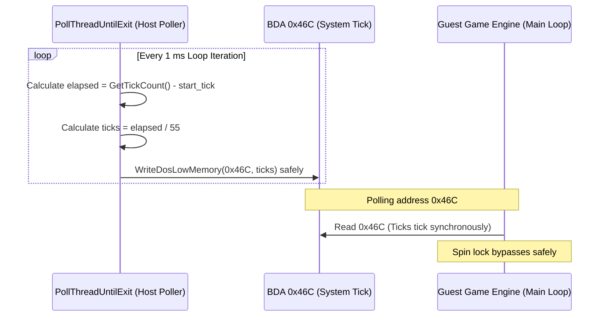

# System Timer Tick HLE 설계 (안정화)
# System Timer Tick HLE Design (Stabilization)

## 개요 (Overview)

원본 DOS x86 게임 로직은 프레임 동기화 및 시간 지연(Delay)을 위해 BIOS Data Area(BDA) 영역의 물리 주소 `0x0040:0x006C` (즉 선형 주소 `0x46C`) 번지에 보존되는 **System Timer Tick Count**를 직접 참조하여 대기 루프(Spin Lock)를 돕니다. 이 값은 BIOS 실시간 18.2Hz (약 55ms 마다 1씩) 주기로 증가해야 합니다.

호스트의 비동기 백그라운드 스레드가 `dos_low_memory` 영역에 비동기적으로 쓰기를 시도할 경우, AOT 감시 속성 및 Write Watch 세이프티 가드 페이지와 레이스 컨디션을 유발하여 `STATUS_GUARD_PAGE_VIOLATION` 크래시를 유발합니다.
이를 방지하기 위해 비동기 스레드를 사용하지 않고, 호스트의 메인 폴러 함수인 `PollThreadUntilExit` 루프의 각 주기 반복마다 가속 감시 메커니즘을 통과하여 **동기식으로 안전하게 틱 카운트를 점진적으로 갱신해 주도록** 설계합니다.

The original DOS x86 game logic polls the **System Timer Tick Count** stored at linear address `0x46C` within the BIOS Data Area (BDA) for frame synchronization and delays, ticking at 18.2Hz (~55ms).

If a background thread attempts to write to the memory area asynchronously under Write Watch / Guard Page attributes, a `STATUS_GUARD_PAGE_VIOLATION` exception occurs.
To bypass concurrency and memory protection issues, we will discard background threading and update the BDA tick counter **synchronously inside the polling loop (`PollThreadUntilExit`)**.

---

## 동기식 타이머 업데이트 흐름 (Synchronous Update Flow)



---

## 세부 데이터 구조 및 알고리즘 (Detailed Data Structures & Algorithms)

### 1. `ThreadContext` 확장 롤백 (ThreadContext Rollback)
타이머 스레드 제어 멤버(`timer_thread`, `timer_thread_shutdown`)를 `ThreadContext` 구조체 및 로더 런칭 라이프사이클에서 완전히 제거하여 단순함을 복원하고 동시성 리스크를 0으로 만듭니다.

Discard background thread handles from `ThreadContext` and loader startup/shutdown routines to minimize concurrency risk.

### 2. 메인 폴러 동기식 갱신 (Synchronous In-Loop Update)
`PollThreadUntilExit` 폴링 루프(라인 830 부근)의 매 반복 회차마다, 경과 시간과 18.2Hz 주기를 대조하여 `0x46C` 번지 값을 안전하게 갱신합니다.

Within the polling loop of `PollThreadUntilExit`, compute current tick count relative to the start time and write it to address `0x46C` of `dos_low_memory` on each iteration.

```cpp
        // PollThreadUntilExit 루프 내부
        if (progress_context != nullptr)
        {
            const DWORD elapsed = GetTickCount() - start_tick;
            const DWORD ticks = elapsed / 55U;
            repiu::runtime::WriteDosLowMemory(
                &progress_context->dos_low_memory, 0x046CU, ticks, 4U);
        }
```
이 방식은 단일 스레드 컨텍스트에서 게스트 단독 실행 시점 및 에뮬레이터 중단 상태와 완벽히 동기화되므로, 멀티스레드 예외 크래시의 소지가 전혀 없습니다.
