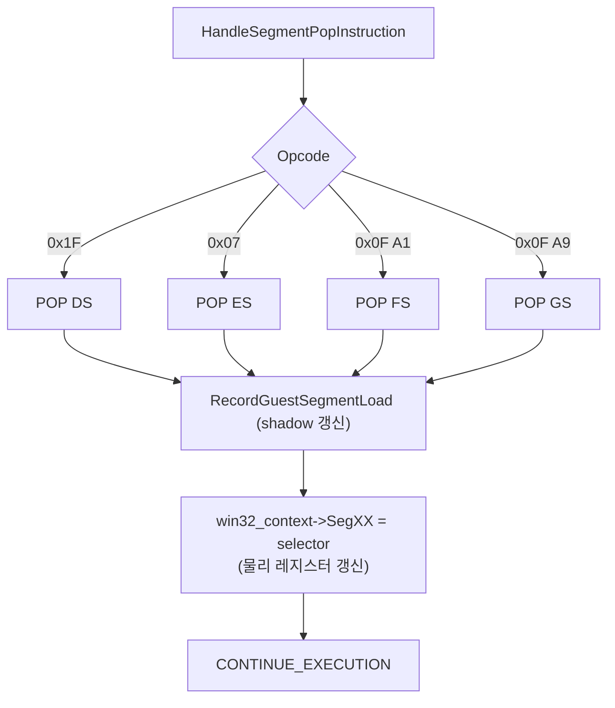

# 2026-07-15 POP ES/FS/GS HLE 복원 및 하드웨어 컨텍스트 동기화 설계
# 2026-07-15 POP ES/FS/GS HLE Restoration and Hardware Context Sync Design

## 1. 개요 (Overview)

Task 206에서 POP ES/FS/GS HLE를 롤백한 이후, 게스트의 LINEXE 모듈 이름 스캔 루프에서 무한 반복이 발생하는 회귀 결함이 관측되었습니다. 이 설계는 POP ES/FS/GS HLE를 복원하면서, 하드웨어 컨텍스트(물리 레지스터)와 HLE shadow 레지스터 간의 상태 일관성을 유지하는 방안을 정의합니다.

After rolling back the POP ES/FS/GS HLE in Task 206, a regression was observed where the guest gets stuck in an infinite loop during the LINEXE module name scan. This design outlines the restoration of POP ES/FS/GS HLE while maintaining state consistency between the hardware context (physical registers) and HLE shadow registers.

## 2. 문제 원인 (Root Cause)

1. **상태 불일치 (State Inconsistency)**: POP ES/FS/GS가 하드웨어에서 직접 실행되면, CPU의 물리적 세그먼트 레지스터는 갱신되지만 `ThreadContext` 내의 shadow 레지스터(`guest_es`, `guest_fs`, `guest_gs`)는 갱신되지 않습니다.
2. **잘못된 번역 (Incorrect Translation)**: 후속 세그먼트 override 메모리 접근(`gs:[ebx]` 등) 시 HLE는 `TranslateSelectorOffset`에서 과거의 stale shadow 레지스터 값을 사용하게 되어 엉뚱한 descriptor 한계를 적용하거나 엉뚱한 메모리를 읽습니다.
3. **무한 루프 (Infinite Loop)**: 결과적으로 LINEXE DLL resolver가 `GLIDE2X` 등의 모듈을 찾을 때, 잘못된 데이터를 읽고 모듈 체인을 정상적으로 순회하지 못하여 이름 스캔 루프에서 탈출하지 못합니다.

## 3. 설계 결정 (Design Decisions)

### 3.1. POP ES/FS/GS HLE 복원
`HandleSegmentPopInstruction` 함수에서 다시 0x07 (POP ES), 0x0F 0xA1 (POP FS), 0x0F 0xA9 (POP GS) 명령을 HLE가 가로채어 처리하도록 복원합니다.

### 3.2. 하드웨어 CONTEXT 동기화
단순히 `RecordGuestSegmentLoad`만 호출하여 shadow 레지스터를 갱신하는 것에 더하여, VEH가 제공하는 `win32_context`의 물리적 세그먼트 레지스터(`SegEs`, `SegFs`, `SegGs`)도 함께 갱신합니다.
이를 통해 후속 네이티브 실행 구간에서 하드웨어 레지스터를 통한 접근과 HLE 에뮬레이션 접근 모두가 동일한, 올바른 selector를 갖게 됩니다.

## 4. 세부 구현 (Detailed Implementation)

* **`src/platform/win32/execution_trampoline.cpp`**
  * `HandleSegmentPopInstruction` 내의 opcode 검사 로직을 확장하여 `0x07`, `0x0F 0xA1`, `0x0F 0xA9`를 수용합니다.
  * 메모리에서 `selector`를 읽어온 후, `RecordGuestSegmentLoad`를 호출합니다.
  * `opcode`에 따라 `win32_context`의 `SegDs`, `SegEs`, `SegFs`, `SegGs` 필드에 `selector` 값을 명시적으로 할당합니다.
  * 명령어 길이에 맞게 `win32_context->Eip`를 증가시킵니다 (1바이트 또는 2바이트).

## 5. 예상 결과 (Expected Outcome)

shadow 레지스터가 정확하게 갱신되므로 `TranslateSelectorOffset`이 정상 동작하며, LINEXE 모듈 스캔이 성공적으로 완료되어 Glide call gate 등에 도달할 수 있게 됩니다. 또한 물리 레지스터도 유효한 값을 가지게 되므로 Task 206 롤백의 원인이었던 "쓰레기 selector"로 인한 OpenGL 윈도우 생성 실패 문제도 발생하지 않게 됩니다.
