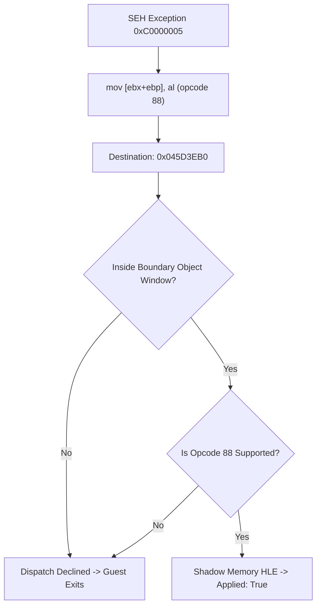

# 20260715-exception-diagnostic-and-buffer-provenance

## 1. 진단 결함 수정 (Exception Diagnostic Correction)

### 배경 (Background)
`Relocated exception byte window` 진단 로그는 SEH 예외 발생 시점의 올바른 게스트 EIP 대신, 마지막으로 정상 처리된 디스패치 지점의 stale `last_guest_eip`를 사용해 디스어셈블리 창을 구성하는 문제가 있었다.
The `Relocated exception byte window` diagnostic window was configured using a stale `last_guest_eip` of the last successfully handled dispatch instead of the correct guest EIP at the time of the SEH exception.

### 설계 (Design)
- `attempt.exception_caught`가 참일 때, 만약 `attempt.aot_exception_mapping_valid`가 참이라면 `attempt.seh_exception_address` 대신 `attempt.aot_exception_guest_address`를 예외 대상 주소로 사용하여 `RelocatedImageByteWindow`를 빌드한다.
- When `attempt.exception_caught` is true, if `attempt.aot_exception_mapping_valid` is also true, build the `RelocatedImageByteWindow` using `attempt.aot_exception_guest_address` as the target address instead of `attempt.seh_exception_address`.

---

## 2. 출력 버퍼 provenance 분석 및 HLE 확장 (Output Buffer Provenance Analysis & HLE Extension)

### 배경 (Background)
- 게스트의 65,536-레코드 디코드 루프 내 `mov [ebx+ebp], al` (guest `0x030873F4`) 스토어 명령에서 미매핑 영역인 `0x045D3EB0`에 쓰기를 시도하다 `0xC0000005` (Access Violation) 예외가 발생한다.
- A `0xC0000005` (Access Violation) exception occurs in the guest's 65,536-record decode loop when `mov [ebx+ebp], al` (guest `0x030873F4`) attempts to write to the unmapped area `0x045D3EB0`.
- 직전에 인접한 4바이트 아래 주소인 `0x045D3EAC`로의 `or-imm8` 스토어는 shadow memory HLE 경로를 통해 처리 성공(`applied: true`)으로 기록되었다.
- An adjacent `or-imm8` store to `0x045D3EAC` (4 bytes below) was previously processed successfully (`applied: true`) via the shadow memory HLE path.
- `0x045D3EB0`과 `0x045D3EAC` 모두 `runtime_end` (이미지 및 물리 메모리 영역의 끝) 바로 바깥의 boundary object 영역(64바이트 이내)에 속해 있으나, `mov [ebx+ebp], al` 명령은 opcode `88` (mov byte ptr)을 사용한다.
- Both `0x045D3EB0` and `0x045D3EAC` belong to the boundary object area (within 64 bytes) just outside `runtime_end`. However, the instruction `mov [ebx+ebp], al` uses opcode `88` (mov byte ptr).
- 현재 `HandleTracedMemoryStoreInstruction`은 `88` opcode의 디코딩 및 에뮬레이션을 구현하지 않아 HLE 처리가 거절되고 예외가 디스패치 루프를 탈출해 게스트가 비정상 종료되었다.
- Currently, `HandleTracedMemoryStoreInstruction` does not implement decoding and emulation for the `88` opcode, causing the HLE dispatch to decline and the guest thread to terminate.

### 설계 (Design)
- `HandleTracedMemoryStoreInstruction`에 `instruction[0] == 0x88` 분기를 추가하여 `ReadRegister8`로 8비트 소스 레지스터 값을 구하고, shadow memory 또는 게스트 물리 메모리에 쓰도록 구현한다.
- `supported_boundary_store` 조건 검사에 `instruction[0] == 0x88`을 추가하여 boundary object store 대상으로 분류되도록 한다.
- Add an `instruction[0] == 0x88` branch inside `HandleTracedMemoryStoreInstruction` to read the 8-bit source register value via `ReadRegister8` and store it to shadow/guest memory.
- Include `instruction[0] == 0x88` in the `supported_boundary_store` check so that it is properly classified as a boundary object store.

---

## 3. 가드 페이지 복구 안전 장치 (Guard Page Restoration Safety Guard)

### 배경 (Background)
- `HandleTracedMemoryStoreInstruction`에서 `IsGuestRangeWritable` 판정이 실패한 후 shadow memory/boundary HLE 처리를 우회 시도할 때, 파일 오픈 도중의 임시 shadow write 로직(`last_dos_open_success` 관련 조건)이 개입하면서, 실제 가드 페이지 영역(`0x03000000` 이상)에 대한 정상적인 쓰기 작업조차 shadow memory 에뮬레이션으로 가로채는 부작용이 발생한다.
- When `IsGuestRangeWritable` fails, the temporary shadow store bypass for file operations captures normal stores targeting the guard pages, preventing the AOT write watch handler from restoring the page's write permissions.
- 이로 인해 AOT dynamic code cache 등의 가드 페이지 복구 루틴(`HandleAotGuestCodeWriteFault`)으로 예외가 전달되지 않아 결국 `STATUS_GUARD_PAGE_VIOLATION` (`0x80000001`) 크래시가 발생하였다.
- This causes the AOT write watch handler to miss the exception, leading to a `STATUS_GUARD_PAGE_VIOLATION` (`0x80000001`) crash.

### 설계 (Design)
- If the `destination` address lies within the relocated image virtual memory range (`runtime_base <= destination < runtime_end`), bypass the shadow HLE check and directly `return false` to allow the guard page recovery handler to handle the write fault.

---

## 4. LINEXE 고정 세그먼트 Limit 확장 (LINEXE Segment Limit Expansion)

### 배경 (Background)
- 게스트 디코드 루프를 통과한 후, `0x030F3A21` (`mov al, gs:[ebx]`) 명령어 실행 시 `kDos4gwLinexeDataSelector` (`0x0090`) 데이터 디스크립터가 가용 LDT로 매핑되어 있으나, 초기 static 로드 헤더 기준인 약 7.5KB (`0x1D5F`)로 한계(limit)가 극히 협소하게 정의되어 있었다.
- After passing the decode loop, the instruction `mov al, gs:[ebx]` at `0x030F3A21` references `kDos4gwLinexeDataSelector` (`0x0090`). However, its descriptor limit was restricted to only ~7.5KB (`0x1D5F`) based on static header limits.
- 게스트가 이 7.5KB 범위를 초과하는 stack/heap 영역의 주소를 `gs:[ebx]` 로 접근하려고 시도했을 때, `TranslateSelectorOffset`에서 LDT limit 위반 검사에 걸려 에뮬레이션이 거절되고 크래시되었다.
- When the guest attempted to read a stack or heap address outside the 7.5KB range via `gs:[ebx]`, the access failed the descriptor limit check in `TranslateSelectorOffset`, causing the emulation to be rejected and the process to crash.

### 설계 (Design)
- 로더 초기화 시점에 `kDos4gwLinexeDataSelector` (`0x0090`), `kDos4gwLinexeCodeSelector` (`0x0080`), `kDos4gwClientDataSelector` (`0x0020`), 셀렉터 `0x0088` (BSS) 등의 모든 고정 세그먼트 디스크립터들의 limit 값을 32비트 전체 대역인 `0xFFFFFFFFU` (4GB)로 확장 등록한다.
- At loader initialization, register all fixed descriptors (`kDos4gwLinexeDataSelector` `0x0090`, `kDos4gwLinexeCodeSelector` `0x0080`, `kDos4gwClientDataSelector` `0x0020`, selector `0x0088` BSS) with a flat 4GB limit (`0xFFFFFFFFU`).
- 이를 통해 limit 체크 실패에 의한 차단을 근본적으로 회피하고, 하위 단계의 `IsGuestRangeReadable` 검증에서 실제 가상 주소 읽기 권한을 안전하고 완벽하게 판정하도록 구성한다.
- This circumvents limit violation checks and defers safety validation to downstream `IsGuestRangeReadable` logic, ensuring robust memory virtualization.

