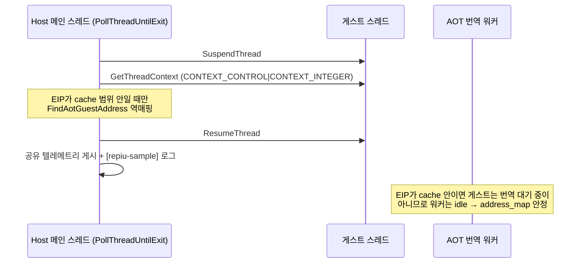

# 네이티브 구간 EIP 샘플링 텔레메트리 설계
# Native-Phase EIP Sampling Telemetry Design

## 개요 (Overview)

600초 장기 관측(`docs/analysis/current-execution-frontier.md` 2026-07-14 항목)에서 150초 이후 **디스패치·heartbeat·single-step이 모두 정지한 순수 네이티브 상태**가 450초 이상 지속됨을 확인했습니다. 현 텔레메트리는 예외 디스패치 시점에만 게스트 상태를 기록하므로, 디스패치가 0인 구간에서는 게스트가 어디에서 무엇을 하는지 관측할 수 없습니다.

후보는 세 가지입니다.

1. 게임 내부 tick/플래그 폴링 무한 대기 (IRQ0 게스트 핸들러 미호출로 게임 자체 카운터 정지)
2. 번역 코드 결함으로 인한 네이티브 무한 루프
3. 초장시간 네이티브 연산 (가능성 낮음)

이번 작업은 **게스트 스레드 context를 주기적으로 캡처하는 EIP 샘플링 텔레메트리**를 추가하여 이 세 후보를 구분하는 것이 목표입니다.

A 600-second observation shows a dispatch-silent pure-native state lasting over 450 seconds. Current telemetry records guest state only at exception dispatches, so a zero-dispatch phase is unobservable. This task adds periodic guest-thread context sampling (EIP sampling telemetry) to distinguish an in-memory polling wait, a translated-code infinite loop, and genuinely long native compute.

---

## 접근 방식 비교 (Approach Comparison)

| 방식 | 내용 | 장점 | 한계 |
| --- | --- | --- | --- |
| A. supervisor 프로세스 측 샘플링 | supervisor가 자식 프로세스의 게스트 스레드를 `OpenThread` 후 suspend/`GetThreadContext` | 로더 무변경 | cache 주소 → 게스트 주소 역매핑(`FindAotGuestAddress`)이 로더 프로세스 내부 자료구조(`Win32AotCodeCachePlacement`)에 있어 원격으로 불가능. 스레드 ID 공유·권한 처리 추가 필요 |
| B. 로더 내부 폴러 샘플링 (권장) | 이미 게스트 스레드 handle을 들고 1ms 주기로 도는 `PollThreadUntilExit`(host 메인 스레드)에서 suspend/`GetThreadContext`/resume 후 역매핑하여 공유 텔레메트리에 게시 | 역매핑 가능, supervisor는 기존처럼 수동 판독만, 스레드 handle 이미 보유 | 로더 변경 필요 |

**선택: B.** 샘플의 진단 가치는 cache 주소가 아니라 **게스트 주소**에 있으며, 역매핑은 프로세스 내부에서만 가능합니다. supervisor는 공유 텔레메트리 신규 필드를 출력만 합니다.

**Chosen: B.** The diagnostic value of a sample is the guest address, and cache-to-guest reverse mapping (`FindAotGuestAddress`) requires in-process access to the placement. The host main thread inside `PollThreadUntilExit` already owns the guest thread handle and polls at millisecond cadence; the supervisor remains a passive reader of new shared-telemetry fields.

---

## 세부 설계 (Detailed Design)

### 1. 샘플링 절차 (Sampling procedure)

1. `SuspendThread(guest)` — 실패(-1)하면 스레드 종료 중이므로 skip.
2. `GetThreadContext`로 EIP와 정수 레지스터(EAX/EBX/ECX/EDX/ESI/EDI/ESP/EBP, EFLAGS)를 캡처.
3. EIP가 AOT cache 범위(`placement.base_address` ~ `+size`) 안이면 `FindAotGuestAddress`로 게스트 주소를 역매핑.
4. `ResumeThread` — GetThreadContext 실패 여부와 무관하게 항상 호출.
5. suspend~resume 사이에는 **heap 할당, lock 획득, I/O를 하지 않는다** (게스트 스레드가 heap lock 등을 쥔 채 정지될 수 있으므로 교착 방지). stderr 출력과 공유 메모리 게시는 resume 이후 수행.

### 2. 역매핑 동시성 안전 근거 (Reverse-mapping concurrency safety)

`Win32AotCodeCachePlacement`(address_map 벡터 포함)를 변경하는 주체는 AOT 번역 워커뿐이며, 워커는 **게스트 스레드가 `aot_translation_complete_event`를 기다리며 블록된 동안에만** 동작합니다 (`RequestAotDynamicTranslation` 계열은 모두 요청 후 INFINITE 대기).

따라서 다음 불변식이 성립합니다.

* 샘플된 EIP가 **cache 범위 안** → 게스트 스레드는 네이티브 번역 코드를 실행 중 → 번역 요청 대기 상태가 아님 → 워커 idle → `address_map` 순회 안전.
* 샘플된 EIP가 **cache 범위 밖**(host 디스패처, 대기 코드 등) → 워커가 변경 중일 수 있으므로 **역매핑을 시도하지 않고** 원시 EIP만 기록.

The placement is mutated only by the AOT worker, and the worker runs only while the guest thread is blocked waiting on the completion event. If the sampled EIP lies inside the cache range, the guest is executing translated native code, hence not blocked on a request, hence the worker is idle and traversing `address_map` is race-free. If the EIP is outside the cache, the sampler records the raw EIP without reverse mapping.

### 3. 샘플링 게이트와 주기 (Gating and cadence)

* `PollThreadUntilExit`의 기존 progress 추적(디스패치/single-step/AOT boundary 카운터)이 **1,000ms 이상 무진행**일 때만 샘플링을 활성화합니다. 관측 대상이 무디스패치 네이티브 구간이므로 디스패치 활발 구간에서는 게스트를 정지시키지 않습니다.
* 활성 상태에서 샘플 주기는 **500ms** (초당 2회). suspend/GetThreadContext/resume 비용은 회당 마이크로초 단위로 무시 가능한 수준입니다.
* 진행이 재개되면 quiet 추적이 리셋되어 샘플링이 자동으로 중단됩니다.

### 4. 텔레메트리 자료구조 (Telemetry structure)

`Win32SharedLiveTelemetry` version을 8 → 9로 올리고 다음 필드를 추가합니다.

| 필드 | 의미 |
| --- | --- |
| `native_sample_count` | 누적 샘플 수 |
| `native_sample_unmapped_count` | cache 밖(host 코드 등)이거나 역매핑 실패한 샘플 수 |
| `native_sample_eip` | 최신 샘플 원시 EIP |
| `native_sample_guest_eip` | 최신 샘플의 역매핑된 게스트 주소 (실패 시 0) |
| `native_sample_eax`~`native_sample_ebp` (8개) | 최신 샘플 정수 레지스터 |
| `native_sample_eflags` | 최신 샘플 EFLAGS |
| `native_sample_ring[8]` | 최근 8개 샘플의 게스트 주소(역매핑 실패 시 원시 EIP) 링 |
| `native_sample_ring_mapped_bits` | 링 각 슬롯의 역매핑 성공 여부 비트마스크 |
| `native_sample_ring_cursor` | 링의 다음 기록 위치 |

로더와 supervisor가 같은 헤더를 공유하므로 version 불일치는 기존 열기 검사에서 차단됩니다.

### 5. 파일 배치 (File placement)

구현 규칙(거대 파일 누적 금지)에 따라 샘플러를 전용 파일로 분리합니다.

* `src/platform/win32/native_phase_sampler.h` / `.cpp` — 샘플 캡처, 역매핑, 링/텔레메트리 게시, `[repiu-sample]` stderr 출력 (`native_fast_path.h`와 같은 플랫폼 로컬 배치).
* `src/platform/win32/execution_trampoline.cpp` — `PollThreadUntilExit`에 게이트·주기 판단과 호출만 추가 (orchestration).
* `include/repiu/platform/win32/live_telemetry.h` — 필드 추가, version 9.
* `src/host/win32/supervisor_main.cpp` — `PrintSnapshot`에 신규 필드 출력.

### 6. 판정 기준 (Interpretation criteria)

| 관측 형태 | 판정 |
| --- | --- |
| 링의 게스트 주소가 소수(1~수 개) 지점을 반복 | 폴링 대기 또는 소형 무한 루프 — 해당 주소의 정적 디스어셈블리로 폴링 대상 메모리를 식별 (후보 1·2 구분) |
| 링의 게스트 주소가 넓은 범위를 이동 | 실제 장시간 연산 (후보 3) |
| 샘플이 계속 cache 밖 host 코드 | 게스트가 host 코드에 블록됨 — 새 진단 대상 |

### English Summary

The host main thread inside `PollThreadUntilExit` samples the guest thread every 500 ms, but only after the existing progress counters have been quiet for at least 1,000 ms. Each sample suspends the thread, captures `CONTEXT_CONTROL|CONTEXT_INTEGER`, reverse-maps the EIP through `FindAotGuestAddress` only when it lies inside the AOT cache range (which guarantees the translation worker is idle, making the traversal race-free), resumes the thread, and only then publishes to shared telemetry (`Win32SharedLiveTelemetry` version 9: latest sample registers plus an 8-entry guest-EIP ring with a mapped-bit mask) and writes a `[repiu-sample]` stderr line. No allocation, locking, or I/O happens between suspend and resume. The sampler lives in dedicated files (`src/platform/win32/native_phase_sampler.{h,cpp}`); the trampoline only orchestrates, and the supervisor prints the new fields. A repeating small EIP set indicates a polling wait or tight loop; a wide-ranging set indicates genuine long compute; persistent host-code samples indicate the guest is blocked in host code.

---

## 기대 효과 및 검증 (Expected Impact & Verification)

* 무디스패치 구간의 게스트 위치가 1초 이내 해상도로 관측되어, 2026-07-14 관측의 미확정 상태(폴링 대기/무한 루프/장시간 연산)를 판정할 수 있습니다.
* 검증: win32_x86_debug 빌드 후 `REPIU_EXECUTION_TIMEOUT_MS=0`, `REPIU_EXECUTION_BACKEND=aot-dynamic` 환경에서 `repiu_supervisor_win32.exe pumpit1 240000`을 구동하여 (1) 자산 사이클의 네이티브 구간과 150초 이후 구간에서 `[repiu-sample]`과 supervisor 스냅샷의 링이 채워짐, (2) 디스패치 활발 구간에서 샘플 수가 증가하지 않음, (3) 기존 실행 결과(디스패치 균형, 예외 부재)에 회귀가 없음을 확인합니다.

---

## 구현 중 확정·변경 사항 (Confirmed and Changed During Implementation)

구현·검증 과정에서 다음이 원안과 다르게 확정되었습니다. 관측 결과 자체는 `docs/analysis/current-execution-frontier.md`의 2026-07-15 항목에 기록합니다.

1. **샘플링 게이트 기준 변경 (progressed → dispatch 카운터).** 원안은 `PollThreadUntilExit`의 기존 progress 추적을 게이트로 쓰려 했으나, 경량 VEH AOT 경로(`HandleAotReentry`/`HandleAotIndirectTransfer` 등)는 `ExceptionDispatchScope` 없이 `aot_boundary/reentry_count`를 초당 수천 회 증가시켜 progressed가 항상 true였습니다. 게이트를 `exception_dispatch_entry/exit_count` 합계의 1,000ms 무변화 기준으로 교체했습니다.
2. **경량 VEH 카운터의 공유 텔레메트리 미러링.** `aot_boundary/reentry_count`를 게스트 스레드가 직접 `Win32SharedLiveTelemetry`에 미러링하여(`BumpAot*Count`), host 폴 루프 정지와 무관하게 외부에서 관측 가능하게 했습니다.
3. **캡처 실패 진단.** 샘플에 `failure_stage`/`windows_error`를 추가하고, 공유 텔레메트리 `native_sample_stage`(1=suspend, 2=context, 3=역매핑, 4=resume 완료)로 정지 지점을 외부에서 판별할 수 있게 했습니다. `REPIU_NATIVE_SAMPLING=0` kill switch를 추가했습니다.
4. **미매핑 샘플의 게스트 귀속.** host 코드에 찍힌 샘플을 게스트 위치로 귀속하기 위해 `aot_last_indirect_source/target`을 샘플에 동봉합니다.
5. **supervisor 외부 샘플러 추가.** 로더가 게스트/메인 스레드 ID와 AOT cache 범위를 공유 텔레메트리에 게시하고, supervisor는 디스패치·샘플 카운터가 3초 이상 정지하면 `OpenThread`+`GetThreadContext`로 자식 스레드 context를 크로스 프로세스 캡처합니다(`[repiu-supervisor-sample]`). 로더 내부 폴러가 정지해도 관측이 유지되며, 실제로 이 경로가 게스트 스레드 소멸(OpenThread `ERROR_INVALID_PARAMETER`)을 확정했습니다.
6. **teardown 단계 마커.** 게스트 종료 후 로더 정리 경로의 정지 지점을 찾기 위해 `host_phase`에 teardown 마일스톤(10~14)을 게시합니다.

Implementation confirmed the following deviations: the sampler gate had to move from the composite `progressed` tracker to the dispatch entry/exit counters, because lightweight VEH AOT paths increment `aot_boundary/reentry` thousands of times per second without any dispatch; those counters are now mirrored into shared telemetry by the guest thread itself; capture failures carry stage/error diagnostics plus a `native_sample_stage` shared marker and a `REPIU_NATIVE_SAMPLING=0` kill switch; unmapped host-code samples carry `aot_last_indirect_source/target` for guest attribution; the loader publishes guest/main thread IDs and the cache range so the supervisor can sample child threads externally when telemetry stalls (this path proved the guest thread had terminated); and teardown milestones (10–14) are published through `host_phase`.
