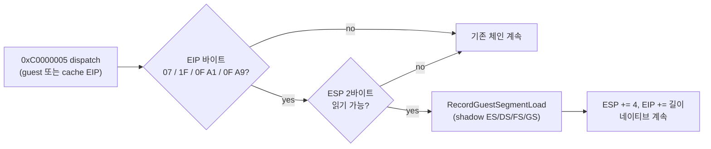

# 세그먼트 POP 에필로그 HLE 설계
# Segment POP Epilogue HLE Design

## 개요 (Overview)

Task 204의 EIP 샘플링(`docs/analysis/current-execution-frontier.md` 2026-07-15 항목)으로 현재 실행 frontier가 다음임을 확정했습니다.

guest `0x030F5074`(cache `0x06BF4334`)의 **`POP ES`(opcode `0x07`)** 가 게스트 selector 값을 실제 ES에 적재하려다 미처리 0xC0000005를 일으켜 게스트 스레드가 종료됩니다. 주변 바이트는 다음과 같은 **세그먼트 복원 에필로그**입니다.

```asm
add esp, 4
pop ebp
pop gs        ; 0F A9
pop fs        ; 0F A1
pop es        ; 07     <- 미처리 fault 지점
pop edi
pop esi
pop edx
pop ecx
pop ebx
ret
```

원인: 기존 `HandleSegmentPopInstruction`(`src/platform/win32/execution_trampoline.cpp`)이 **`0x1F`(POP DS)만** 인식합니다. POP ES/FS/GS 형태는 어떤 핸들러도 받지 않아 dispatch가 실패로 끝납니다.

Task 204 sampling identified the execution frontier as the unhandled `POP ES` (opcode `07`) at guest `0x030F5074`, inside a segment-restore epilogue (`pop ebp; pop gs; pop fs; pop es; pop edi; …; ret`). The existing `HandleSegmentPopInstruction` recognizes only `1F` (POP DS), so the ES/FS/GS pop forms fall through the dispatch chain and the guest thread dies on the resulting access violation.

---

## 설계 (Design)

### 접근 방식

기존 POP DS 처리와 동일한 **shadow 세그먼트 의미**를 POP ES/FS/GS로 확장합니다. 실제 host 세그먼트 레지스터는 적재하지 않고, 게스트 스택에서 selector를 읽어 `RecordGuestSegmentLoad`(shadow `guest_es/fs/gs` 갱신 + provisional descriptor 등록)로 기록한 뒤 `ESP += 4`, `EIP += 길이`로 전진합니다.

| Opcode | 명령 | segment index | EIP 전진 |
| --- | --- | ---: | ---: |
| `07` | POP ES | 0 | +1 |
| `1F` | POP DS (기존) | 3 | +1 |
| `0F A1` | POP FS | 4 | +2 |
| `0F A9` | POP GS | 5 | +2 |

* **POP SS(`17`)는 제외**합니다. 이번 에필로그에서 관측되지 않았고, SS는 interrupt-inhibit 특수 의미가 있어 관측 전 선제 구현을 하지 않는 기존 원칙(observed HLE)을 따릅니다.
* selector 값 검증은 하지 않습니다. shadow에 기록만 하므로 임의 값도 안전하며, 이후 접근은 기존 selector translation 경로가 처리합니다.

### AOT 경로 동작 근거

이 fault는 AOT cache 주소에서 access violation으로 dispatch되며, `HandleSegmentPopInstruction`은 `EIP`의 바이트를 직접 패턴 매칭하므로 cache 주소에서도 그대로 동작합니다. POP Sreg는 plain 명령이라 AOT 번역이 바이트를 그대로 복사(`emitted_length == guest_length`)하므로, cache 좌표에서 `EIP += 길이` 전진은 블록 내 다음 번역 명령으로 정확히 이어집니다. 뒤따르는 `ret`은 블록 방출 시점에 이미 return-continuation 처리되어 있습니다.

오검출 위험: faulting EIP의 첫 바이트가 `07`/`0F A1`/`0F A9`이면 해당 명령 자체가 fault 명령이므로 단일 바이트 opcode 특성상 오검출이 없습니다. 스택 읽기는 기존과 동일하게 `IsGuestRangeReadable` 검증 후 수행합니다(실패 시 기존 dispatch 흐름으로 후퇴하는 fail-closed).



### English Summary

Extend `HandleSegmentPopInstruction` from the single `1F` (POP DS) form to `07` (POP ES, index 0), `0F A1` (POP FS, index 4), and `0F A9` (POP GS, index 5), reusing the existing shadow semantics: read the selector from the guest stack, record it through `RecordGuestSegmentLoad` (shadow register + provisional descriptor), advance `ESP` by 4 and `EIP` by the instruction length, and never load the real host segment register. The handler pattern-matches bytes at the faulting EIP, so it works identically at AOT cache addresses, where plain instructions are verbatim copies and the +1/+2 advance lands on the next translated instruction. `POP SS` (`17`) stays unimplemented until observed, and an unreadable stack falls through to the existing dispatch chain (fail-closed).

---

## 기대 효과 및 검증 (Expected Impact & Verification)

* guest `0x030F5074` 에필로그를 통과해 게스트 스레드 종료가 사라지고, 150초 이후 실행이 계속되어 다음 frontier가 드러날 것으로 기대합니다.
* 검증: win32_x86_debug 빌드 후 `REPIU_EXECUTION_BACKEND=aot-dynamic` 환경에서 `repiu_supervisor_win32.exe pumpit1 240000` 구동으로 (1) 약 150초 지점에서 `original entry raised a caught exception` 종료가 사라짐, (2) 디스패치·aot 카운터·샘플링이 150초 이후에도 지속됨, (3) `dos4gw_hello` 회귀 없음을 확인합니다.

---

## 구현 후 판정 (Post-Implementation Verdict)

**수정됨:** 구현은 설계대로 동작하지만(세그먼트 로드 trace로 POP GS/ES 처리 확인, 처리 건수 8,481 → 11,443, 회귀 없음), 게스트 종료는 동일하게 재현되었습니다. 검증 중 `AOT exception cache/guest mapping` 로그로 **종료 예외가 POP ES가 아니라 guest `0x030873F4`의 디코드 루프 스토어(`mov [ebx+ebp], al` → 미매핑 `0x045D3EB0`)임을 확인**했습니다. 본 설계의 전제였던 Task 204의 판정은 `Relocated exception byte window` 진단이 stale `last_guest_eip`를 사용한 오판정이었습니다. 재판정과 다음 단계는 `docs/analysis/current-execution-frontier.md`의 2026-07-15 Task 205 항목과 `docs/work-logs/20260715-205-segment-pop-epilogue-hle-log.md`를 참조하십시오.

**Corrected:** the implementation behaves as designed (POP GS/ES handling confirmed by segment-load traces, handled count 8,481 → 11,443, no regression), but the guest death reproduces identically. Verification re-attributed the terminal exception via the `AOT exception cache/guest mapping` log to the decode-loop store at guest `0x030873F4` (`mov [ebx+ebp], al` into unmapped `0x045D3EB0`); the Task 204 premise of this design was a misattribution caused by the `Relocated exception byte window` diagnostic using the stale `last_guest_eip`. See the 2026-07-15 Task 205 entry in `docs/analysis/current-execution-frontier.md` and the work log for the re-attribution and next steps.
