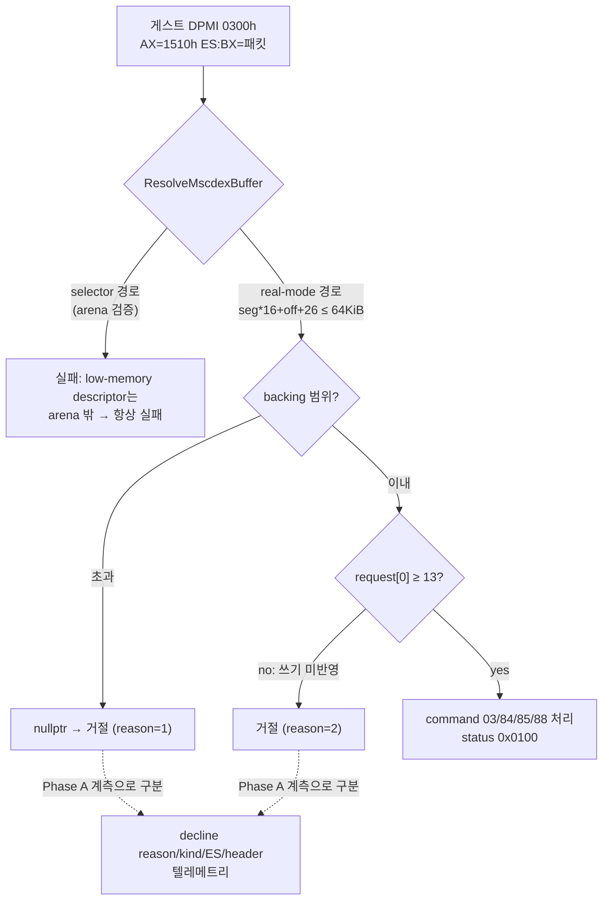

# MSCDEX real-mode 요청 거절 진단 및 해석 수정 설계 (Task 211)

## 배경

2026-07-16 300초 관측(`docs/analysis/current-execution-frontier.md`의 2026-07-16 항목)에서 PIU가 처음으로 MSCDEX를 실제 호출했다.

* `INT 2Fh AX=1500h` 탐지는 1건 응답되었다 (`mscdex_probe=1`).
* 이어서 DPMI `AX=0300h`(BL=2Fh) real-mode 프레임으로 `AX=1510h`(디바이스 드라이버 요청), `EBX=0`, `ECX=3`(가상 드라이브 D:와 일치)이 전달되었으나, `HandleMscdexRequest`의 request 카운트는 0으로 남았고 게스트에는 error 0x000F(carry)가 반환되었다.
* 그 결과 CD-DA 재생 요청이 시작되지 못했을 가능성이 있다. 기존 분석(`docs/analysis/pumpit1-mscdex-cd-audio.md`)의 "PIU 실제 play packet 미확인" 상태가 "요청은 왔으나 거절됨"으로 갱신되어야 한다.

## 거절 지점 분석 (코드 확인됨)

`HandleMscdexRequest`는 진입 직후 다음 두 조건으로 거절한다.

```cpp
std::uint8_t* request = ResolveMscdexBuffer(context, segment, offset, 26U);
if (request == nullptr || request[0] < 13U)
{
    return false;   // → 호출측이 AX=0x000F, carry 설정
}
```

`ResolveMscdexBuffer`의 두 해석 경로는 각각 다음 조건에서 실패한다.

1. **selector 경로** (`ResolveSegmentLinearRange`): 변환된 주소가 guest arena 안에서 읽기/쓰기 가능해야 성공한다. DPMI `AX=0100h`가 등록하는 real-mode block descriptor는 base가 low-memory 오프셋(작은 값)이라 arena 검증을 통과하지 못해 **구조적으로 항상 실패**한다.
2. **real-mode 경로**: `segment*16 + offset + 26 ≤ 65536`(64 KiB `DosLowMemory` backing) 안에서만 성공한다. 게스트가 64 KiB 밖의 conventional memory 세그먼트(예: `0x1000` 이상)를 전달하면 실패한다. 원본 DOS의 conventional memory는 640 KiB이므로 backing 크기 자체가 원본 모델보다 작다.
3. 두 경로가 모두 성공해도, 게스트가 쓴 요청 패킷이 `dos_low_memory` backing에 실제로 반영되지 않았다면(스토어 HLE 미커버) zero-init 값이 읽혀 `request[0]=0 < 13`으로 거절된다.

현 텔레메트리는 프레임 `EAX/EBX/ECX`만 기록하고 **`ES`(패킷 세그먼트)와 거절 사유를 기록하지 않아** 위 세 후보를 구분할 수 없다. 따라서 진단 계측을 먼저 넣고, 증거로 수정 방향을 확정한다.

## 설계

### Phase A — 거절 사유 진단 계측

VEH 핸들러 내부이므로 heap 할당 없이 Interlocked/단순 대입만 사용한다(기존 `0xC0000374` 재발 방지 원칙).

1. `ThreadContext`에 추가:
   * `std::uint16_t mscdex_frame_es` — 마지막 1510h 프레임의 ES.
   * `std::uint32_t mscdex_decline_count` — 초입 거절 횟수.
   * `std::uint32_t mscdex_last_decline_reason` — 0=없음, 1=버퍼 해석 실패, 2=헤더 길이 부족.
   * `std::uint32_t mscdex_last_resolve_kind` — 0=미해석, 1=selector 경로, 2=real-mode 경로.
   * `std::uint32_t mscdex_last_header_bytes` — 해석된 패킷의 첫 4바이트(LE).
2. `ResolveMscdexBuffer`가 해석 경로(kind)를 보고하도록 out-parameter를 추가한다.
3. DPMI `0300h/1510h` 경로와 `INT 2Fh AX=1510h` 직접 경로 양쪽에서 위 필드를 기록한다.
4. `Win32SharedLiveTelemetry` version 9→10: `mscdex_frame_es`, `mscdex_decline_reason`, `mscdex_resolve_kind`, `mscdex_header` 필드를 추가하고 supervisor 스냅샷 출력을 확장한다.
5. attempt 요약(main.cpp)에 `Win32 MSCDEX frame ES / decline reason / resolve kind / header` 라인을 추가한다.

### Phase B — 증거 기반 수정 (후보)

| 진단 결과 | 수정 |
| --- | --- |
| real-mode 경로가 64 KiB 초과로 실패 | `DosLowMemory` backing을 원본 conventional memory 모델(640 KiB)로 확장. 크기 상수 의존처(`kDosLowMemorySize` 사용처, BDA `0x46C` 틱 등)를 함께 검증 |
| 해석은 성공하나 헤더가 0 | 게스트의 패킷 스토어 명령 형태를 low-memory store HLE 커버리지에 추가 (관찰된 opcode 기반) |
| selector 값이 ES로 전달됨 | `ResolveMscdexBuffer` selector 경로가 low-memory 기반 descriptor(base < backing 크기)를 `dos_low_memory` backing 포인터로 매핑하도록 확장 |



## 검증 계획

* 빌드: `build\win32_x86_debug` 전체 빌드 통과.
* **재현 제약 (확인됨):** 머지된 main의 aot-dynamic은 `0x030F3438` assertion 폭풍(progress=0, 약 137k dispatch/s)에 갇혀 MSCDEX 경로에 도달하지 못한다(90초 재현 구동으로 확인, Task 210 대기). 검증 경로는 다음 순서로 시도한다.
  1. 기본 trap 백엔드 600초 구동으로 MSCDEX 도달 여부 확인.
  2. 도달 불가 시, **진단 목적의 임시 로컬 실험**: `ReadGuestSegmentSelector`의 물리 레지스터 우선 반환을 작업 사본에서만 비활성화(커밋하지 않음)하여 99f60de 수준의 도달성을 복원한 뒤 진단 데이터를 수집한다. 실험 여부와 결과는 작업 로그에 명시한다.
* 성공 판정: (Phase A) `mscdex_decline_reason/resolve_kind/frame_es/header`로 거절 원인 1건 이상 확정. (Phase B) `mscdex_request_count ≥ 1` 및 command 처리 status `0x0100` 관측, 가능하면 command `84h`(Play) 도달.
* 검증 후 `docs/analysis/pumpit1-mscdex-cd-audio.md`와 `docs/analysis/current-execution-frontier.md`를 같은 작업에서 갱신한다.

---

# MSCDEX Real-Mode Request Decline Diagnosis and Resolution Fix (Task 211)

## Background

The 2026-07-16 300-second observation recorded PIU's first real MSCDEX traffic: the `INT 2Fh AX=1500h` probe was answered once, then a DPMI `AX=0300h` real-mode frame carrying `AX=1510h`, `EBX=0`, `ECX=3` (matching virtual drive D:) arrived — but `HandleMscdexRequest`'s request count stayed 0, meaning the early-out rejection fired and the guest received error 0x000F with carry set. CD-DA playback therefore never started. The prior "PIU's concrete play packet unconfirmed" state in `docs/analysis/pumpit1-mscdex-cd-audio.md` must be updated to "request arrived but was declined."

## Decline Sites (confirmed in code)

`HandleMscdexRequest` declines immediately when `ResolveMscdexBuffer(context, segment, offset, 26)` returns nullptr or the header length byte `request[0]` is below 13. `ResolveMscdexBuffer` fails when: (1) the selector path — DPMI `AX=0100h` descriptors carry low-memory-offset bases that can never pass the guest-arena validation in `ResolveSegmentLinearRange`, so this path structurally fails; (2) the real-mode path — `segment*16 + offset + 26` exceeds the 64 KiB `DosLowMemory` backing (real conventional memory is 640 KiB); or (3) both resolve but the guest's packet stores never reached the backing, leaving `request[0] = 0`. Current telemetry records only frame EAX/EBX/ECX — not ES or the decline reason — so the three candidates cannot be distinguished. Diagnosis instrumentation comes first; the fix follows the evidence.

## Design

**Phase A (diagnosis, VEH-safe: interlocked/plain stores only):** add `mscdex_frame_es`, `mscdex_decline_count`, `mscdex_last_decline_reason` (1=resolve failure, 2=short header), `mscdex_last_resolve_kind` (1=selector, 2=real-mode), and `mscdex_last_header_bytes` to `ThreadContext`; report the resolve kind from `ResolveMscdexBuffer` via an out-parameter; record on both the DPMI `0300h/1510h` and direct `INT 2Fh AX=1510h` paths; extend `Win32SharedLiveTelemetry` (version 10) and the supervisor snapshot; print the new fields in the attempt summary.

**Phase B (fix, evidence-based):** enlarge the `DosLowMemory` backing to the original 640 KiB conventional-memory model if the real-mode path overflows 64 KiB; extend low-memory store HLE coverage if resolution succeeds but the header reads zero; map low-memory-based descriptors onto the `dos_low_memory` backing in the selector path if the guest passes a selector.

## Verification Plan

Full `build\win32_x86_debug` build. Reproduction constraint (confirmed): merged main under aot-dynamic is stuck in the `0x030F3438` assertion storm (progress=0, ~137k dispatches/s; Task 210 pending) and never reaches MSCDEX. Verification order: (1) a 600-second default trap-backend run; (2) if unreachable, a documented, uncommitted local experiment disabling the physical-register preference in `ReadGuestSegmentSelector` to restore 99f60de-level reachability for diagnosis. Success criteria: the decline reason pinned by Phase A telemetry, then `mscdex_request_count ≥ 1` with status `0x0100` (ideally command `84h` Play) after Phase B. Update the MSCDEX and frontier analysis documents in the same task.
