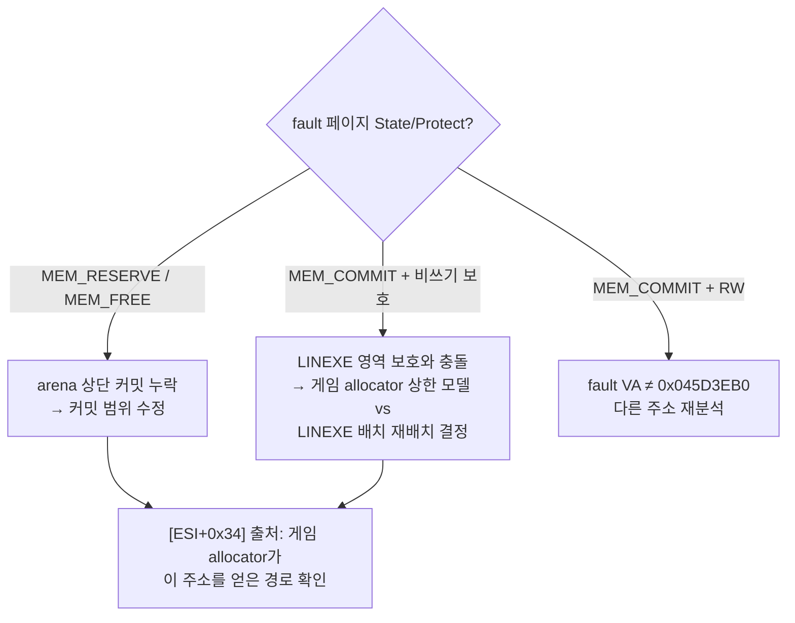

# 디코드 출력 버퍼 0x045D3EB0 provenance 진단 설계 (Task 212)

## 배경

Task 205~206에서 확정된 현재 실행 frontier는 65,536-레코드 디코드 루프의 출력 스토어다.

```asm
; guest 0x030873F4
mov [ebx+ebp], al        ; EBX=0x045D3EB0, EBP=0 → 0x045D3EB0 쓰기 → 0xC0000005
mov eax, [esi+0x34]      ; 출력 포인터는 [ESI+0x34]에서 적재 (ESI=0x041B6B50)
```

Task 210 해소로 main의 두 백엔드가 이 frontier까지 다시 도달하므로(180초 aot-dynamic에서 재확인), 이제 이 주소의 provenance를 진단한다.

## 정적 분석으로 확인된 사실

1. **`0x045D3EB0`은 LINEXE 합성 영역 안이다.** `BuildLinexeArenaLayout`은 arena 끝(`0x045D7000`)에서 아래로 client(4 KiB, `0x045C6000`)/gate code/bss/private data를 배치하며, 실측 로그 기준 private data는 `0x045D2000`~`0x045D7000`이다. fault 주소는 private data 시작 `+0x1EB0`이다.
2. **게임의 동적 allocator 상한은 `client_data_base`(`0x045C6000`)여야 한다** (`dynamic_allocator_end = client_data_base`, "dynamic allocator range precedes extracted LINEXE segments"). 즉 게임 포인터가 `0x045D3EB0`에 도달했다면 allocator 모델과 LINEXE 배치가 **주소 공간을 공유(충돌)** 하고 있을 가능성이 있다.
3. private data 영역은 LINEXE extraction 성공 시 `PAGE_READWRITE`로 보호된다 — 이 경우 쓰기가 AV일 수 없으므로, **fault의 실제 페이지 상태(비커밋? 보호? 다른 주소?)를 실측으로 확정해야 한다.**
4. `INT 21h AH=4Ah` resize HLE는 selector `0x24`의 `0xE700` 초과 요청만 거절하고 나머지는 무조건 성공을 보고하며 크기를 추적하지 않는다 — 게임 allocator가 자신이 소유했다고 믿는 범위와 실제 커밋 범위가 다를 수 있다.

## 진단 설계 (Phase A)

SEH 필터 `CaptureException`(게스트 스레드, 크래시 순간)에서 다음을 캡처한다. teardown이나 사후 상태 변화의 영향을 받지 않는다.

1. `EXCEPTION_RECORD.ExceptionInformation[0]/[1]` — 접근 종류(read/write/DEP)와 **정확한 fault 가상 주소**.
2. fault 주소의 `VirtualQuery` 결과 — region base / allocation base / `State`(커밋 여부) / `Protect` / region size. "미매핑"인지 "보호 위반"인지 즉시 판별된다.
3. `[ESI+0x20 .. +0x3C]` 8 dword의 checked 덤프(`ReadProcessMemory` self, 실패 무해) — 출력 포인터 필드(`+0x34`)와 인접 필드로 디코드 구조체의 실체(버퍼 base/용량/인덱스)를 확인한다.

모두 attempt 요약(`Win32 minimal execution exception access/fault VA`, `Win32 exception fault page ...`, `Win32 exception ESI structure ...`)으로 출력한다.

## 판별 트리 (Phase B 방향)



* **커밋 누락**이면: 게임 allocator가 사용 가능하다고 믿는 범위를 실제로 커밋한다(정확성 우선 원칙, Task 205 미확정 2-(a)).
* **LINEXE 충돌**이면: 게임 allocator 상한을 resize HLE에서 `dynamic_allocator_end` 기준으로 보고하도록 고치거나, LINEXE 합성 영역을 arena 밖(별도 reserve)으로 이전한다 — 설계 결정 필요.

## 검증 계획

* 빌드 통과 후 `REPIU_EXECUTION_BACKEND=aot-dynamic` 180초 구동(게스트 종료 ~147초 후 요약 출력)에서 새 진단 라인 3종을 회수한다.
* 진단 자체는 행동 불변(관찰 전용)이므로 회귀 기준은 기존 180초 기준선과 동일 거동이다.

---

# Decode Output Buffer 0x045D3EB0 Provenance Diagnosis (Task 212)

The current frontier (Tasks 205–206) is the decode loop's byte store at guest `0x030873F4` writing `EBX=0x045D3EB0` (output pointer loaded from `[ESI+0x34]`, `ESI=0x041B6B50`). Static findings: `0x045D3EB0` lies inside the LINEXE synthetic private-data region (`0x045D2000`–`0x045D7000`, carved downward from the arena end by `BuildLinexeArenaLayout`); the game's dynamic allocator range is supposed to end at `client_data_base` (`0x045C6000`), so a game pointer reaching this address suggests an address-space collision between the allocator model and the LINEXE layout; the private-data region is `PAGE_READWRITE` when extraction succeeds, so a write AV there is not yet explained and the actual fault page state must be measured; the `AH=4Ah` resize HLE reports success unconditionally (except one observed limit) without tracking sizes.

Phase A captures, inside the SEH filter at crash time: `ExceptionInformation[0]/[1]` (access kind, exact fault VA), `VirtualQuery` of the fault VA (state/protect/region), and a checked dump of `[ESI+0x20..0x3C]` to identify the decode structure's buffer base/capacity fields. Decision tree: uncommitted page → commit the range the allocator legitimately believes it owns (accuracy-first); committed but non-writable → resolve the allocator-ceiling vs LINEXE-layout collision (report the real ceiling in the resize HLE or relocate the synthetic region); committed RW → re-analyze with the true fault VA. Verification: a 180-second aot-dynamic run recovers the three new diagnostic lines; the diagnostics are observation-only so behavior must match the existing 180-second baseline.
