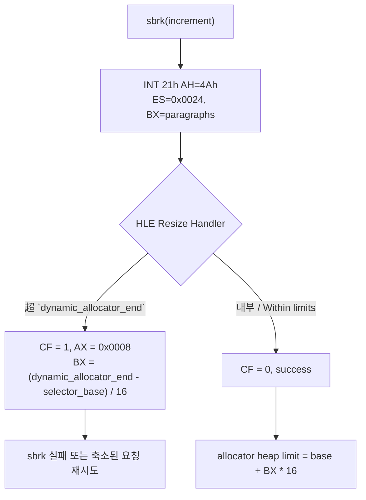

# Resize HLE 크기 추적과 Allocator Heap 상한 모델링 설계 (Task 213)

## 배경 / Background

Task 212의 진단 결과, 디코드 루프의 예외는 미매핑 쓰기가 아니라 **arena 끝 `0x045D7000`(MEM_FREE)을 초과한 arena-end overflow**였습니다. 디코드 출력 버퍼 base `0x045D3EB0`부터 `0x3150`바이트가 정상 기록되는 과정에서 LINEXE 합성 private data 영역(`0x045D2000`~`0x045D7000`)이 조용히 훼손되고 있었으며, 경계를 넘어서는 순간 access violation이 발생했습니다.

게임 allocator는 `client_data_base`(`0x045C6000`) 아래인 `dynamic_allocator_end`를 상한으로 준수해야 하지만, 실제로는 이를 넘어선 메모리를 할당했습니다. 이 설계에서는 allocator가 자신의 heap 상한을 인식하는 출처를 제어하여 충돌을 해결합니다.

---

## 1. Allocator Heap 상한의 결정 메커니즘 / Heap Ceiling Determination Mechanism

### 역추적 결과 / Backtracking Results

1. **`INT 21h AH=4Ah` (Resize Memory Block)**: Watcom C runtime heap manager(특히 `sbrk`)는 DPMI 환경에서 메모리를 추가 확보하기 위해 DOS resize 서비스를 주기적으로 호출합니다.
2. **요청 파라미터**: `ES` = resize 대상 block selector (PIU.EXE object 2는 data segment로서 selector `0x24`에 할당됨), `BX` = 요청할 크기(paragraphs, 16-byte 단위).
3. **성공/실패 응답**:
   - 성공 시: Carry flag(CF) = 0. allocator는 해당 segment의 limit가 `BX * 16`으로 안전하게 확장되었다고 판단하고, 이를 새로운 heap top으로 간주합니다.
   - 실패 시: Carry flag(CF) = 1. `AX` = 에러 코드 (`0x0008` = insufficient memory), `BX` = 실제 확보 가능한 최대 paragraphs. allocator는 `BX`로 반환된 값을 보고 차후 다시 시도하거나 heap allocation 실패를 처리합니다.

---

## 2. 대응 방향: (a) allocator 상한 모델링 / Direction (a): Allocator Ceiling Modeling

임시로 slack을 늘려 문제를 회피하는 대신, allocator가 인식하는 heap 상한을 LINEXE 합성 영역 앞인 `dynamic_allocator_end`로 정확히 제한하여 충돌을 원천 차단합니다.

### 세부 설계 / Detailed Design

1. **`ThreadContext`에 `dynamic_allocator_end` 보존**:
   - `BuildLinexeArenaLayout`에 의해 계산된 `layout.dynamic_allocator_end` 값을 `ThreadContext`에 보존합니다.
2. **동적 상한 계산**:
   - `HandleDosResizeMemoryBlock`에서 `ES` selector의 base 주소를 `SelectorTable`에서 조회합니다.
   - `limit_paragraphs = (dynamic_allocator_end - selector_base) / 16`으로 해당 selector가 가질 수 있는 최대 paragraph를 동적으로 계산합니다.
3. **엄격한 크기 제어**:
   - 요청된 `BX` paragraphs가 `limit_paragraphs`를 초과하면:
     - carry flag를 set합니다.
     - `AX` 하위 16비트에 `0x0008`(insufficient memory)을 기록합니다.
     - `BX` 하위 16비트에 실제 할당 가능한 최대인 `limit_paragraphs`를 반환합니다.
     - 이는 Watcom `sbrk`가 축소된 크기로 재시도하거나 메모리 부족을 안전하게 인지하도록 돕습니다.
   - 초과하지 않으면:
     - carry flag를 clear하고 성공 처리합니다.
4. **기존 하드코딩 제거**:
   - `0xE700` (piu_1st 임시 상한) 및 `0x4AE0` (stage.cfg 실패 분기 상한) 하드코딩 논리를 모두 제거하고, 위의 `dynamic_allocator_end` 기반 동적 상한 논리로 단일화합니다.
5. **텔레메트리 보완**:
   - `ThreadContext` 및 `Win32ExecutionAttempt`에 `last_dos_resize_requested_end` 및 `last_dos_resize_allocator_end`를 기록하여, resize 요청이 가리킨 가상 주소 영역과 최종 적용된 allocator limit를 명확히 진단할 수 있도록 합니다.

---

# Design: Resize HLE Paragraph Tracking & Allocator Heap Ceiling Modeling (Task 213)

## Background

Diagnosis in Task 212 showed the terminal exception in the decode loop was an **arena-end overflow crossing `0x045D7000`** rather than a generic unmapped write. In writing `0x3150` bytes from output buffer base `0x045D3EB0`, the guest allocator silent corrupted the LINEXE synthetic private-data region (`0x045D2000`–`0x045D7000`) and crashed at the boundary. The guest allocator must respect `dynamic_allocator_end` (beneath `0x045C6000`). We resolve this collision by modeling the allocator's source of heap limits.

## 1. Heap Ceiling Determination Mechanism

### Findings
1. **`INT 21h AH=4Ah` (Resize Memory Block)**: The Watcom heap manager (`sbrk`) periodically resizes its primary block under DPMI to expand memory.
2. **Parameters**: `ES` = target selector (object 2 is mapped to `0x24`), `BX` = paragraphs requested (16-byte units).
3. **Response Contract**:
   - Success: `CF` = 0. The allocator assumes the segment limit is expanded to `BX * 16` and sets it as the new heap top.
   - Failure: `CF` = 1, `AX` = `0x0008` (insufficient memory), `BX` = maximum available paragraphs. The allocator retries with a smaller request or handles the out-of-memory state.

## 2. Proposed Fix: Direction (a) Allocator Ceiling Modeling

We precisely limit the allocator's heap top to `dynamic_allocator_end` (before the LINEXE region) rather than expanding arena slack.

### Design Details
1. **Store `dynamic_allocator_end` in `ThreadContext`**: Copied from `BuildLinexeArenaLayout`.
2. **Compute Dynamic Ceiling**:
   - Look up the base of selector `ES` in the `SelectorTable`.
   - Calculate `limit_paragraphs = (dynamic_allocator_end - selector_base) / 16`.
3. **Strict Bounds Checking**:
   - If `BX > limit_paragraphs`:
     - Set carry flag.
     - Write `0x0008` (insufficient memory) into low `AX`.
     - Write `limit_paragraphs` into low `BX`.
   - Else:
     - Clear carry flag, report success.
4. **Remove Hardcoded Guards**: Remove `0xE700` and `0x4AE0` overrides.
5. **Telemetry**: Add `last_dos_resize_requested_end` and `last_dos_resize_allocator_end`.
