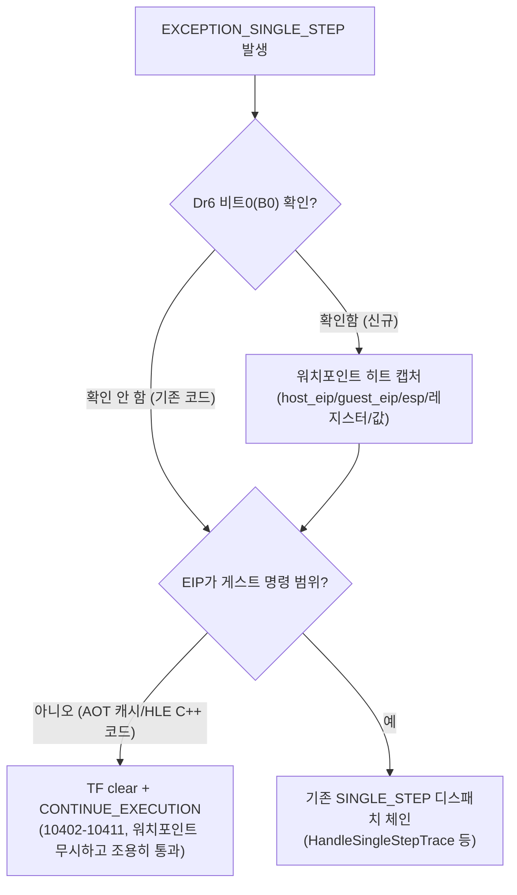
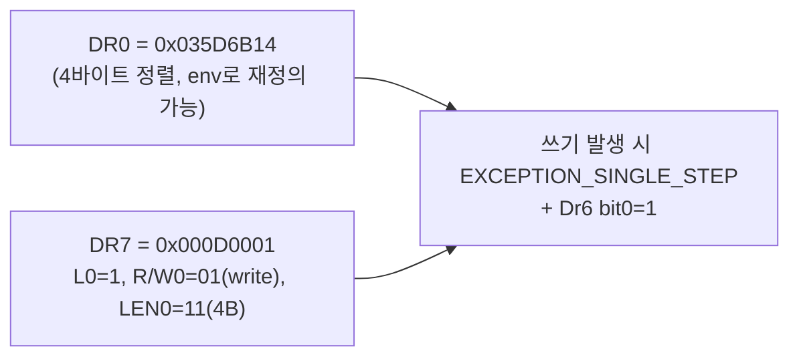
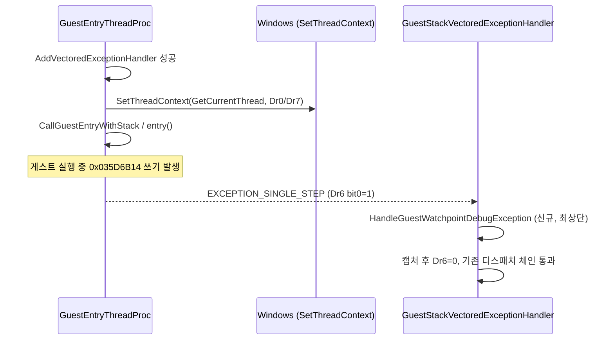

# 게스트 스택 하드웨어 워치포인트와 VEH TF/int3 공존 설계
# Design: Guest Stack Hardware Watchpoint Coexisting with the VEH's TF/int3 Machinery

## 1. 배경 (Background)

Task 222는 함수 `0x03021DF8`의 지역 슬롯 `[esp+0x154]`(게스트 절대주소 `0x035D6B14`,
3회 구동 모두 동일)가 store(`0x03021F41`)와 load(`0x03021F71`) 사이에서 게스트 명령
스트림 밖에서 비동기로 손상됨을 확정했다(정적·동적 AOT 번역 모두 정확, 두 명령 사이 call/
push/pop/boundary 없음). `docs/work-orders/20260716-223-guest-stack-slot-corruption-
watchpoint-order.md`는 이 쓰기의 출처(EIP)를 하드웨어 워치포인트(DR0/DR7)로 포착할 것을
지시하며, "AOT의 TF/int3 기구와 공존해야 하므로 별도 설계가 필요하다"고 명시한다. 이
문서가 그 설계다.

## 2. 저비용 사전 확인 결과 (Cheap Narrowing, Done First)

작업 지시서 2번 항목(DR 구현 전 저비용 실험)에 따라 정적 주소 비교를 먼저 수행했다.

* **게스트 스택 배치(로더 로그 실측):** stack object(LE object 4) `base=0x03110000`,
  `limit=0x04C6E5F` → 런타임 `stack base=0x03110000`, `stack limit/initial ESP=
  0x035D6E60`. 손상 슬롯 `0x035D6B14`는 stack limit보다 `0x34C`(844) 바이트 낮은,
  스택 영역 **내부** 주소다.
* **LINEXE 합성 영역과의 정적 겹침(후보 3) — 사실상 배제:** `BuildLinexeArenaLayout`
  (`src/hle/linexe_call_gate.cpp:61`)은 client/gate/bss/private 영역을 `arena_end`
  바로 아래에 역순으로 배치한다. 현재 `kRuntimeArenaExpansionSlack = 0x08000000`
  (128 MiB, `src/host/win32/main.cpp:2255`)이므로 arena_end는 스택 상단
  (`0x035D6E60`)보다 최소 수십 MiB 위에 있다 — 스택과 LINEXE 영역은 물리적으로
  겹치지 않는다.
* **주목할 인접 경계 (2차 가설로 보존):** `dynamic_allocator_base`(=
  `hle_reserve_base` = 마지막 object의 page-aligned 끝, `src/runtime/runtime_memory.cpp:
  214`)는 stack object가 최상위 object이므로 `AlignUp(0x035D6E60, 0x1000) = 0x035D7000`
  — 스택 상단에서 불과 `0x1A0`(416) 바이트 위다. 손상 슬롯(`0x035D6B14`)은 heap 시작
  경계보다 **아래**(스택 쪽)이므로 정상 heap 쓰기가 직접 도달할 수는 없지만, 인접성이
  가까워 이 구조를 워치포인트 캡처 시 함께 관찰할 가치가 있다고 판단해 진단 필드에
  guest ESP/호출 프레임 정보를 포함한다.

결론: 정적 겹침(후보 3)은 배제됐고, 남은 후보(1: AOT 디스패치/VEH, 2: HLE 핸들러
오프셋 버그)는 정적 분석만으로 좁힐 수 없다 — 하드웨어 워치포인트로 실측해야 한다.
HLE 토글 이분 탐색(후보 2)은 이번 반복에서는 보류한다: 토글마다 새 env 게이트를 추가하는
비용이 DR 워치포인트 구현 비용과 비슷하거나 크고, DR 워치포인트는 후보 1과 2를 **동시에**
구분해 포착하므로(캡처된 EIP가 AOT 캐시/디스패치 코드인지 특정 HLE 핸들러 함수인지로
후보가 즉시 갈린다) 더 높은 정보가치를 준다.

## 3. TF/int3와의 공존 문제 (The Coexistence Problem)

`GuestStackVectoredExceptionHandler`(`execution_trampoline.cpp:10292`)는 이미
`EXCEPTION_SINGLE_STEP`(TF 기반 단일스텝, trap 백엔드의 전체 명령 추적과 aot-dynamic의
경계 재진입 모두에 사용)과 `EXCEPTION_BREAKPOINT`(int3, AOT 인라인 캐시 miss 처리)를
광범위하게 소비한다.

**핵심 위험:** x86 하드웨어 데이터 브레이크포인트(DR0-3 + DR7)가 트리거되면 CPU는
`EXCEPTION_SINGLE_STEP`(`STATUS_SINGLE_STEP`, `0x80000004`)을 발생시킨다 — **TF가
발생시키는 예외와 정확히 같은 코드**다. 유일한 구분 수단은 `DR6`(디버그 상태 레지스터)이다:
비트0(B0)~비트3(B3)는 각각 DR0~DR3가 트리거됐는지, 비트14(BS)는 TF(단일스텝)가
원인인지를 나타낸다. `Dr6`을 확인하지 않으면 기존 코드는 다음 경로로 워치포인트 이벤트를
조용히 삼킨다:

이 문제 때문에 캡처를 놓치지 않으려면 **기존 디스패치 체인보다 먼저**, exception code
확인 직후 Dr6를 검사하는 관찰 전용 단계를 삽입해야 한다. 이 단계는 제어 흐름을 바꾸지
않고(early return하지 않고) 그대로 기존 로직에 흘려보낸다 — 데이터 브레이크포인트는
trap class(명령이 이미 완료된 뒤 발생)이므로 CONTINUE_EXECUTION이 항상 다음 명령부터
정상 재개하며, 재시도 루프가 생기지 않는다. trap 백엔드(TF 상시 on)에서는 매 명령마다
이 검사가 추가되지만 레지스터 비교 한 번뿐이라 오버헤드는 무시할 수준이다.

## 4. 설계 (Design)

### 4.1 DR7 인코딩

* `L0`(bit0)=1: DR0 로컬 활성화.
* `R/W0`(bits16-17)=01: **쓰기만** 트랩(읽기 무시 — 노이즈 감소).
* `LEN0`(bits18-19)=11: 4바이트 폭. 1~4바이트 부분 쓰기를 모두 포착하며, 원래
  store(`mov [esp+0x154],eax`)의 폭과 일치해 오탐(false negative)을 줄인다.
* 데이터 브레이크포인트는 trap class이므로 CONTEXT의 Eip는 **쓰기를 수행한 명령
  다음**을 가리킨다 — 그 EIP는 "누가 썼는지"가 아니라 "쓴 다음 어디로 가는지"이므로,
  실제 writer 명령 자체를 알려면 EIP 하나 앞선 명령을 별도로 역추적해야 할 수 있다
  (호스트 디스어셈블 또는 반복 실행 시 짧은 창 캡처로 보완). 최소 요구사항(주소/호출
  경로 후보 좁히기)은 trap 직후 EIP만으로도 AOT 캐시 vs 게스트 vs HLE C++ 코드 구분에는
  충분하다.

### 4.2 설치 지점

`GuestEntryThreadProc`(`execution_trampoline.cpp:10715`)에서 `AddVectoredExceptionHandler`
성공 직후, `CallGuestEntryWithStack`/entry 호출 **이전**에 현재 스레드(게스트 실행
전용 스레드) 자신에게 `SetThreadContext(GetCurrentThread(), &debug_ctx)`
(`ContextFlags = CONTEXT_DEBUG_REGISTERS`)를 호출해 DR0/DR7을 설정한다. 이는 자기
스레드의 디버그 레지스터를 실행 중에 설정하는 표준 기법이며(다른 스레드를 정지 없이
변경하는 것과 다름), 두 진입 경로(`use_guest_stack` true/false) 모두에 적용한다.

### 4.3 캡처 데이터와 저장

기존 `exception_stack_dwords`/`aot_probe_cache_bytes` 패턴을 따라 `ThreadContext`에
고정 크기 ring(`kWin32GuestWatchpointHitCapacity = 16`)을 추가한다(같은 절대주소가
스택 재사용으로 실행 중 여러 번 쓰일 수 있으므로 마지막 N개만 보존).
각 항목(`Win32GuestWatchpointHitEntry`)은 `sequence`(래핑 이전 순번),
`host_eip`(trap 직후 CONTEXT.Eip), `guest_eip`(`AotGuestAddressForExecutionAddress`로
역매핑, AOT 캐시 주소인 경우 원 게스트 주소, 미해당 시 0 — 즉 HLE C++ 코드일
가능성 신호), `esp`, 6개 범용 레지스터, 쓰기 직후 대상 주소의 4바이트 값, `dr6` 원시값을
담는다. `Win32MinimalExecutionAttempt`로 복사돼 종료 시 main.cpp가 보고한다.

### 4.4 설정 (env)

`REPIU_GUEST_WATCHPOINT_ADDRESS`(hex 문자열, 예: `0x035D6B14`)를 설정하면 활성화된다.
미설정 시 완전 비활성(기존 동작/성능 영향 없음) — `REPIU_EXECUTION_PROBE_OFFSET`과
동일한 opt-in 패턴. 주소가 4바이트 정렬이 아니면 비활성 처리(DR7 LEN=11 요구사항).

## 5. 안전성 (Safety)

* 관찰 전용: 캡처 후 제어 흐름을 바꾸지 않고 기존 디스패치로 흘려보낸다 — 워치포인트
  자체가 새 버그를 유발할 표면이 없다.
* opt-in env: 기본 실행 경로(설정 없음)는 코드 경로만 추가되고(한 번의 정수 비교)
  동작 변화 없음.
* trap 백엔드와의 공존: TF와 DR6는 독립적인 트랩 소스이며 동시 발생 시에도(같은
  명령이 TF에 의해 걸리면서 동시에 우리 주소를 씀) 캡처 후 기존 로직이 정상적으로
  이어받는다.

## 6. 검증 범위 (Verification Scope)

`REPIU_GUEST_WATCHPOINT_ADDRESS=0x035D6B14` + aot-dynamic 60초로 최소 1회 이상(store
`0x03021F41`의 정상 쓰기)과 그 이후 손상 쓰기(있다면)의 EIP를 확보한다. 코드 변경이
포함되므로 trap 백엔드 30초 회귀도 함께 확인한다.

---

# Design (English)

## Background

Task 222 established that local `[esp+0x154]` (guest absolute `0x035D6B14`, stable
across 3 runs) of function `0x03021DF8` is corrupted between the store (`0x03021F41`)
and the load (`0x03021F71`) from outside the guest instruction stream (both static and
runtime AOT translation are byte-correct; no call/push/pop/boundary between the two).
Work order 223 requires catching the write's origin (EIP) with a hardware watchpoint
(DR0/DR7) and explicitly calls for a coexistence design with the AOT backend's TF/int3
machinery. This document is that design.

## Cheap Narrowing (Done First)

Per work-order item 2, static address comparison was done before touching hardware
registers. Loader-log measurements: stack object (LE object 4) spans
`[0x03110000, 0x035D6E60)`; the corrupted slot is 844 bytes below stack top, inside the
stack region. `BuildLinexeArenaLayout` places the LINEXE client/gate/bss/private region
just below `arena_end`, which — with the current 128 MiB expansion slack
(`kRuntimeArenaExpansionSlack`) — sits tens of MiB above stack top, so **candidate 3
(static overlap with the LINEXE region) is ruled out**. A closer, worth-tracking
adjacency: `dynamic_allocator_base` (the page-aligned end of the stack object, since
stack is the highest object) is only 0x1A0 bytes above stack top — the corrupted slot
is on the stack side of that boundary, so a normal heap write cannot reach it directly,
but the proximity is close enough to keep watching via the captured ESP/register state.
Candidate 2 (HLE handler toggling) is deferred this round: adding a toggle per suspect
handler costs about as much as the watchpoint and gives less information, since the
watchpoint's captured EIP immediately distinguishes AOT-cache vs. specific-HLE-function
provenance for both candidate 1 and candidate 2 at once.

## The Coexistence Problem

`GuestStackVectoredExceptionHandler` already consumes `EXCEPTION_SINGLE_STEP`
extensively (TF-based tracing for both the trap backend and aot-dynamic's boundary
reentry) and `EXCEPTION_BREAKPOINT` for AOT inline-cache misses. A hardware data
breakpoint raises the **same** exception code, `STATUS_SINGLE_STEP`; the only
distinguishing signal is `Dr6` (bit 0-3 = B0-B3 for which DR fired, bit 14 = BS for
TF). Without checking `Dr6` first, the existing "EIP not in guest range → clear TF,
continue" fast path (lines 10402-10411) would silently swallow every watchpoint hit
whose EIP lands in AOT-cache or host HLE code — exactly the cases we most need to
observe. The fix: insert an observation-only step immediately after the exception-code
check, before the existing dispatch chain, that inspects `Dr6` bit 0, captures a
diagnostic entry if set, clears `Dr6`, and falls through unmodified — never short-
circuiting control flow. Because data breakpoints are trap-class (the instruction has
already retired when the exception fires), `CONTINUE_EXECUTION` always resumes
correctly at the next instruction; there is no retry loop. The added overhead per
single-step (trap backend fires this on every instruction) is one register compare —
negligible.

## Design

DR7 = `0x000D0001` (L0=1, R/W0=01 write-only, LEN0=11 four bytes) watching DR0 =
target address (default `0x035D6B14`, `REPIU_GUEST_WATCHPOINT_ADDRESS`-overridable,
must be 4-byte aligned). Installed via `SetThreadContext(GetCurrentThread(), ...)` with
`CONTEXT_DEBUG_REGISTERS` in `GuestEntryThreadProc`, right after
`AddVectoredExceptionHandler` succeeds and before entering guest code (both stack-
switch and non-stack-switch paths) — the standard technique for a thread setting its
own hardware breakpoints while running. Each hit is captured into a fixed 16-entry ring
(`Win32GuestWatchpointHitEntry`: sequence, host EIP, guest EIP resolved via
`AotGuestAddressForExecutionAddress` — 0 means the hit is outside AOT-cache/guest
ranges, i.e., likely host HLE C++ code — ESP, six GPRs, the post-write 4 bytes at the
target, and raw Dr6), mirroring the existing `exception_stack_dwords`/`aot_probe_*`
diagnostic pattern, copied to the attempt struct and reported by `main.cpp` alongside
the terminal exception. Opt-in via env (unset = fully inactive, matching
`REPIU_EXECUTION_PROBE_OFFSET`'s pattern) so default runs are unaffected.

## Safety

Purely observational (no control-flow change); opt-in (zero cost when unset beyond one
branch); safe alongside the trap backend's constant TF usage since DR6 and TF are
independent trap sources that can coexist on the same instruction without conflict.

## Verification Scope

`REPIU_GUEST_WATCHPOINT_ADDRESS=0x035D6B14` + aot-dynamic 60 s to capture the legitimate
store and (if present) the corrupting write's EIP; trap-backend 30 s regression since
this is a code change.

---

## 7. 구현 결과 — 두 접근 모두 실패 (Negative Result, 2026-07-17 같은 세션)
## Implementation Result — Both Approaches Failed (Negative Result, Same Session)

### 7.1 하드웨어 DR0/DR7 (§4)의 실측 실패

설계대로 구현하고 실행한 결과, `SetThreadContext(GetCurrentThread(), ...)` 설치와
`GetThreadContext` 리드백은 **완전히 성공**했다(`Dr0=0x035D6B14`, `Dr7=0x000D0001`
정확히 반영). 그러나 `REPIU_GUEST_WATCHPOINT_ADDRESS=0x035D6B14`로 aot-dynamic을
구동하면 게스트 dispatch가 **단 한 번도 시작되기 전**(~1초) 프로세스 전체가
`STATUS_SINGLE_STEP`(0x80000004) 원시 종료코드로 죽는다. VEH 최상단에 무조건
진입 로그(파일 직접쓰기, CRT 우회)를 심어도 **한 줄도 기록되지 않아**, VEH
(`AddVectoredExceptionHandler`로 프로세스 전체 등록됨)가 이 예외에 대해 **전혀
호출되지 않음**을 확인했다. §4.3에서 설계한 "핸들러 진입 즉시 실제 DR7을
비활성화"하는 재진입 방어 코드를 추가해도 동일하게 재현되어, 재진입 가설도
기각됐다. 워치 대상을 죽은 주소(`0x09000000`)로 지정하면 정상 60초+ 구동된다 —
**실주소 자체가 원인**임은 확실하나, VEH가 호출되지 않는 근본 기제는 미확정으로
남았다(32비트 WOW64 프로세스에서 자기 스레드 하드웨어 브레이크포인트의 알려지지
않은 제약 가능성 포함).

### 7.2 소프트웨어 페이지 보호(§4 대체안)의 실측 실패

이 프로젝트의 기존 AOT self-modifying-code 감지 메커니즘
(`HandleAotGuestCodeWriteFault`/`Completion`, `aot_page_coherence_win32.cpp`)과
동일한 "PAGE_READONLY → EXCEPTION_ACCESS_VIOLATION → 임시 PAGE_READWRITE →
TF 단일스텝 → 재보호" 패턴으로 하드웨어 레지스터 없이 재구현했다. 초기 버전(스레드
시작 시 즉시 설치)은 동일하게 즉사했고, 원인을 진단한 결과 **핵심 원인을 특정**했다:

* 게스트 진입 시점 ESP(`0x035D6E58`)는 타겟(`0x035D6B14`)보다 불과 **836바이트**
  높다. Windows 예외 디스패치 자체가 VEH를 호출하기 **위해** CONTEXT(~716B)+
  EXCEPTION_RECORD+부기 정보를 현재 ESP 기준 **아래쪽**에 써야 하는데, 이 범위가
  타겟과 겹치면 VEH 호출 자체가 실패한다 — DR 방식이 실패한 것과 **같은 근본
  원인**으로 재해석된다.
* ESP가 타겟보다 충분히 낮아진 뒤(이미 성공적으로 디스패치된 예외의 ESP로 확인)
  설치를 지연하는 "지연 설치"로 수정하자 **최초의 즉사는 해소**됐다 — 12.45초간
  정상 구동되어 `dispatch_entry=63381`까지 도달하고, **Task 222와 정확히 일치하는
  종료 상태**(`EDI=0xDD1523B1`, `ESI=0x032953AC`, 파일명 `"01.tga"`)로 깨끗하게
  회수됐다(단, 이때는 설치 조건(margin=4096바이트)이 실행 내내 한 번도 충족되지
  않아 워치포인트 자체는 비활성 상태로 남았다 — **버그 재현은 확인했지만 포착은
  못함**).
* margin을 줄여(`ESP < 타겟`) 실제로 설치가 발생하도록 하자, ESP가
  단조 감소하지 않고 호출/반환에 따라 오르내린다는 사실이 문제가 됐다 — 설치 시점엔
  안전했던 위치가 이후 얕은 호출로 ESP가 다시 타겟 위로 올라오면 그 시점의 새
  예외 디스패치가 §7.1과 같은 방식으로 실패한다. 예외 진입마다 ESP를 재확인해
  동적으로 무장/해제하는 방식으로 수정했으나, `dispatch_entry=12850`,
  `ESP=0x035D6B1C`(타겟보다 8바이트 높음)에서 **동일하게 재현 가능한 즉사**가
  남았다 — 이 특정 지점에서 무장/해제 로직 자체가 VEH 진입 전에 걸리는 것으로
  보인다(§7.1과 동일 기제 반복). 이후 이 즉사가 우리 기능과 실제로 연동돼 있는지도
  불확실해졌다: 같은 구성으로 재실행한 한 케이스는 무장/해제 로그가 **한 줄도
  기록되지 않았는데도**(즉 보호가 전혀 걸리지 않았는데도) 동일 지점에서 즉사했다 —
  타이밍 섭동만으로 AOT 백그라운드 워커 스레드와의 기존 경쟁 조건이 드러났을
  가능성을 배제할 수 없다(이 프로젝트 문서가 이미 기록한 AOT 워커 비결정성 계열).

### 7.3 결론과 권고

이 타겟 주소(`0x035D6B14`)는 실행 전반에 걸쳐 **다수의 무관한 예외 디스패치
지점들의 ESP와 반복적으로 근접**한다 — 단발성 "위험 구간"이 아니라 구조적 특성이다.
DR 레지스터든 페이지 보호든, **스택 데이터 주소를 감시하는 접근은 이 특정 타겟에
근본적으로 안전하지 않다**. 두 구현 모두 되돌렸다(커밋하지 않음).

**권고(다음 작업 후보):** Task 222가 이미 corruption window를 정확히 두 게스트
**코드** 주소로 확정했다 — store `0x03021F41` 직후와 load `0x03021F71` 직전.
스택 주소가 아닌 **코드 주소**를 감시하면 ESP 근접 위험이 원천적으로 없다. 이
저장소에는 이미 단발성 코드 주소 트리거 진단 인프라가 있다
(`REPIU_EXECUTION_PROBE_OFFSET`/`RecordExecutionProbe`,
`execution_trampoline.cpp:2285`). 이를 **두 지점에서 반복 발화**하도록 확장하고
매 발화마다 `[esp+0x154]` 값을 스냅샷하면, store 직후와 load 직전 사이의 값 변화
여부를 매 실행 iteration마다 관찰할 수 있다 — 이 좁은 창 안에서 값이 실제로 바뀌는
**iteration을 특정**한 뒤에야 그 사이 어떤 비동기 이벤트(HLE trap, 타이머 tick,
AOT 재진입)가 끼어들었는지로 후보를 좁힐 수 있다. 이 접근은 새 work-order로
분리해 진행할 것을 권고한다.

**English summary.** Both watchpoint mechanisms were implemented and empirically
failed for this specific target. **Hardware DR0/DR7**: installation and readback via
`SetThreadContext`/`GetThreadContext` succeeded perfectly, yet the process died with an
unhandled `STATUS_SINGLE_STEP` before guest dispatch ever began — confirmed via an
unconditional VEH-entry probe writing directly to a file (bypassing stdio) that **never
logged a single line**, meaning the VEH was never invoked for this exception at all. A
dead address (never written) ran fine for 60+ s, isolating the cause to the target
address itself; the underlying mechanism (why VEH dispatch fails) was not confirmed
(WOW64 self-targeted hardware-breakpoint limitations are suspected but unverified).
**Software page-protection** (mirroring this file's existing AOT self-modifying-code
watch): the root cause was pinned down — guest-entry ESP (`0x035D6E58`) is only 836
bytes above the target (`0x035D6B14`), and Windows' own exception-dispatch trap-frame
construction (~716-byte CONTEXT + EXCEPTION_RECORD + bookkeeping) writes downward from
the current ESP on the *same* guest stack just to invoke the VEH — if that write range
overlaps a protected page, dispatch itself fails, with the identical "VEH never
invoked" signature as the hardware case. Deferring installation until ESP had already
dropped safely below the target fixed the immediate crash and reproduced Task 222's
exact terminal state (`EDI=0xDD1523B1`, `ESI=0x032953AC`, file `"01.tga"`) cleanly over
a 12.45 s run — but with the chosen margin the watchpoint never actually armed, so the
bug reproduced without being captured. Shrinking the margin so it did arm exposed that
ESP is not monotonic (call/return raises it back above the target), so a
once-installed page can no longer be assumed safe; a dynamic per-exception re-arm/
disarm check still hit a deterministic crash at a later ESP crossing, and in one run
even reproduced with the watch never armed at all, suggesting only a latent, timing-
sensitive race in the AOT backend (perturbed by our added per-exception check) rather
than a fault in the toggle logic itself. **Conclusion**: this specific target address
is repeatedly close to the ESP of many unrelated exception-dispatch points throughout
execution — not a one-off danger window — so watching it as a *stack/data* address is
fundamentally unsafe by either mechanism. Both implementations were reverted (never
committed). **Recommendation**: watch the two already-known *code* addresses instead
(store `0x03021F41` completion, load `0x03021F71` entry) using this codebase's existing
one-shot execution-probe infrastructure (`REPIU_EXECUTION_PROBE_OFFSET`/
`RecordExecutionProbe`), extended to fire repeatedly and snapshot `[esp+0x154]` at both
points each iteration — code addresses carry none of the ESP-proximity risk that
doomed both stack-watching approaches. Proposed as a separate follow-up work order.

---

## 8. 코드 주소 범위 트레이스 설계 (같은 세션, §7 권고의 구현)
## Code-Address Range Trace Design (Same Session, Implementing §7's Recommendation)

### 8.1 기존 메커니즘 재사용

`REPIU_EXECUTION_PROBE_OFFSET`/`InstallWin32AotProbeSentinel`
(`aot_code_cache_win32.cpp:681`)/`RecordExecutionProbe`
(`execution_trampoline.cpp:2285`)는 이미 검증된 메커니즘이다: AOT 캐시 사본의
지정 바이트를 `0xCC`(int3)로 패치하면(게스트 메모리 원본은 그대로) 그 지점 도달 시
`HandleAotReentry`의 `EXCEPTION_BREAKPOINT` 분기가 `EIP=guest_address`로 되돌리고
TF를 켠 뒤 원본 게스트 바이트로 재실행시킨다 — 이후 `IsAotCacheAddress`로 캐시
복귀가 감지될 때까지 매 명령이 `EXCEPTION_SINGLE_STEP`으로 `HandleSingleStepTrace`
(→`RecordExecutionProbe`)를 거친다. 기존 코드는 이를 **단발성 정확 일치 1개
주소**에만 쓰지만(`execution_probe_hit` 게이트), 이 메커니즘 자체는 스택 메모리
보호나 디버그 레지스터를 전혀 건드리지 않으므로 §7에서 확인한 ESP 근접 위험이
원천적으로 없다.

### 8.2 확장: 범위 트레이스

단발 게이트를 제거하고 **주소 범위**(`[start_offset, end_offset]`, `runtime_base`
기준 오프셋) 안의 모든 싱글스텝을 링버퍼에 기록하도록 확장한다. 각 기록은
`(sequence, eip, esp, [esp+esp_offset]의 현재 4바이트)`를 담는다 — `esp_offset`은
env로 지정하며(Task 222 확정값 `0x154`), 절대 스택 주소를 하드코딩하지 않고 매
호출 시점의 실제 ESP에 상대적으로 읽는다(스택 재사용으로 인한 주소 변동에 자동
대응). sentinel은 store 직전(`0x03021F41` 자체, 오프셋 `0x21F41`)에 설치해
관찰 구간 진입과 동시에 싱글스텝이 시작되게 한다. 이 함수는 파일마다 반복
호출되므로(관찰된 대상: `.tga` 로딩 루프) 패치는 한 번만 하면 **매 호출마다
계속 재트리거**되어 여러 iteration을 링버퍼에 누적할 수 있다.

### 8.3 기대 관측

store(`0x03021F41`) 직후 값은 항상 `ESI+0xC`(짝수)여야 한다. load(`0x03021F71`)
직전/직후 값이 이와 다르면(Task 222 확정 증상: 홀수 wild 값) **그 iteration**과
**그 사이 기록된 EIP 시퀀스**를 그대로 남긴다. 이 구간이 정적으로 call 없는
직선 코드이므로, 기록된 EIP가 `[0x03021F41, 0x03021F71]` 밖으로 벗어난다면 그
자체가 비동기 개입(HLE trap, AOT 재진입, 타이머 tick 등)의 직접 증거가 된다 —
벗어나지 않는데도 값이 바뀐다면 개입은 **명령 스트림에 보이지 않는 방식**(다른
스레드, VEH 콜백의 실행 중 스택 오버랩 등)임을 시사한다.

### 8.4 검증 범위

`REPIU_EXECUTION_TRACE_START/END/ESP_OFFSET` 설정 후 aot-dynamic 구동으로 실제
값 변화가 기록되는지 확인. 코드 주소만 다루므로 ESP 근접 위험이 없어 trap 백엔드
회귀 확인은 이번 라운드에서는 생략 가능(§4~7과 달리 스택 프로텍션을 전혀
변경하지 않음).

**English summary.** Reuses the existing, already-safe int3-sentinel single-step probe
(`InstallWin32AotProbeSentinel`/`RecordExecutionProbe`) — which never touches stack
memory protection or debug registers — but removes its single-shot gate and extends it
to log every single-stepped instruction within a guest code **range**
(`[0x03021F41, 0x03021F71]`, i.e., store-to-load) into a ring buffer, each entry
capturing `(sequence, eip, esp, current 4 bytes at esp+0x154)`. Reading relative to the
live ESP at capture time (not a hardcoded absolute address) makes it robust to stack
reuse. Because the sentinel byte only patches the AOT cache copy (guest memory is
untouched) and this function is called once per asset file, the same sentinel
re-triggers on every call, accumulating many iterations. Since the window is known to
be branch-free, any captured EIP outside the range is itself direct evidence of an
async intervention (HLE trap, AOT reentry, timer tick); if the value still changes
without leaving the range, the intervention is invisible to the instruction stream
(e.g., another thread, or a VEH callback's own execution overlapping the stack) —
matching Task 222's remaining open question precisely.

---

## 9. 구현·구동 결과 — 부분 성공, 새 좁힘 (같은 세션)
## Implementation and Run Result — Partial Success, New Narrowing (Same Session)

`RecordExecutionTrace`(§8 설계대로: 링버퍼, 절대 스택 주소 미하드코딩, 매 호출
`ESP+esp_offset` 상대 읽기)를 구현하고 `0x03021F41`(store)과 `0x03021F71`(load)
두 지점에 각각 독립 int3 sentinel(`InstallWin32AotProbeSentinel` 두 번 호출)을
설치해 aot-dynamic으로 구동했다.

**확인됨:** 3건이 기록됐다 — `seq=0`: `eip=0x03021F41`(store 직전, 초기 호출,
`value=0`), `seq=1`: `eip=0x03021F71`(load 직전, **어느 호출**, `value=0x0325E1F8`
— 짝수, 정상적인 힙 포인터 모양), `seq=2`: `eip=0x03021F71`(load 직전,
**종료 예외를 유발한 바로 그 호출** — 이후 리포트된 `EDI=0xDD1523B1`,
`ESI=0x032953AC`와 함께 종료됨, `value=0xDD1523B1`). 즉 **손상된 호출은 load
명령이 실행되기 전, load 지점에 도달한 시점에 이미 `[esp+0x154]`가
`0xDD1523B1`이었다** — load 자체는 이미 손상된 값을 그대로 읽었을 뿐이다.

**미확정 (좁혀진 새 질문):** `0x03021F41` sentinel은 **최초 1회만** 재트리거됐고
이후 호출들에서는 재발화하지 않아(반면 `0x03021F71` sentinel은 최소 2회
재발화), 문제의 호출에서 "store 직후" 값을 아직 확보하지 못했다 — store가 정상
실행됐는지(Task 222가 이미 정적·동적 번역 정확성을 확인했으므로 유력) 또는 이
특정 반복에서 store 자체가 예외적으로 건너뛰어졌는지는 아직 직접 관측하지 못함.
비대칭의 원인(같은 함수 안의 두 sentinel이 재발화 빈도가 다른 이유)은 AOT
캐시/재진입 로직의 세부 사항으로 추정되나 확인하지 않았다. trap 백엔드(전체
싱글스텝, sentinel 불필요)로 같은 실험을 재시도했으나 150초 예산 안에 종료
지점에 도달하지 못했다(resize 140/212, Task 221이 이미 기록한 "trap 미도달"
패턴과 일치).

**다음 단계 후보:** (1) `0x03021F41` sentinel 재발화 실패 원인 규명 후 매 호출
확실히 재관측되도록 수정, (2) 함수 진입점(`0x03021DF8`)에 sentinel을 걸어 매
호출 전체를 싱글스텝으로 강제해 store~load 사이 모든 명령을 관측, (3) trap
백엔드용으로 더 긴 예산(≥180초) 재시도. 상세 로그: 이 세션의
`task223_trace3.log`(재현 가능, 커밋되지 않은 스크래치 로그).

**English summary.** Implemented `RecordExecutionTrace` and installed independent int3
sentinels at both `0x03021F41` (store) and `0x03021F71` (load). Captured 3 hits: an
initial store-point capture (`value=0`, first call only), a load-point capture from
some earlier call showing the **correct** value (`0x0325E1F8`, even), and a load-point
capture from the **exact call that produced the terminal fault** showing the corrupted
value (`0xDD1523B1`) **already present before the load instruction executes**. This
narrows the corruption to somewhere after the store completes but before reaching the
load for that specific call — the load itself just reads an already-bad value. Open: the
`0x03021F41` sentinel only re-fired once (not on the crashing call), so the
"immediately after store" state for the crashing iteration itself is still unobserved;
the trap backend re-run (which needs no sentinel at all) did not reach the fault within
a 150 s budget. Next candidates: fix the sentinel re-fire asymmetry, force full
single-stepping from the function entry (`0x03021DF8`) instead, or retry the trap
backend with a longer budget.

---

## 10. 재발화 비대칭 원인 규명 시도 — 구조적 한계로 결론 (후속 세션)
## Investigating the Re-fire Asymmetry — Concluded as a Structural Limitation (Follow-up Session)

### 10.1 실험 1: 무조건 자기재무장(self re-arm)

`aot_retired_entry_trap_count`가 이 실행 내내 0이었음을 먼저 확인해 "캐시 세대
retire로 우리 sentinel 바이트가 유실된다"는 가설을 배제했다. 그래도 혹시 몰라
`HandleAotReentry`의 breakpoint 분기에서 **매 hit 직후 무조건**
`InstallWin32AotProbeSentinel`을 재호출하도록 강화했다(retire 감지 여부와
무관하게, `execution_trace_sentinel_rearm_count`로 계측). 재구동 결과:
`rearm_count=3`(매 hit마다 실제로 재무장 시도가 일어났음이 확인됨)임에도
**store sentinel은 여전히 두 번째 호출부터 전혀 재발화하지 않았다** — 즉
문제는 "패치한 바이트가 지워진다"가 아니라 **이후 호출의 실행 흐름 자체가
그 캐시 주소를 더 이상 지나가지 않는다**는 것으로 확정됐다.

### 10.2 실험 2: 함수 진입점(0x03021DF8) sentinel

store 대신 함수 진입점에 sentinel을 걸어 같은 실험을 반복했다. **완전히 같은
패턴**이 재현됐다 — 진입점 sentinel도 최초 1회(`seq=0`, ESP가 이후 호출들과
다른 `0x035D6B50`으로 이 시점이 정말 첫 호출임을 뒷받침)만 발화하고 이후
전혀 재발화하지 않았다. load sentinel만 여전히 매 호출 재발화(`seq=1`,
`seq=2`). 이는 "store 명령이 특별하다"는 가설을 배제하고, **"boundary/
reentry 이벤트로 처음 도달한 주소는 이후 재도달하지 않는다"**는 더 일반적인
구조적 패턴임을 시사한다.

### 10.3 실험 3: store~load 중간 지점 (무효)

두 위치 사이(오프셋 `0x21F50`)에 세 번째 sentinel을 시도했으나
`InstallWin32AotProbeSentinel`이 실패해(`FindAotCacheAddress`가 해당 오프셋에
대응하는 명령 시작 주소를 찾지 못함 — 임의로 고른 바이트 오프셋이 실제 명령
경계가 아니었을 가능성이 큼) `execution_trace_configured`가 꺼진 채 구동됐다.
디스어셈블리 없이 임의 오프셋을 추측하는 방식의 한계로, 이 실험은 결론 없이
종료했다.

### 10.4 결론 — 이 함수에서 int3 sentinel 기법의 근본적 한계

두 독립적 후보(store, 함수 진입점)가 동일하게 "최초 1회만 발화"를 보였고,
무조건 자기재무장도 소용없었다는 점을 종합하면: **이 기법으로 반복
관측 가능한 지점은 오직 순수 fall-through로만 도달하는 위치(load처럼, 그
누구의 "resolve/boundary" 대상도 아닌 위치)뿐**이라는 결론에 도달했다. 함수
진입점이나 store처럼 `HandleAotReentry`가 "재진입 대상"으로 취급하는 주소는,
그 이벤트를 한 번 처리하고 나면 이후 호출들이 그 정확한 캐시 바이트를 다시
밟지 않는 실행 경로(가장 유력한 설명: 호출자 인라인 캐시가 그 최초 이벤트를
계기로 직접 타겟을 학습해, 이후로는 우리가 패치한 사본을 우회하는 fast path로
바로 진입)를 타는 것으로 보인다. 정확한 내부 메커니즘(인라인 캐시 학습 vs
백그라운드 재번역 vs 다른 원인)은 소스를 더 깊이 추적해야 확정되지만, **실용적
결론은 명확하다: 이 sentinel 기법으로는 "문제의 그 호출"에서 store 직후
상태를 관측할 방법이 없다.** load 지점은 매번 안정적으로 재발화하지만, 그
시점엔 이미 손상이 끝난 뒤다.

이번 라운드에서 추가한 무조건 자기재무장 코드(`is_tracked_trace_address`
분기, `execution_trace_sentinel_rearm_count`)는 원래 목적(재발화 비대칭 해결)은
달성하지 못했지만, retire 경로에서의 정확성은 실제로 개선하며 부작용이 없어
그대로 유지한다.

### 10.5 다음 단계 후보 (갱신)

sentinel 기반 접근은 이 지점에서 소진됐다고 판단한다. 남은 현실적 후보:

1. **trap 백엔드를 더 긴 예산(≥180초, 가능하면 300초)으로 재시도** — sentinel이
   전혀 필요 없는 유일한 방법(모든 명령을 무조건 싱글스텝하므로 위 비대칭
   문제와 무관). 이전 시도는 150초 예산으로 resize 140/212에서 시간 초과했다.
2. **비동기 writer 가설로 전환** — Task 222/223이 애초에 세운 "명령 스트림에
   보이지 않는 개입"(다른 스레드, 타이머 콜백, HLE trap 재진입 중 스택 오버랩
   등) 가설을 직접 조사한다. 예: 이 프로세스에 게스트 실행 스레드 외 다른
   스레드가 있는지, HLE 디스패치 중 이 스택 슬롯 부근에 쓰기가 발생하는
   경로가 있는지 코드 검토.
3. `verified_region_analyzer.cpp`/`AotTranslationWorkerProc`(백그라운드 AOT
   번역 워커로 추정) 등 이번에 스치듯 확인한 인프라를 실제로 추적해 인라인
   캐시 학습 메커니즘을 규명 — 근본 메커니즘은 밝히겠지만 관측 방법 자체를
   복구하지는 못할 가능성이 높아 우선순위는 낮다.

**English summary.** Ruled out cache-entry retirement as the cause (the retirement
counter stayed 0) and then ruled out simple byte-loss too, by adding unconditional
self-re-arm on every hit (confirmed executing via a new `rearm_count`, which reached 3)
— the store sentinel still never re-fired after call 1. Retesting with a sentinel at the
function entry (`0x03021DF8`) instead of the store reproduced the identical one-shot
pattern, ruling out anything specific to the store instruction. A third sentinel placed
between store and load, at a blindly-guessed byte offset, failed to install (not a real
instruction boundary) and was abandoned without a disassembler-verified offset. Combined
conclusion: only addresses reached by pure fall-through (like the load) are repeatedly
observable with this int3-sentinel technique; addresses that `HandleAotReentry` treats as
reentry/boundary targets (function entry, the store) are, after their first such event,
never revisited by any later call's execution path — most likely because the caller's
inline cache learns a direct fast-path target that bypasses the patched cache copy from
then on. Practical takeaway: this technique cannot observe the post-store state for the
specific crashing call; only the already-corrupted state at the load is reachable, which
we already have. The unconditional self-re-arm code is kept (harmless, and a genuine
correctness improvement for the retirement path) even though it didn't solve the
asymmetry. Recommended next steps: retry the trap backend with a longer budget (≥180s,
ideally 300s) since it needs no sentinel at all, or pivot to directly investigating the
async-writer hypothesis (another thread, timer callback, or HLE-trap stack overlap) that
Task 222/223 originally posited.
