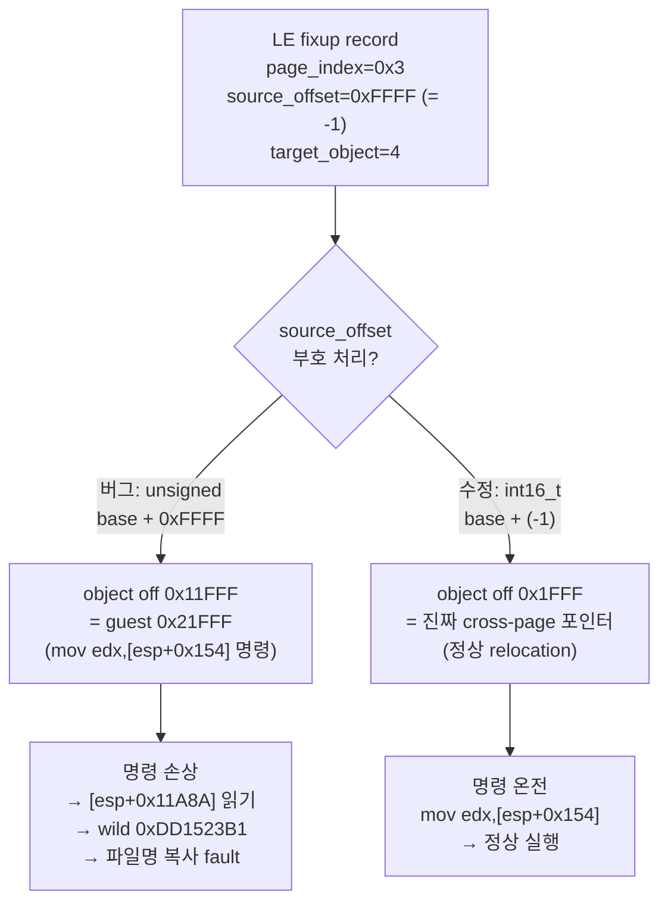

# LE cross-page fixup 부호 확장 수정 설계
# Design: LE Cross-Page Fixup Sign-Extension Fix

## 1. 배경 (Background)

Tasks 221-225가 추적해 온 실행 frontier는 게스트 스택 슬롯 `0x035D6B14`
(`[esp+0x154]`)가 상수 `0xDD1523B1`으로 손상되어 파일명 복사(`mov [edi],al` @
`0x0302208C`)에서 access violation을 내는 것이었다. Task 226에서 trap 백엔드
전체 단일스텝(int3/워치포인트 없이 실제 x86 의미론)으로 손상 구간을 관측해 근인을
확정했다.

## 2. 근인 (Root Cause) — 확정

함수 `0x03021DF8`(asset-struct 준비 루틴)은 setup에서 파일명 목적지 포인터
`[esp+0x154]=esi+0xC`를 쓰고, 이후 **루프**(본체 `0x03021F63`, back-edge
`jmp 0x03021F63` @ `0x0302204D`)에서 매 반복 이 포인터를 `0x1C`씩 전진시킨다:

```
0x03021FFD: mov edx, [esp+0x154]   ; 현재 목적지 포인터 로드
0x03022021: add edx, 0x1C
0x0302202D: mov [esp+0x154], edx   ; 다음 반복용으로 저장
```

그런데 로더가 처리한 이미지에서 `0x03021FFD`의 명령이
`mov edx,[esp+0x11A8A]`(디스크 원본 `8b 94 24 54 01 00 00` →
`8b 94 e4 8a 1a 01 00`)로 **손상**되어 있었다. 이 명령은 프레임(0x190) 밖 72KB
힙 위치를 읽어, edx=garbage(`0xDD152395`)+0x1C=`0xDD1523B1`을 만들고, 이 wild
포인터가 다음 반복의 목적지로 저장되어 복사 시 fault한다. 값이 런 간 불변인 것도
이 결정론적 손상 때문이다.

손상의 출처: 이 명령은 **페이지 경계**(guest `0x21FFF`/`0x22000`)를 걸친다.
LE fixup 레코드 중 `page_index=0x3, source_offset=0xFFFF, target_object=4`가
있는데, **`source_offset`은 부호 있는 16비트**로, `0xFFFF`는 `-1`을 뜻한다 —
"이 fixup의 32비트 타겟이 이 페이지 시작 **1바이트 앞**(이전 페이지)에서 시작해
현재 페이지로 넘친다"는 cross-page fixup 표식이다. 올바른 기록 위치는
`object_page_base + (-1)`인데, 우리 로더는 `source_offset`을 **부호 없는
0xFFFF로 처리**해 `object_page_base + 0xFFFF`(= 0x10000바이트 높은 곳)에 적용,
무관한 명령 `mov edx,[esp+0x154]`의 SIB+displacement 4바이트를 relocated 포인터
값으로 덮어썼다. 실제 DOS4GW는 부호를 올바로 처리하므로 게임이 정상 동작한다.



## 3. 수정 (Fix)

LE fixup의 `source_offset`을 적용 시 **`std::int16_t`로 부호 확장**한다. 두 곳:

* `src/exe/executable_headers.cpp` `ApplyLeInternalRelocations` — LE 이미지에
  fixup을 적용하는 원 경로.
* `src/runtime/runtime_memory.cpp` `FindSourceObjectForPage` —
  `BuildRelocatableRuntimeImagePlan`/`BuildRelocatedRuntimeImage`가 런타임
  이미지에 fixup을 재적용할 때 쓰는 공유 헬퍼(같은 버그가 복제되어 있었음).

두 곳 모두 `object_page_index * page_size + record.source_offset`(부호 없음)을
`object_page_index * page_size + static_cast<std::int16_t>(record.source_offset)`
로 바꾸고, 결과가 음수면 스킵한다(이전 객체로 넘어가는 경계 케이스 방어).

`source_offset < 0x8000`인 일반 fixup에는 영향이 없다(부호 확장해도 값 동일).
`source_offset >= 0x8000`(cross-page, 음수)인 fixup만 올바른 위치로 이동한다.

## 4. 검증 (Verification)

* `repiu_aot_probe`로 `0x01021FFD` 디스어셈블: 수정 후 `mov edx, [esp+0x154]`
  (정상)으로 복원됨을 확인.
* `repiu_supervisor_win32 pumpit1` aot-dynamic 구동: `0xDD1523B1` 크래시 소멸,
  `dispatch_entry` 63446→95867로 실행 전진, EDI가 `0xDD1523B1`→정상값. 새
  frontier는 `0x030F7A0C`(fault VA `0x4091`)로 별개 문제.
* 회귀 없음: 실행이 더 멀리 진행(이전 크래시 지점을 통과).

## 5. 참고 (References)

* 근인 관측: trap 백엔드 full 단일스텝 트레이스(범위 `[0x21F36, 0x21F90]`,
  ESP-상대 `[esp+0x154]` 캡처)로 2차 루프 반복이 wild 값을 load함을 확인.
* 정적 근거: `repiu_aot_probe` 디스어셈블 + raw 디스크 바이트 비교.
* 상세: `docs/work-logs/20260717-226-le-cross-page-fixup-sign-extension-log.md`,
  `docs/analysis/current-execution-frontier.md`,
  `docs/kb/le-lx-fixup-records.md`.

---

**English summary.** The Tasks 221-225 frontier (guest stack slot `0x035D6B14`
corrupted to the run-invariant constant `0xDD1523B1`, faulting the filename copy at
`0x0302208C`) is root-caused. Function `0x03021DF8` is an asset-struct prep routine whose
loop (body `0x03021F63`, back-edge at `0x0302204D`) advances a destination pointer
`[esp+0x154]` by `0x1C` each iteration via `mov edx,[esp+0x154]; add edx,0x1C; mov
[esp+0x154],edx`. The loader-processed image had that first instruction corrupted from
`mov edx,[esp+0x154]` (raw `8b 94 24 54 01 00 00`) into `mov edx,[esp+0x11A8A]`, so the
loop read its pointer from 72 KiB outside the 0x190 frame, yielding the wild constant. The
corruption is a **cross-page LE fixup applied with an unsigned source offset**: a fixup
record with `source_offset=0xFFFF` means signed `-1` ("the 32-bit target begins one byte
before this page and spills in"), but the loader treated `0xFFFF` as unsigned and wrote
`page_base + 0xFFFF` (0x10000 bytes too high), clobbering the unrelated instruction. Fix:
sign-extend `source_offset` via `std::int16_t` in both `ApplyLeInternalRelocations`
(`executable_headers.cpp`) and the runtime helper `FindSourceObjectForPage`
(`runtime_memory.cpp`). Verified: `repiu_aot_probe` shows the instruction restored to
`mov edx,[esp+0x154]`; the game's `0xDD1523B1` crash is gone and execution advances
(dispatch 63446→95867) to a new, unrelated frontier at `0x030F7A0C`.
