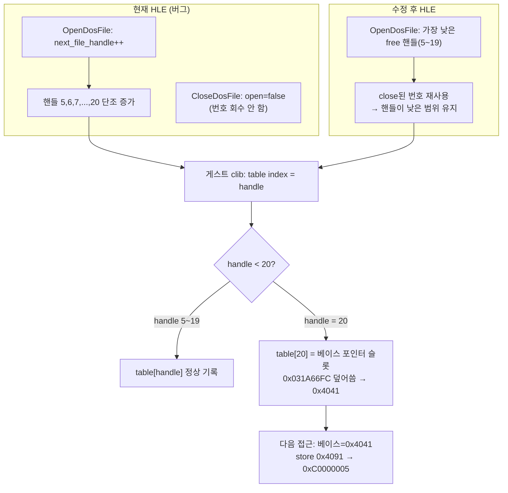

# 설계: DOS 파일 핸들 번호 재사용 (lowest-free 할당)
# Design: DOS File Handle Number Recycling (lowest-free allocation)

## 1. 배경 / Background

Task 227이 특성화한 frontier(게스트 `0x030FAB04`의 `mov [edx+eax],ebx`가 fault
VA `0x00004091`에서 `0xC0000005`)의 근인을 확정했다.

**게스트 측 구조 (repiu_aot_probe 정적 분석으로 확인):**

fault 블록은 파일 핸들 플래그 테이블에 엔트리를 쓰는 clib 루틴이다.

```
0x030FAAF4: push ebx
0x030FAAF5: or   dh, 0x40            ; 저장값 = value | 0x4000
0x030FAAF8: mov  ebx, edx
0x030FAAFA: mov  edx, eax            ; edx = handle
0x030FAAFC: mov  eax, [0x031A66FC]   ; eax = 테이블 베이스 포인터
0x030FAB01: shl  edx, 0x02           ; edx = handle * 4
0x030FAB04: mov  [edx+eax], ebx      ; table[handle] = value|0x4000   <-- FAULT
```

* 베이스 포인터 `[0x031A66FC]`의 **정적 초기값 = `0x031A66AC`** (probe:
  `static_0x011A66FC=0x11a66ac`).
* `0x031A66FC − 0x031A66AC = 0x50 = 80바이트 = 4바이트 엔트리 20개`.
* 즉 테이블은 **엔트리 20개(인덱스 0~19)**이고, **`table[20]`의 주소가 곧 베이스
  포인터 슬롯 `0x031A66FC`**이다 (테이블 바로 뒤에 자기 자신을 가리키는 베이스
  포인터가 위치하는 전형적 Watcom clib 레이아웃, DOS 기본 핸들 수 20과 일치).

**런타임 관측 (aot-dynamic 구동으로 확인):**

* fault: `0xC0000005`, fault VA `0x00004091`, AOT 매핑 → guest `0x030FAB04`.
* `handled DOS open count: 16`, `handled DOS close count: 16`,
  `last DOS open handle: 0x0014`(=20), `last DOS close handle: 0x0014`.
* DOS 파일 I/O 추적: 핸들이 `0x05→0x06→…→0x14`로 **단조 증가**, 각 핸들이
  트레이스에서 고립된 read/seek 블록으로 등장 → 파일을 **순차적으로 open/close**하며
  동시에 열려 있는 파일은 1~2개뿐이다.

**근인:** 우리 HLE의 `OpenDosFile`은 `next_file_handle++`로 핸들 번호를 **단조
증가**시키고 `CloseDosFile`은 `open=false`만 설정할 뿐 **핸들 번호를 회수하지
않는다**. 실제 DOS(INT 21h AH=3Dh/3Ch)는 프로세스 Job File Table에서 **가장 낮은
비어 있는 핸들**을 반환하고 close(AH=3Eh) 시 그 번호를 free 풀로 되돌린다. 게임은
파일을 16번 순차적으로 열고 닫지만, 재사용이 없으면 16번째 open이 핸들 20을
반환한다. 게스트 clib는 이 핸들을 20칸 테이블의 인덱스로 써서 `table[20]`, 즉 베이스
포인터 슬롯 `0x031A66FC`를 덮는다. 첫 오버플로우가 베이스 포인터를 `0x4041`(=플래그
`0x41` | `0x4000`)로 손상시키고, 이후 같은 핸들 접근이 `0x4041+0x50=0x4091`에서
fault한다.

이것은 게스트 코드 버그가 아니라 **HLE가 DOS 핸들 시맨틱을 위반**한 것이다. AGENTS.md
원칙(원본 게임 로직 보존, HLE로 DOS 서비스 대체)에 따라 HLE를 DOS 동작에 맞춘다.

## 2. 관측 흐름 / Observed flow



## 3. 수정 방침 / Fix approach

`src/hle/dos_file_system.cpp`의 핸들 할당을 **가장 낮은 free 핸들** 정책으로 바꾼다.

* 사용자 파일 핸들 범위: `[5, 20)` (0~4는 stdin/stdout/stderr/stdaux/stdprn 예약,
  20은 DOS 기본 JFT 크기 = 게스트 테이블 엔트리 수).
* `OpenDosFile`:
  1. `[5, 20)`에서 현재 열려 있지 않은 **가장 낮은 핸들**을 찾는다.
  2. 없으면 `kAccessDenied`("DOS file handle table is exhausted")로 실패(=DOS
     "too many open files" 상당). 게임은 동시 1~2개만 열므로 실제로는 도달하지 않음.
  3. `open==false`인 닫힌 슬롯이 있으면 재사용해 `open_files` 벡터 무한 증가를
     막고, 없으면 새 엔트리를 추가한다.
* `CloseDosFile`은 그대로 `open=false`로 두되(슬롯은 다음 open이 재사용),
  핸들 번호가 free 풀로 되돌아가는 것은 위 lowest-free 탐색이 자동으로 반영한다.
* 이제 쓰이지 않는 `DosVirtualFileSystemState::next_file_handle` 필드는 제거한다
  (전 저장소에서 이 파일들만 참조).

## 4. 상수 / Constants

| 이름 | 값 | 근거 |
| --- | --- | --- |
| `kFirstDosUserHandle` | 5 | DOS 표준 핸들 0~4(stdin/out/err/aux/prn) 예약 |
| `kDosOpenHandleLimit` | 20 | DOS 기본 Job File Table 크기 = 게스트 clib 20칸 테이블 |

## 5. 검증 전략 / Verification

* **정적**: `repiu_aot_probe`로 베이스 포인터 슬롯이 테이블 20칸 바로 뒤임을 재확인
  (이미 확인: `static_0x011A66FC=0x11a66ac`, 간격 0x50).
* **동적**: `REPIU_EXECUTION_BACKEND=aot-dynamic`로 `pumpit1` 구동 후
  - `last DOS open handle`가 20 아래(예: ≤6)로 유지되는지,
  - fault VA `0x00004091` / guest `0x030FAB04` 크래시가 **소멸**하는지,
  - `dispatch_entry`가 이전 크래시 지점을 넘어 전진하는지 확인.
* **회귀**: 기본 trap 백엔드 단시간 구동에서 진행도 회귀 없음 확인.
* **단위**: DOS 파일 시스템 핸들 할당/회수 동작을 검증하는 테스트를 추가(없으면
  최소 검증 절차를 작업 로그에 기록).

## 6. 위험 / Risks

* 게임이 실제로 20개 이상 파일을 **동시에** 열어야 한다면 이 상한이 새 실패를 만들 수
  있으나, 관측상 동시 1~2개뿐이라 위험은 낮다. 상한 도달 시 DOS 규격대로 실패를
  반환하므로 게스트 로직은 원본 DOS와 동일하게 동작한다.

---

**English summary.** Root-caused the Task 227 frontier: the faulting clib routine at guest
`0x030FAB04` writes `table[handle] = value|0x4000` with the table base loaded from
`[0x031A66FC]`, whose static value `0x031A66AC` sits exactly `0x50` (= 20 four-byte
entries) below the base-pointer slot itself. So `table[20]`'s address **is** the base
pointer at `0x031A66FC` — a 20-entry table (DOS default handle count) with a self-pointing
base immediately after it. Runtime traces show the game opens/closes 16 files sequentially
(never more than ~2 open at once), yet our HLE allocates DOS handles via monotonic
`next_file_handle++` and never recycles numbers on close, so the 16th open returns handle
20, overflowing the guest table and corrupting the base pointer to `0x4041` (= flags `0x41`
| `0x4000`); the next access then faults at `0x4041 + 0x50 = 0x4091`. Real DOS returns the
lowest free handle and recycles freed numbers, keeping handles in the 5–6 range. Fix: change
`OpenDosFile` to allocate the lowest free handle in `[5, 20)`, reuse closed slots, and fail
with "too many open files" only when all 15 user slots are occupied; remove the now-unused
`next_file_handle` field. This aligns the HLE with DOS semantics without touching guest code.
