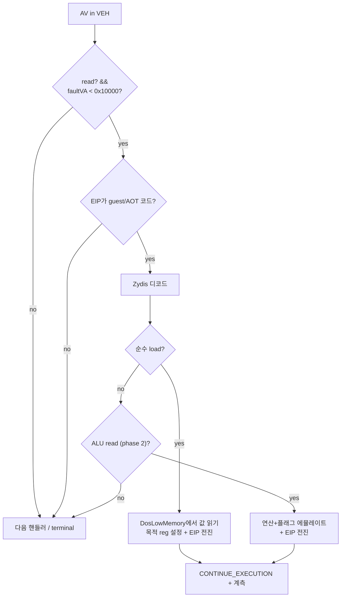

# 설계: DOS/4GW 저지대 메모리 read 관용 (널 근처 read fault 에뮬레이션)
# Design: DOS/4GW low-memory read tolerance (near-null read-fault emulation)

## 1. 배경 / Background

Task 230이 특성화한 frontier(guest `0x030F4A98` `mov al,[ebx]`가 EBX=0으로
`0xC0000005` **read** of VA `0x00000000`)를 재해석했다.

* 이 fault는 **주소 0을 1바이트 읽는 것**이다(access kind 0 = read).
* stricmp(`0x030F4A94`) 본체는 `mov al,[ebx]`로 `[0]`에서 1바이트 읽고 `[edx]`("t")와
  비교→불일치 시 즉시 "not equal" 반환한다. parse_texture(`0x03019C78`)는 확장자
  불일치를 정상 처리한다(`0x03019E8A` 경로).
* **DOS/4GW에서는 선형주소 0(IVT/BIOS 영역 포함 하위 1MB)이 매핑되어 읽기 가능**하므로
  이 read는 무해하다. 원본 게임의 Watcom clib stricmp가 널 체크를 안 해도 DOS에선
  문제되지 않았다.
* 우리 Win32 호스트는 널 페이지(`0x0`~`0xFFFF`)를 보호 영역으로 두므로 같은 read가
  fault한다.

**즉 이것은 데이터 버그가 아니라 HLE 격차다:** 게스트가 DOS/4GW처럼 저지대(널 근처)
메모리를 무해하게 읽을 수 있다고 기대하는데, 우리 호스트가 이를 제공하지 않는다.
AGENTS.md 원칙(게스트 로직 보존, DOS 환경만 대체) 관점에서 게스트 코드는 DOS 기준으로
정상이며, **우리가 저지대 read 접근성을 재현해야 한다.**

관련 근거·콜스택은 `docs/analysis/current-execution-frontier.md` Task 230 절 참조.

## 2. 제약 / Constraint

Win32는 첫 64KB(`0x0`~`0xFFFF`, 할당 granularity 경계 아래)를 커밋할 수 없다 —
`VirtualAlloc`이 널 페이지를 거부한다. 따라서 게스트 선형주소 0을 **직접 매핑하는
방법은 불가**하고, **fault를 잡아 에뮬레이트**하는 방식이 유일한 실용적 경로다.

## 3. 기존 인프라 / Existing infrastructure

이미 부분적인 저지대 read 에뮬레이션이 존재한다 — 이를 확장한다.

* `HandleDosMemoryAccess`(`execution_trampoline.cpp:8406`): VEH의 AV 경로
  (`execution_trampoline.cpp:10719`, `enable_dos_hle`)에서 호출되며, faulting EIP의
  명령 바이트를 **하드코딩 패턴 매칭**해 소수 형태(대부분 `ESI<0x10000` 기반 문자열
  명령: `8B 06`, `AC` lodsb, `A4` movsb, `80 3E 00` 등)를 에뮬레이트한다(레지스터 설정
  + EIP 전진 + `RecordLowMemoryAccess`).
* `DosLowMemory`(`include/repiu/runtime/dos_low_memory.h`, `kDosLowMemorySize=0x10000`):
  64KB DOS 저지대 메모리 **모델**. Read/Write 헬퍼 보유(예: BIOS 타이머 tick을
  `0x046C`에 기록). 단 게스트 주소 0에 매핑돼 있지 않아 게스트가 직접 못 읽는다.

**현재 frontier가 미처리인 이유:** `mov al,[ebx]`(`8A 03`, EBX 기반)가 하드코딩 목록에
없어 `HandleDosMemoryAccess`가 false를 반환→fault가 terminal이 된다.

## 4. 설계 / Design

저지대 read fault 에뮬레이션을 **Zydis 기반으로 일반화**한다(하드코딩 패턴 확장 대신).
Zydis는 이미 이 파일에 포함돼 있다(`#include <Zydis.h>`).

### 4.1 트리거 (VEH, AV 발생 시)

* `ExceptionInformation[0] == 0`(read) **그리고** `ExceptionInformation[1]`(fault VA)
  `< kDosLowMemorySize(0x10000)`.
* faulting EIP가 게스트 또는 AOT 캐시 코드(`IsGuestInstructionPointer` /
  `IsAotCacheAddress`).
* 기존 레지스터 값 기반(`ESI<0x10000`) 판정 대신 **fault VA 기반** 판정으로 더 견고하게.

### 4.2 에뮬레이션

1. faulting EIP의 명령을 Zydis로 디코드(길이·오퍼랜드 획득).
2. **Phase 1 — 순수 load** (`mov`/`movzx`/`movsx reg,[mem]`): 메모리 오퍼랜드 크기만큼
   `DosLowMemory` 모델에서 값 읽기(미초기화 바이트는 0), 목적 레지스터에 opcode 규약대로
   기록(zero/sign 확장), `EIP += 명령 길이`. **현재 frontier `mov al,[ebx]`가 여기 해당.**
3. **Phase 2 — ALU read 형태** (`cmp`/`test`/`add`/`sub`/`or`/`and`/`xor r,[mem]` 등):
   Zydis 오퍼랜드 의미로 연산·플래그까지 에뮬레이트하거나, 초기엔 미지원으로 fall-through.
4. 처리 성공 시 `RecordLowMemoryAccess`로 계측 후 true(→`EXCEPTION_CONTINUE_EXECUTION`),
   미지원 형태는 false(기존대로 terminal).

### 4.3 값 출처

블랭킷 0 대신 **`DosLowMemory` 모델 값**을 반환한다(BIOS 데이터 영역 등 이미 채워진
바이트는 정확히, 나머지는 0). 이는 문자열 비교 케이스뿐 아니라 BIOS 타이머(`0x046C`)류
저지대 read의 정확성도 높인다.

### 4.4 안전장치 / Safety

* **read 전용.** write fault는 이 경로로 관용하지 않는다(기존 동작 유지) — write는 진짜
  버그 신호일 가능성이 높다.
* **동일 EIP 반복 fault 감지 카운터**로 runaway 방지(에뮬레이트 후에도 같은 지점이 즉시
  재fault하면 중단).
* **계측**: 저지대 read 에뮬레이트 횟수·마지막 주소/EIP/opcode를 텔레메트리로 노출해
  어떤 저지대 read가 발생하는지 감사 가능하게(진짜 널 포인터 버그를 조용히 삼키지 않도록).
* **임계값 `0x10000` 고정**: 그 이상 주소의 fault는 관용하지 않음.

## 5. 검증 전략 / Verification

* `aot-dynamic pumpit1` 구동으로 `0x030F4A98`/VA 0 read 크래시가 **소멸**하고 실행이
  전진해 새 frontier에 도달하는지 확인 → 이로써 Task 230의 "저지대 read 관용" 가설이
  **확정**된다.
* trap 백엔드 단시간 회귀 확인.
* 저지대 read 에뮬레이트 계측이 예상대로 기록되는지 확인.

## 6. 위험 / Risks

* **진짜 널 포인터 버그 은폐:** 저지대 read를 관용하면 실제 버그도 조용히 지나갈 수 있다.
  → read 전용 + 계측 + 임계값으로 완화하고, 계측 로그를 주기적으로 감사한다.
* **명령 커버리지:** phase 1은 load만. 복잡한 ALU read 형태는 phase 2로 미룬다(그 전엔
  해당 형태 fault가 여전히 terminal이라 새 frontier로 드러남 — 점진 확장 가능).
* **모델 정확성:** `DosLowMemory`가 실제 DOS 저지대 콘텐츠를 완전히 재현하진 않는다.
  현재 케이스(문자열 비교)엔 무관하나, 특정 저지대 구조체 의존 코드가 나오면 모델을
  확장해야 할 수 있다.

## 7. 후속 문서 / Follow-up docs

* 구현 시 `docs/kb/dos4gw-low-memory-model.md`(DOS/4GW 하위 1MB 접근성·IVT/BIOS 데이터
  영역)를 작성하고 `docs/kb/README.md` 색인을 갱신한다.

---

**English summary.** Reframes the Task 230 frontier: guest `0x030F4A98` `mov al,[ebx]` faults
as a **read of address 0**, which is benign on DOS/4GW (the low 1 MiB, including the IVT/BIOS
area, is mapped and readable) but faults on the Win32 protected null page. The guest's Watcom
clib `stricmp` reads one byte at `[0]`, finds a mismatch, and returns — and `parse_texture`
handles the non-match gracefully — so this is an **HLE gap (low-memory read accessibility), not
a data bug**. Win32 cannot map the first 64 KiB (null page), so the only practical fix is
**fault emulation**. Infrastructure already exists: `HandleDosMemoryAccess` (wired into the VEH
AV path under `enable_dos_hle`) hand-matches a few low-memory read forms, and a 64 KiB
`DosLowMemory` model exists but is not mapped at guest address 0. The current frontier is
unhandled because `mov al,[ebx]` (`8A 03`) is not in the hand-coded list. Plan: **generalize the
low-memory read emulation with Zydis** (already included) — gate on read AV with fault VA
`< 0x10000` from guest/AOT code; Phase 1 emulates pure loads (`mov/movzx/movsx reg,[mem]`,
covering `mov al,[ebx]`) by reading the value from the `DosLowMemory` model and advancing EIP;
Phase 2 extends to ALU-read forms. Reads only (writes stay faults), with a runaway counter and
telemetry so genuine null-pointer bugs are auditable. Verify by an aot-dynamic `pumpit1` run
that the read-of-0 crash is gone and execution advances (confirming the Task 230 hypothesis),
plus a trap-backend regression check. Implementation will also add a
`docs/kb/dos4gw-low-memory-model.md` note.
