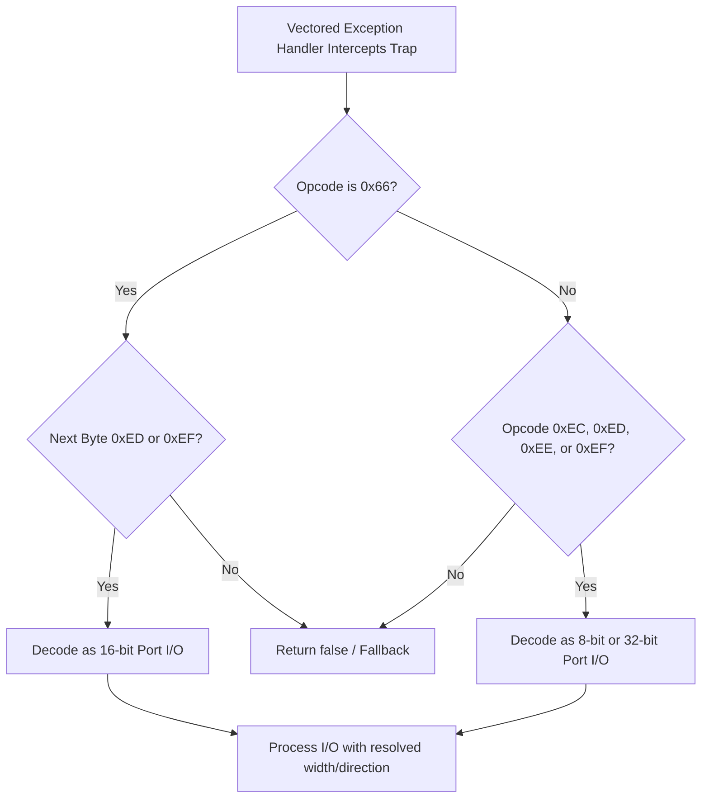

# 포트 I/O 한도 도달 및 8비트 포트 I/O 완화 설계
# Port I/O Limit and 8-bit Port I/O Tolerance Design

## 개요
## Overview
현재 `aot-dynamic` 백엔드 상에서 `pumpit1`을 실행할 때, 하드웨어 포트 I/O 명령이 대량으로 유발되며, 16비트/32비트 포트 외에도 `out dx, al` (8비트 출력) 및 `in al, dx` (8비트 입력) 등의 8비트 포트 I/O 명령어가 존재합니다.
현재 구현은 다음 두 가지 문제로 인해 크래시가 발생합니다.
1. 포트 I/O 횟수(`observed_count`)가 `kWin32DeferredPortIoLimit`(1024)에 도달하면 `deferred-limit` 에러와 함께 강제 종료(`return false`)됨.
2. `HandlePortIoInstruction` 함수가 오직 `0x66` prefix가 존재하는 16비트 포트 I/O만 처리하여, `0x66` prefix가 없는 8비트/32비트 포트 I/O(예: `EE` 즉 `out dx, al`, `EC` 즉 `in al, dx` 등)는 미지원 HLE 트랩으로 감지해 크래시됨.

이 문서는 포트 I/O 기록 제한에 도달하더라도 성공 처리하여 우회하고, 8비트/16비트/32비트 모든 크기의 포트 I/O를 지원하도록 설계하는 것을 목표로 합니다.

When running `pumpit1` on the `aot-dynamic` backend, a high volume of hardware port I/O instructions are generated. In addition to 16-bit and 32-bit instructions, 8-bit port I/O instructions such as `out dx, al` (8-bit output) and `in al, dx` (8-bit input) are also generated.
The current implementation crashes due to the following issues:
1. The process crashes (`return false`) with a `deferred-limit` error once the port I/O count (`observed_count`) reaches `kWin32DeferredPortIoLimit` (1024).
2. The `HandlePortIoInstruction` function only processes 16-bit port I/O instructions with a `0x66` prefix. It fails to handle 8-bit or 32-bit instructions without a prefix (e.g., `EE` for `out dx, al`, `EC` for `in al, dx`), leading to an unhandled HLE trap crash.

This document aims to design a tolerance mechanism where port I/O emulation continues safely even if the log limit is reached, while extending support to 8-bit, 16-bit, and 32-bit port I/O instructions.

---

## 분석 및 상세 설계
## Analysis and Detailed Design

### 1. 포트 I/O 명령어 집합 및 디코딩 확장
### 1. Port I/O Instruction Set and Decoding Extension
x86 아키텍처의 포트 I/O 명령어는 `0x66` prefix의 존재 여부와 opcode 바이트에 의해 크기와 방향이 결정됩니다.

- `0x66` prefix가 존재하는 경우:
  - `66 ED` : `in ax, dx` (16-bit, width = 2)
  - `66 EF` : `out dx, ax` (16-bit, width = 2)
- `0x66` prefix가 존재하지 않는 경우:
  - `ED` : `in eax, dx` (32-bit, width = 4)
  - `EF` : `out dx, eax` (32-bit, width = 4)
  - `EC` : `in al, dx` (8-bit, width = 1)
  - `EE` : `out dx, al` (8-bit, width = 1)

`HandlePortIoInstruction` 함수가 `0x66` prefix 여부를 먼저 체크하고, opcode 바이트(`0xEC`, `0xED`, `0xEE`, `0xEF`)에 따라 포트 크기(`width` = 1, 2, 4)와 입출력 방향(`is_input` = true/false)을 정적 분석하도록 변경합니다.

The port I/O instructions in the x86 architecture determine their width and direction based on the presence of the `0x66` prefix and the opcode byte.

- With `0x66` prefix:
  - `66 ED` : `in ax, dx` (16-bit, width = 2)
  - `66 EF` : `out dx, ax` (16-bit, width = 2)
- Without `0x66` prefix:
  - `ED` : `in eax, dx` (32-bit, width = 4)
  - `EF` : `out dx, eax` (32-bit, width = 4)
  - `EC` : `in al, dx` (8-bit, width = 1)
  - `EE` : `out dx, al` (8-bit, width = 1)

We will modify `HandlePortIoInstruction` to detect the `0x66` prefix first, then dynamically determine the width (1, 2, 4) and direction (`is_input`) based on the opcode byte (`0xEC`, `0xED`, `0xEE`, `0xEF`).



### 2. IsPortIoTraceCandidate 확장
### 2. IsPortIoTraceCandidate Extension
`IsPortIoTraceCandidate`는 8비트, 16비트, 32비트 모든 종류의 출력을 추적 대상으로 승인해야 합니다.
```cpp
bool IsPortIoTraceCandidate(std::uint16_t port,
                             std::uint32_t width,
                             bool is_input)
{
    return !is_input && (width == 1 || width == 2 || width == 4) && port >= 0x02A0 && port <= 0x02AF;
}
```

`IsPortIoTraceCandidate` must accept 8-bit, 16-bit, and 32-bit writes to track them successfully.
```cpp
bool IsPortIoTraceCandidate(std::uint16_t port,
                             std::uint32_t width,
                             bool is_input)
{
    return !is_input && (width == 1 || width == 2 || width == 4) && port >= 0x02A0 && port <= 0x02AF;
}
```

### 3. 완화 대책 (Tolerance Strategy)
### 3. Tolerance Strategy
- `observed_count`가 한도를 초과할 때 `RecordPortIo`에 `"deferred-limit"` 결과와 함께 `handled = true`로 기록하고, `win32_context->Eip`를 포트 명령어 크기(1 또는 2바이트)만큼 전진시킨 후 `true`를 반환해 실행을 복구시킵니다.
- 8비트/16비트/32비트 포트 입력 시 `port`가 `0x02A0 ~ 0x02AF` 범위 내에 있으면 각각 `0xFFU`, `0xFFFFU`, `0xFFFFFFFFU` 더미 값을 반환하여 폴링(Polling) 대기 상태를 안전하게 해제합니다.

- When `observed_count` exceeds the limit, `RecordPortIo` logs `"deferred-limit"` with `handled = true`, advances the EIP by the instruction size (1 or 2 bytes), and returns `true` to resume.
- For 8-bit, 16-bit, and 32-bit port reads within `0x02A0 ~ 0x02AF`, return `0xFFU`, `0xFFFFU`, or `0xFFFFFFFFU` respectively to satisfy hardware polling logic.
