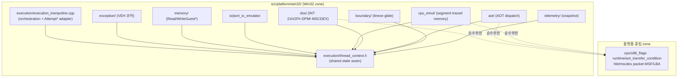

# 20260718-233 execution_trampoline.cpp 분해 설계 (Phase 1)

## 배경 / Background

`src/platform/win32/execution_trampoline.cpp`는 12,117줄 단일 파일로, VEH 예외 디스패치·명령어 에뮬레이션·DOS/DPMI/MSCDEX HLE·AOT 런타임 디스패치·라이브 텔레메트리를 모두 담고 있다. 이는 AGENTS.md 구현 규칙("큰 기능은 하나의 거대 파일에 누적하지 않는다", "독립적으로 이름 붙일 수 있는 하위 시스템은 전용 파일로 추출")에 위배된다.

`src/platform/win32/execution_trampoline.cpp` is a single 12,117-line file holding VEH exception dispatch, instruction emulation, DOS/DPMI/MSCDEX HLE, AOT runtime dispatch, and live telemetry together. This violates the AGENTS.md implementation rules (do not accumulate major features in one monolithic file; extract independently-named subsystems into dedicated files).

## 제약: 왜 단순 분리가 안 되는가 / Constraint: why a naive split fails

파일 전체가 하나의 익명 네임스페이스(내부 링크) 안에 있고, 거대한 `ThreadContext`를 공유 seam으로 쓴다. 별도 TU로 나누려면 다음이 필요하다.

The whole file lives in one anonymous namespace (internal linkage) and shares a large `ThreadContext` as its seam. Splitting into separate translation units requires:

1. 공유 타입/상수(`ThreadContext` 등)를 **최상위 `namespace repiu::platform::win32`(외부 링크)** 의 헤더로 이동. 익명 네임스페이스 내부 `#include` 금지(중첩 네임스페이스가 되어 링크 실패).
2. TU 경계를 넘어 호출되는 함수는 익명 네임스페이스 밖(외부 링크)으로 옮기고 헤더에 선언.
3. 분리한 `.cpp`를 반드시 `CMakeLists.txt`에 등록.

> 참고: 이전 미완성 시도(discard됨)는 (1)을 익명 네임스페이스 안에서 include하고 (3)을 누락했으며, `g_active_thread_context`·`DispatchGuestException`·`IsAotCacheAddress`·`WriteGuestBytes`를 외부 링크로 승격하지 않아 링크 불가 상태였다.

## Phase 1 목표 구조 / Target structure

동작 보존을 최우선으로, 디렉토리 그룹화 + 하위 시스템별 TU 분리를 수행한다. `CONTEXT`/`ThreadContext`는 Win32 전용(`HANDLE`·`std::atomic`·`Win32Aot*` 포함)이므로 Win32 zone에 잔류한다. `CONTEXT` 비의존 순수 leaf만 중립 dir로 이동한다.

Phase 1은 위 구조로의 **파일 재배치(동작 보존)** 까지만 수행한다. `CONTEXT` → 중립 `GuestCpuFrame` seam 도입(Phase 2)과 서비스 의미론의 중립 dir 이관(Phase 3)은 두 번째 플랫폼 백엔드가 실제로 필요해질 때 착수한다.

Phase 1 performs only behavior-preserving file relocation into the structure above. Introducing a neutral `GuestCpuFrame` seam (Phase 2) and relocating service semantics into neutral dirs (Phase 3) is deferred until a second platform backend actually exists.

## 증분 순서와 링크 규칙 / Increment order and linkage rule

각 증분은 **한 모듈 추출 → 빌드 검증 → 커밋** 을 지킨다. 경계 함수(다른 TU에서 호출)는 반드시 외부 링크로 승격하고 공유 헤더에 선언한다.

| # | 증분 | 승격 필요한 경계 심볼(예상) | 상태 |
|---|---|---|---|
| 1 | `thread_context.h` 공유 상태 헤더 추출 | (없음 - 타입/상수만) | 완료 |
| 2 | `port_io_emulator.{h,cpp}` | `IsAotCacheAddress`, `WriteGuestBytes` | 예정 |
| 3 | `exception_rescue_win32.{h,cpp}` (ExceptionDispatchScope·VEH 엔트리) | `g_active_thread_context`, `DispatchGuestException` | 예정 |
| 4 | 텔레메트리 스냅샷 | (조사 필요) | 예정 |
| 5 | 게스트/섀도 메모리 접근 | (조사 필요) | 예정 |
| 6 | DOS INT 21h/2Fh 서비스 | (조사 필요) | 예정 |
| 7 | MSCDEX / DPMI·마우스 | (조사 필요) | 예정 |
| 8 | 명령어 디코드·세그먼트·traced 메모리 에뮬 | (조사 필요) | 예정 |
| 9 | AOT 런타임 디스패치 | (조사 필요) | 예정 |
| 10 | linexe/glide 경계 | (조사 필요) | 예정 |
| 11 | 순수 중립 leaf(MSF/LBA·패킷·EvaluateAotCondition·x86 flags) 중립 dir 이동 | (없음) | 예정 |

> 디렉토리 하위 그룹화(execution/·exception/·dos/ 등)는 include 경로 수정 범위가 크므로, 각 TU 분리가 안정화된 후 마지막에 일괄 이동하는 것을 권장한다.

## 검증 절차 / Verification

- 빌드: `cmake --build build/win32_x86_dpmi --config Debug --target repiu_exe` (그리고 `repiu_loader_win32`).
- 동작 보존: 각 증분은 순수 코드 이동이므로 링크 성공 = 심볼 정합성 확인. 회귀 여부는 로더 실행이 동일 frontier까지 전진하는지로 확인(별도 관측).
- 기준선(clean HEAD)은 green 확인됨(C4819 코드페이지 경고만, 무해).
