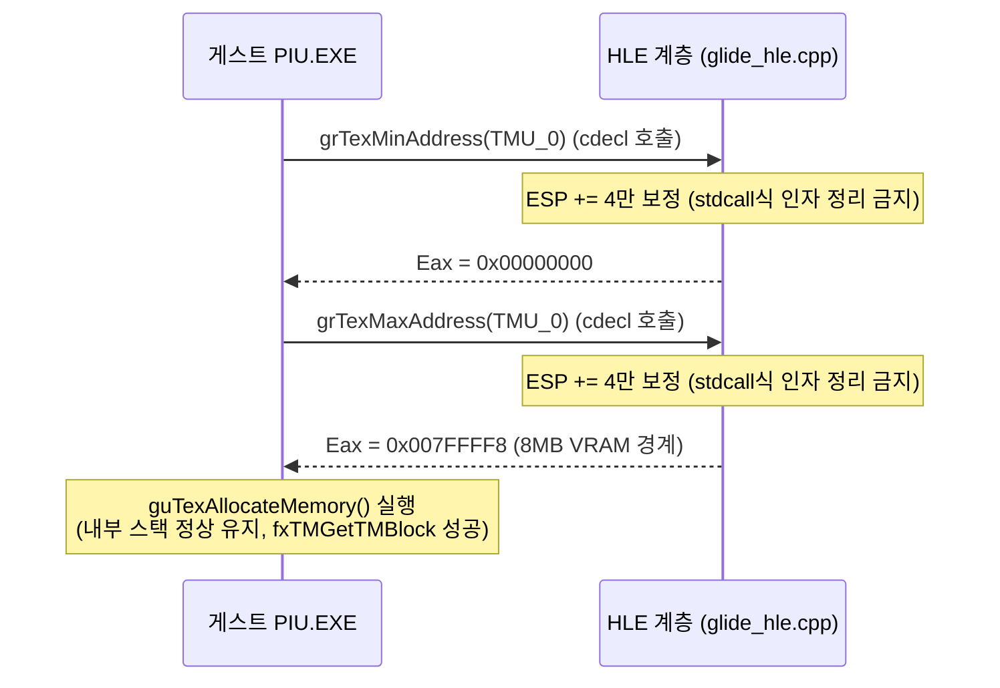

# fxTMGetTMBlock() HLE 구현 및 우회 전략
# HLE Implementation and Bypass Strategy for fxTMGetTMBlock()

---

## 1. 개요 (Overview)
`PIU.EXE` 실행 시 3dfx Glide 드라이버의 Voodoo 그래픽 초기화 과정에서 `fx Driver: internal error in fxTMGetTMBlock()` 에러 메시지를 출력하며 실행이 비정상 종료(Exit code: 0으로 DOS 정상 종료 탈출)하는 현상이 포착되었습니다. 
이 오류는 게스트 프로그램에 정적 링크된 Glide 텍스처 매니저(`txmgr` / `guTexAllocateMemory` 등) 모듈이 가상 텍스처 메모리 풀(TMBlock)을 구성 또는 조회하는 데 실패했기 때문에 발생합니다.

사용자 피드백에 따라, 아직 실제로 런타임 상에서 호출이 확인되지 않은 Glide 텍스처 가속 API들은 미리 구현하지 않으며, 오직 호출이 확인되고 스택 프레임 정렬 오염을 일으킨 `grTexMinAddress`와 `grTexMaxAddress`에 대한 정정 작업만을 1단계로 진행합니다.

When running `PIU.EXE`, the Voodoo graphics initialization process in the 3dfx Glide driver prints the error message `fx Driver: internal error in fxTMGetTMBlock()` and cleanly exits the process (DOS exit code: 0).
This error occurs because the Glide texture manager module (`txmgr` / `guTexAllocateMemory`, etc.) statically linked into the guest program fails to construct or query the virtual texture memory pool (TMBlock).

In accordance with user feedback, Glide texture acceleration APIs that have not yet been observed in the runtime trace will not be preemptively implemented. Instead, Stage 1 will focus solely on correcting `grTexMinAddress` and `grTexMaxAddress`, which are confirmed to be called and have caused the stack alignment corruption.

---

## 2. 근본 원인 분석 (Root Cause Analysis)

### A. `grTexMinAddress` 및 `grTexMaxAddress` 호출 후 스택 오염 (Stack Alignment Mismatch)
* **현상**: standard Glide 2.x API인 `_GRTEXMINADDRESS@4` 및 `_GRTEXMAXADDRESS@4`는 `stdcall` (인자 4바이트) 사양이지만, 게임 바이너리(`PIU.EXE`)는 이 함수들을 `cdecl` 방식으로 간주하여 호출자(Caller) 측에서 직접 스택을 정리(`add esp, 4`)하도록 컴파일되어 있습니다.
* **오류**: 현재 HLE의 `HandleGlideGateBoundary` 함수 내 구현체는 이 API들을 `stdcall`로 가로채어 복귀 시 `win32_context->Esp += 8` (복귀 주소 4 + 인자 정리 4) 처리를 수행합니다. 결과적으로 게스트 복귀 후 게스트 코드가 직접 `add esp, 4`를 다시 실행해버려 `Esp`가 정상보다 **4바이트 초과 정렬**되는 불일치가 발생합니다.
* **영향**: 스택 프레임이 손상되어 `guTexAllocateMemory` 내부에서 관리하는 로컬 변수나 구조체 주소 포인터가 손상되고, 이로 인해 내부 함수 `fxTMGetTMBlock()`가 오염된 메모리에 접근해 에러를 내며 탈출하게 됩니다.

### A. Stack Invalidation After calling `grTexMinAddress` and `grTexMaxAddress` (Stack Alignment Mismatch)
* **Symptom**: While the standard Glide 2.x APIs `_GRTEXMINADDRESS@4` and `_GRTEXMAXADDRESS@4` are designed under `stdcall` (4-byte argument) conventions, the game binary (`PIU.EXE`) treats them as `cdecl` and is compiled to clean up the stack itself (`add esp, 4`) on caller return.
* **Error**: The current implementation of `HandleGlideGateBoundary` in HLE intercepts these calls and applies `win32_context->Esp += 8` (4 bytes return address + 4 bytes argument cleanup) upon return. Consequently, once back in the guest code, the caller executes `add esp, 4` again, resulting in an **unintended 4-byte shift** of the `Esp` pointer.
* **Impact**: Misalignment corrupts stack-allocated local variables and struct pointers in `guTexAllocateMemory`, triggering the internal helper `fxTMGetTMBlock()` to read corrupted memory, fail, and abort.

---

## 3. 해결 및 구현 전략 (Proposed Architecture & Strategy)

### 전략 1: 스택 복귀 오프셋 정정 (Fix Stack Alignment)
`HandleGlideGateBoundary` 내에서 `_GRTEXMINADDRESS@4` 및 `_GRTEXMAXADDRESS@4` API 처리 시,
스택 복귀 값을 `win32_context->Esp += 2U * sizeof(std::uint32_t)` 대신 **`1U * sizeof(std::uint32_t)`** (4바이트)로 설정합니다.
이로 인해 복귀 주소만 스택에서 꺼내지고, 인자 4바이트는 게스트 프로그램이 복귀 직후 직접 `add esp, 4`로 정리할 수 있게 되어 스택 오염이 완전히 소멸합니다.

### Strategy 1: Correct Return Stack Offset (Fix Stack Alignment)
When handling `_GRTEXMINADDRESS@4` and `_GRTEXMAXADDRESS@4` in `HandleGlideGateBoundary`,
adjust the return stack adjustment to **`1U * sizeof(std::uint32_t)`** (4 bytes) instead of `2U * sizeof(std::uint32_t)`.
This only pops the return address off the stack, letting the guest caller clean up the 4-byte argument with its own `add esp, 4` instruction, thereby resolving the stack misalignment completely.

---

## 4. 검증 계획 (Verification Plan)
1. **스택 정렬 검증**: `grTexMinAddress` 및 `grTexMaxAddress` 호출 직후 `Esp`가 정상 범위에 복귀했는지 디버그 로그 및 single-step EIP를 통해 모니터링합니다.
2. **HLE 텍스처 매니저 생존 확인**: `fx Driver: internal error in fxTMGetTMBlock()` 에러 출력 없이 그래픽 초기화 과정 전체가 통과하는지 검증합니다.
3. **추가 호출 API 모니터링**: 텍스처 초기화 통과 후 새롭게 노출되는 Glide API 호출 유무를 텔레메트리 덤프와 log를 통해 관찰하여 추가 HLE 대상 목록을 도출합니다.

### Verification Plan
1. **Stack Alignment Verification**: Verify that the `Esp` register correctly aligns after returning from `grTexMinAddress` and `grTexMaxAddress` via debug logs and single-step EIP tracing.
2. **HLE Texture Manager Survival**: Confirm that the graphics initialization pipeline bypasses `fx Driver: internal error in fxTMGetTMBlock()`.
3. **Subsequent Call Monitoring**: Watch the telemetry dump and logs for any new Glide API calls requested after texture initialization passes, gathering names for future HLE tasks.
