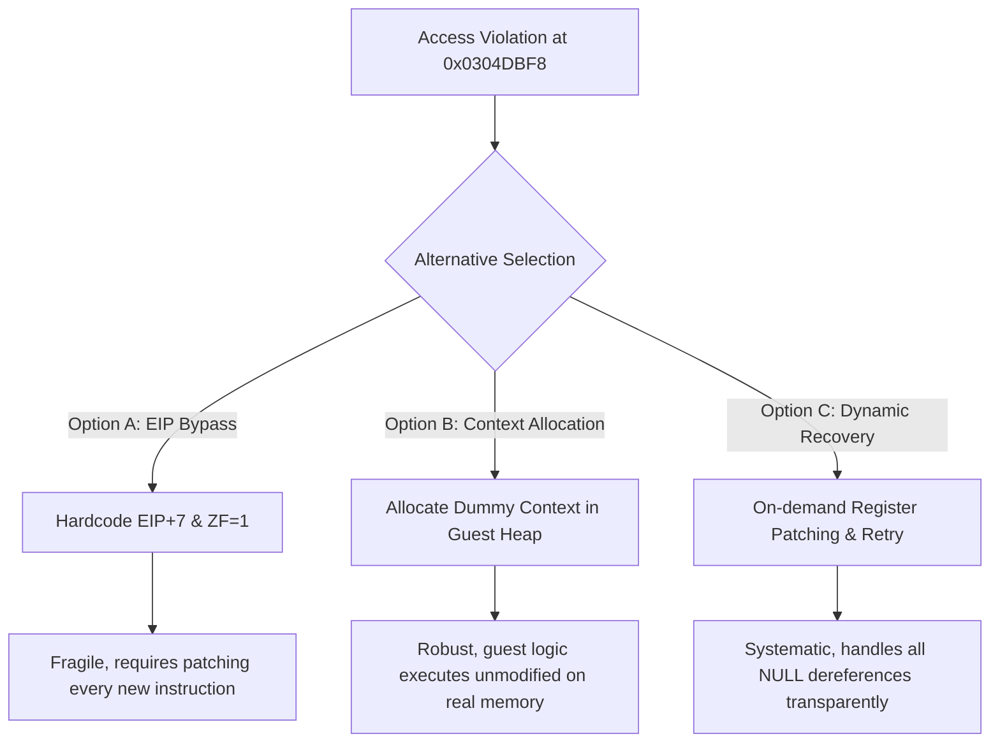
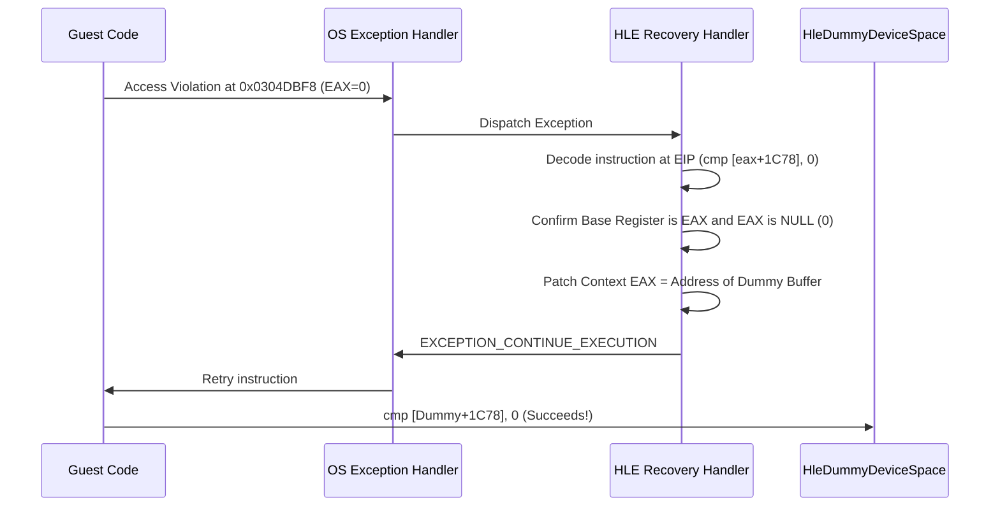

# HLE 미적재 장치 AV 예외에 대한 정석적 처리 전략 설계
# Systematic Strategy Design for HLE Device Initialization Access Violation Exceptions

## 개요
## Overview
현재 `aot-dynamic` 백엔드를 구동했을 때, WGL 윈도우 생성 이후 다음 단계인 `0x0304DBF8` (`cmp byte ptr [eax + 0x1C78], 0`)에서 `EAX` 레지스터가 `0` (NULL) 임으로 인해 읽기 Access Violation이 발생합니다. 이는 3dfx/Glide 드라이버를 로드한 상위 Mesa Voodoo 그래픽 드라이버의 내부 컨텍스트가 HLE 래핑으로 인해 누락/미탑재되어 발생한 전형적인 장치 체크 실패 예외입니다. 

본 문서에서는 이를 단순 EIP 스킵 방식으로 우회하지 않고, 게스트 바이너리의 변경을 최소화하며 실행 안정성을 확보할 수 있는 정석적인 처리 방안들을 검토 및 설계합니다.

When running the `aot-dynamic` backend, an Access Violation occurs at `0x0304DBF8` (`cmp byte ptr [eax + 0x1C78], 0`) because the `EAX` register is `0` (NULL). This is a typical device check exception caused by the missing/unloaded internal context of the static-linked Mesa Voodoo graphics driver (which relies on the HLE-wrapped Glide driver).

This document evaluates and designs systematic solutions to handle this without hardcoding individual EIP bypasses, ensuring maximum execution stability while minimizing guest code changes.

---

## 1. 정밀 분석 및 대안 검토
## 1. Detailed Analysis and Alternatives

### 문제의 분석 (Problem Analysis)
게스트 코드 디스어셈블 결과는 다음과 같습니다:
The disassembled guest code is as follows:
```assembly
0x0104dbe0: mov [esp], eax   ; eax에 보관된 context 포인터 저장
0x0104dbf5: mov eax, [esp]   ; context 포인터를 EAX로 복원
0x0104dbf8: cmp byte ptr [eax+0x1C78], 0x00 ; EAX가 0인 상태에서 멤버 조회 -> 크래시!
```
이 `EAX`는 Mesa Voodoo 드라이버의 `GLcontext` 또는 Glide 디바이스 컨텍스트 포인터로, 실제 Voodoo 그래픽 카드가 탐색되지 않았거나 Glide HLE 초기화 반환 흐름에서 메모리가 할당되지 않았기 때문에 `0`으로 남아있게 됩니다.

`EAX` represents the `GLcontext` of the Mesa Voodoo driver or the Glide device context. Because the real Voodoo graphics card was not detected, or the Glide HLE initialization returned successfully without allocating actual guest-side structures, this pointer remains `0`.

### 대안 비교 (Comparison of Alternatives)



#### 방안 A: 개별 EIP 우회 및 플래그 세팅 (EIP Bypass & Flag Setting)
* **내용**: 예외 핸들러에서 EIP가 `0x0304DBF8`일 때, ZF(Zero Flag)를 `1`로 세팅하고 복귀 지점을 7바이트 뒤로 이동시키는 방식.
* **장점**: 구현이 가장 빠르고 간단함.
* **단점**: 이후 메모리 쓰기(`mov [eax + offset], val`) 등의 연산이 이어질 경우 스킵만으로는 대응할 수 없고, 주소가 바뀔 때마다 신규 우회 코드를 추가해야 하므로 설계의 유지보수성이 떨어짐.

* **Description**: Capture the exception when EIP equals `0x0304DBF8`, set the Zero Flag (ZF) to `1`, and skip 7 bytes.
* **Pros**: Simple and quick to implement.
* **Cons**: Fails if the guest subsequent code performs writes (`mov [eax + offset], val`), and requires manual bypass additions whenever new addresses are hit, degrading maintainability.

#### 방안 B (정석 1): HLE 영역에 더미 컨텍스트 할당 및 반환 (Dummy Context Allocation)
* **내용**: Glide/Mesa 초기화 API(`_GRSSTWINOPEN` 등) 또는 로더 구동 시점에 게스트 가상 메모리 공간(예: DPMI 힙 영역)에 더미 컨텍스트로 사용할 안전한 메모리 블록(약 8KB 이상)을 할당하고, 게스트의 전역 컨텍스트 포인터나 반환값에 해당 메모리 주소를 제공하는 방식.
* **장점**: 게스트 코드가 수정되지 않은 오리지널 상태 그대로 실제 유효한 메모리에 접근하므로, 읽기/쓰기 동작이 모두 안전하게 통과되며 예외 처리(AV) 자체가 발생하지 않아 오버헤드가 전혀 없음.
* **단점**: 컨텍스트 주소가 보관되는 전역 변수(`0x0111C3BC` 등)의 메모리 주소를 추가적으로 분석해 내야 함.

* **Description**: Allocate a dummy context block (e.g., 8KB) in the guest virtual memory space (such as the DPMI heap area) during Glide/Mesa initialization (`_GRSSTWINOPEN`) or loader startup. Feed this address back to the guest through its context pointers or global variables.
* **Pros**: Guest code executes unmodified on valid memory. Both reads and writes are inherently safe, and zero runtime exception overhead is introduced since no Access Violation occurs.
* **Cons**: Requires reverse engineering the exact global/local variables storing the context pointer (e.g., `0x0111C3BC`).

#### 방안 C (정석 2 - 추천): 동적 널 포인터 레지스터 복구 및 재시도 (Dynamic Register Patching & Retry)
* **내용**: 범용적인 NULL 포인터 AV 복구 기전을 예외 핸들러에 추가합니다. `STATUS_ACCESS_VIOLATION`이 감지되었을 때, 역참조 대상 베이스 레지스터(여기서는 `EAX`)가 `0`인 경우, 해당 레지스터의 값을 HLE 내부의 **안전한 공용 더미 메모리 버퍼(HleDummyDeviceSpace)**의 가상 주소로 덮어쓰고, EIP를 그대로 둔 채 **명령어를 재시도(EXCEPTION_CONTINUE_EXECUTION)**하게 만듭니다.
* **장점**:
  1. 개별 EIP나 명령어의 크기(7바이트 등)를 하드코딩하여 스킵할 필요가 전혀 없음.
  2. 향후 널 포인터로 인해 다른 주소에서 발생하는 모든 장치 체크 예외(`cmp`, `mov` 등)를 하나의 범용적인 기전으로 일괄 해결함.
  3. 쓰기 동작이 발생하더라도 더미 영역에 안전하게 쓰여지므로 프로그램이 죽지 않음.
* **단점**: 예외 발생 시 레지스터 구조와 명령어 디코딩(어떤 레지스터가 베이스인지 판별)을 가볍게 수행해야 함. (Zydis 디코더가 이미 탑재되어 있으므로 수월하게 구현 가능)

* **Description**: Implement a generic NULL pointer recovery mechanism in the exception handler. When a `STATUS_ACCESS_VIOLATION` occurs, check if the base register (e.g., `EAX`) is `0`. If so, dynamically rewrite that register's context value to point to a pre-allocated **HleDummyDeviceSpace** and return `EXCEPTION_CONTINUE_EXECUTION` to **retry the instruction**.
* **Pros**:
  1. Eliminates the need to hardcode EIP addresses or instruction lengths.
  2. Generically handles all future NULL dereferences (`cmp`, `mov`, etc.) across different subsystems.
  3. Safe for both reads and writes as they target a valid dummy buffer.
* **Cons**: Requires lightweight instruction parsing to determine which base register triggered the fault (readily feasible since Zydis is already integrated).

---

## 2. 권장 제안 및 구체적 설계 (방안 C)
## 2. Recommended Proposal and Detailed Design (Option C)

가장 확장성 있고 정석적인 해결을 위해 **방안 C (동적 널 포인터 레지스터 복구 및 재시도)**를 적용할 것을 제안합니다.

For the most extensible and robust solution, we propose implementing **Option C (Dynamic Register Patching & Retry)**.

### HLE 공용 더미 버퍼 구조 (HLE Dummy Buffer Structure)
* **주소 할당 (Address)**: 런타임 이미지의 DPMI/HLE 예약 영역(예: `0x05E70000` 대역 또는 호스트가 별도 할당한 페이지)에 읽기/쓰기가 가능한 `64KB` 더미 영역 `HleDummyDeviceSpace`를 할당 및 0으로 채움.
* **할당**: `VirtualAlloc(..., 64 * 1024, MEM_COMMIT, PAGE_READWRITE)`

* **Memory Allocation**: Reserve and commit a read/writeable `64KB` page (`HleDummyDeviceSpace`) in the HLE region (e.g., `0x05E70000` block).
* **Allocation**: `VirtualAlloc(..., 64 * 1024, MEM_COMMIT, PAGE_READWRITE)`

### 예외 처리기 내의 복구 알고리즘 (Recovery Algorithm in Exception Handler)
예외(`0xC0000005`) 발생 시 다음과 같은 흐름으로 복구합니다:
When an exception (`0xC0000005`) occurs, recover using the following flow:



1. **예외 종류 필터링**: `ExceptionCode == STATUS_ACCESS_VIOLATION` 이고 `ExceptionInformation[0] == 0` (읽기 AV) 또는 `1` (쓰기 AV) 일 때 진입.
2. **명령어 분석**: 예외 EIP의 명령어를 Zydis로 디코딩하여 메모리 역참조에 사용된 베이스 레지스터(Base Register)를 획득. (예: `EAX`, `EDX` 등)
3. **Null 여부 검사**: 컨텍스트 구조체(`CONTEXT`)에서 획득한 베이스 레지스터의 값이 `0`인지 확인.
4. **레지스터 패칭**: `0`이 맞다면 해당 레지스터 값을 `HleDummyDeviceSpace` 가상 주소로 업데이트.
5. **재시도 지시**: `EXCEPTION_CONTINUE_EXECUTION`을 반환하여 OS가 해당 명령어를 새 레지스터 상태로 재실행하도록 유도.

1. **Filter Exception**: Enter when `ExceptionCode == STATUS_ACCESS_VIOLATION` and `ExceptionInformation[0]` is `0` (Read) or `1` (Write).
2. **Decode Instruction**: Use Zydis to decode the instruction at the exception EIP and identify the base register used for memory dereferencing (e.g., `EAX`, `EDX`).
3. **Verify NULL**: Confirm if the identified register's value in the thread `CONTEXT` is indeed `0`.
4. **Patch Register**: If it is `0`, update that register's context value with the virtual address of `HleDummyDeviceSpace`.
5. **Resume Execution**: Return `EXCEPTION_CONTINUE_EXECUTION` to instruct the CPU to retry the faulting instruction with the modified register state.

---

## 3. 검증 계획
## 3. Verification Plan

1. **AOT 컴파일 및 디코더 테스트**:
   - `repiu_loader` 빌드 후 `aot-dynamic` 모드 실행 시 `0x0304DBF8` 예외 지점에서 동적 복구가 일어나 JZ 분기로 정상 진입하는지 관측.
2. **레지스터 검사**:
   - 디버그 로그에 `[HLE-AV-Fix] Patched NULL register EAX to dummy device buffer at 0x...` 로그가 찍히고, 후속 메모리 명령이 오류 없이 정상 진행되는지 수동 로깅 검증.

1. **AOT Compiler & Decoder Verification**:
   - Build `repiu_loader` and run in `aot-dynamic` mode to verify that the dynamic patching takes place at `0x0304DBF8` and successfully transitions to the JZ branch.
2. **Register Verification**:
   - Ensure the debug log outputs `[HLE-AV-Fix] Patched NULL register EAX to dummy device buffer at 0x...` and subsequent memory operations complete without crash.
