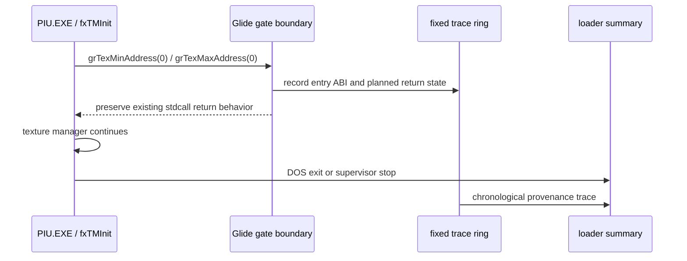

# fxTMGetTMBlock 인자 원점 추적 설계
# fxTMGetTMBlock Argument Provenance Trace Design

## 목적

현재 최신 빌드에서도 약 83초 후 `fxTMGetTMBlock()`가 `TMU: 0 Size: 51375639 (0x030FEE17)`로 실패하고 DOS 종료 코드 `0xFF`를 반환한다. `0x030FEE17`은 유효한 텍스처 크기가 아니라 게스트 이미지 안의 코드 주소처럼 보인다. 따라서 해결을 가정하거나 게임 로직을 우회하지 않고, `grTexMinAddress`와 `grTexMaxAddress` HLE 게이트에서 실제 호출 ABI와 복귀 상태를 보존해 인자 오염의 원점을 확인한다.

The current build still fails after about 83 seconds: `fxTMGetTMBlock()` reports `TMU: 0 Size: 51375639 (0x030FEE17)` and terminates through DOS exit code `0xFF`. `0x030FEE17` resembles a guest image code address rather than a texture size. Rather than assume a fix or bypass game logic, preserve the actual call ABI and return state at the `grTexMinAddress` and `grTexMaxAddress` HLE gates to establish the provenance of the corruption.

## 범위와 비목표

이 작업은 Win32 예외 경로에 고정 크기·할당 없는 진단 링만 추가한다. 대상은 TMU 0의 `_GRTEXMINADDRESS@4`와 `_GRTEXMAXADDRESS@4` 호출이며, 게이트의 반환값, ESP 조정, 게스트 메모리 또는 게임 로직을 변경하지 않는다. `fxTMGetTMBlock`의 실패를 무시하거나 인위적 텍스처 블록을 만들지 않는다.

This work adds only a fixed-size, allocation-free diagnostic ring in the Win32 exception path. It targets TMU 0 calls to `_GRTEXMINADDRESS@4` and `_GRTEXMAXADDRESS@4`; it does not change return values, ESP adjustment, guest memory, or game logic. It neither suppresses `fxTMGetTMBlock` failure nor fabricates a texture block.

## 설계

`ThreadContext`에 작은 순환 버퍼를 둔다. 각 항목은 호출 순서, 게이트 이름/ordinal, 진입 EIP·ESP, 복귀 주소, TMU 인자, 진입 EAX, HLE가 설정한 반환 EAX, 그리고 HLE가 계산한 복귀 ESP를 기록한다. 항목은 게이트가 실제로 처리하기 직전에 기록하므로 실패한 호출이 예외 경로 밖에서 유실되지 않는다. 실행 종료 시 `Win32ExecutionAttempt` 스냅샷으로 복사하고 loader가 시간 순서대로 출력한다.

A small circular buffer lives in `ThreadContext`. Each entry records sequence, gate name/ordinal, entry EIP/ESP, return address, TMU argument, entry EAX, the return EAX selected by HLE, and the HLE-calculated post-return ESP. Entries are recorded immediately before a gate is actually handled, preventing the relevant call from being lost outside the exception path. At termination, the snapshot is copied into `Win32ExecutionAttempt` and the loader prints it chronologically.

## 판정 기준과 검증

장기 `aot-dynamic` 실행에서 다음을 확인한다.

1. 두 게이트 호출의 실제 진입 ESP와 계획된 복귀 ESP 차이가 정확히 8바이트인지 확인한다.
2. 두 호출의 TMU 인자가 0이고 반환값이 각각 0 및 설정된 texture max인지 확인한다.
3. 실패 재현 시 trace의 복귀 주소와 `0x030FEE17`의 출현 위치를 종료 스택과 비교한다.
4. 전체 Win32 Debug 빌드가 성공하고, 진단 추가가 게이트 반환 동작을 바꾸지 않는지 확인한다.

Verify the following in a long `aot-dynamic` run.

1. Confirm that each gate's entry ESP and planned post-return ESP differ by exactly eight bytes.
2. Confirm TMU argument zero and returns of zero and configured texture max, respectively.
3. When failure reproduces, compare trace return addresses and the appearance of `0x030FEE17` with the termination stack.
4. Confirm the complete Win32 Debug build succeeds and that the diagnostics do not change gate return behavior.
