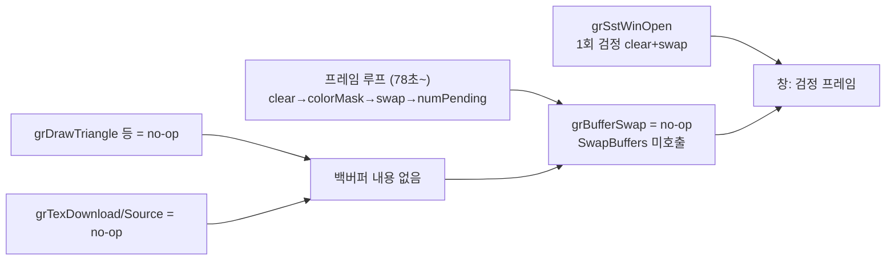
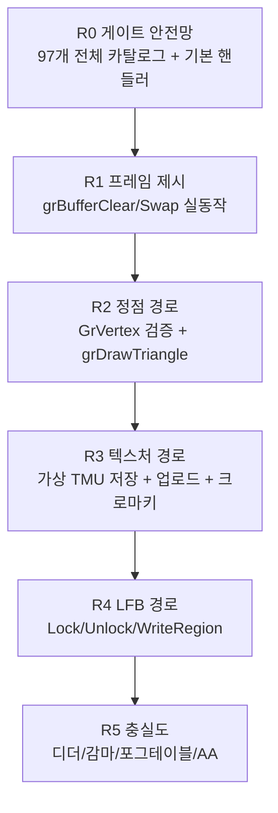

# Glide 렌더 경로 완성 설계 — 검은 화면 근인과 단계별 보완 방안 / Glide Render-Path Completion Design — Black-Screen Root Cause and Phased Plan

* 작성일 / Date: 2026-07-19 (Task 249)
* 상태 / Status: 설계 (관측 완료, 구현 전) / Design (observation complete, pre-implementation)
* 근거 관측 / Evidence: aot-dynamic `pumpit1` 600초(10분) 구동, Glide 게이트 전수 로그, `PIU.EXE` 바이너리 문자열 스캔, `glide2x.ovl` resident-name table 전수 파싱

## 1. 문제 정의 / Problem Statement

Tasks 245-248 이후 `pumpit1`은 aot-dynamic 백엔드에서 크래시 없이 장시간 실행되고
약 78초부터 프레임 루프에 정착하지만, 게임 창은 **검은 화면**만 표시한다.

After Tasks 245-248, `pumpit1` runs long sessions on the aot-dynamic backend and
settles into a frame loop at about 78 seconds, yet the game window shows only a
**black screen**.

## 2. 검은 화면 근인 / Black-Screen Root Cause

**확인됨.** 검은 화면은 단일 결함이 아니라 렌더 경로 3계층이 모두 ABI-보존 no-op이기
때문에 발생하는 구조적 결과다.

1. **제시(present) 부재:** `_GRBUFFERSWAP@4` 핸들러는 stdcall 정리만 하고
   `SwapBuffers`를 호출하지 않는다. 창에 남는 픽셀은 `OpenWindowed`가 초기화 시
   1회 수행한 `glClear(검정)` + `SwapBuffers` 결과뿐이다. 즉 창은 영원히 첫
   프레임(검정)을 표시한다.
2. **그리기 부재:** `_GRDRAWTRIANGLE@12` 등 draw 계열(71~76)과
   `_GRBUFFERCLEAR@12`가 전부 no-op이므로, swap을 구현하더라도 백버퍼에 그려진
   내용이 없다.
3. **텍스처 부재:** `_GRTEXDOWNLOADMIPMAPLEVEL@32`가 게스트가 준 텍셀 데이터를
   버리고, `_GRTEXSOURCE@16`도 no-op이므로, 그리기를 구현해도 텍스처가 필요한
   폴리곤은 내용을 표현할 수 없다.

**Confirmed.** The black screen is not a single defect; all three layers of the
render path are ABI-preserving no-ops: (1) no present — `_GRBUFFERSWAP@4` never
calls `SwapBuffers`, so the window forever shows the single black clear done once
inside `OpenWindowed`; (2) no drawing — the draw family and `_GRBUFFERCLEAR@12`
are no-ops, so the back buffer would be empty even if swapped; (3) no textures —
downloaded texel data is discarded and `_GRTEXSOURCE@16` is a no-op.

## 3. 현재 구현 인벤토리 / Current Implementation Inventory

세 계층으로 나뉜다: 게이트 핸들러(`linexe_glide_boundary.cpp`), 플랫폼 공용 논리
상태(`glide_hle.{h,cpp}`), Win32 OpenGL 백엔드(`glide_opengl_backend.cpp`,
`glide_opengl_shader.cpp`).

Three layers: gate handlers (`linexe_glide_boundary.cpp`), platform-neutral
logical state (`glide_hle.{h,cpp}`), and the Win32 OpenGL backend
(`glide_opengl_backend.cpp`, `glide_opengl_shader.cpp`).

### 3.1 시그니처 카탈로그 44개의 처리 등급 / Handling Grades of the 44 Cataloged Signatures

| 등급 / Grade | API | 비고 / Note |
|---|---|---|
| **A. 실제 의미 구현** (GL 상태/값 반영) | grSstWinOpen/WinClose, grSstQueryHardware, grSstSelect, grSstScreenWidth/Height, grTexMinAddress, grTexMaxAddress, grTexTextureMemRequired, grColorMask, grRenderBuffer, grDepthMask, grDepthBufferMode, grDepthBufferFunction, grAlphaTestFunction, grFogMode, grClipWindow, grCullMode, grDitherMode, grGlideGetState/SetState | 대부분 "관측된 인자값만" 지원하는 조건부 구현 (아래 3.2) |
| **B. 상태 보존 + 부분 GL 반영** | grAlphaCombine, grColorCombine, grAlphaBlendFunction | GLSL 번역기가 관측식(`1,0,0,2,0` / `4,0,4,0`)만 지원, 미지원 식은 상태만 유지하고 정상 반환(design 237 유지 정책) |
| **C. 상태만 보존** | grLfbWriteColorFormat, grGlideInit | 렌더 의미 없음 |
| **D. ABI-보존 no-op** | grBufferClear, grBufferSwap, grBufferNumPending(0 반환), grDrawPoint/Line/Triangle, grDrawPlanarPolygon(VertexList), grDrawPolygon, grTexDownloadMipMapLevel, grTexSource, grTexCombine, grTexClampMode, grTexFilterMode, grTexMipMapMode, grHints, grDepthBiasLevel | **검은 화면의 직접 원인 집합** |

### 3.2 조건부(관측값 한정) 구현의 제약 / Observed-Value-Only Constraints

등급 A 다수가 관측된 단일 인자만 받아들이고 그 외에는 `false`(게이트 미처리)로
떨어진다. 게임이 곡 선택·게임플레이로 진행해 새 인자를 쓰는 순간 게이트 미처리
크래시 사슬(Task 245-248의 zero-EIP)로 이어질 수 있는 잠재 위험이다.

* `DecodeGlideResolution`: resolution 7(640×480)만 지원
* `SetAlphaTestFunction`/`SetDepthBufferFunction`: Task 302에서 유효 비교 함수 `0..7` 지원
* `SetFogMode`/`SetCullMode`: 0(disable)만
* `SetClipWindow`: 전체 창(0,0,640,480)만
* `SetDitherMode`: 2만
* `SetAlphaBlend`: `ONE,ZERO,ONE,ZERO`만 (그 외는 유지 정책으로 정상 반환)
* `SetRenderBuffer`: front(0)/back(1)만

Many grade-A handlers accept only the single argument value observed so far and
otherwise fall through to `false` (unhandled gate). Any new value used by the
game later (song select, gameplay) risks re-entering the unhandled-gate crash
chain (the Task 245-248 zero-EIP).

### 3.3 게이트 안전망 구조 결함 / Structural Gate-Safety Defects

* Task 302에서 guest 반환 주소와 catalog signature가 검증된 이후의 handler 실패는
  공용 `decline_gate`가 보수적 반환값과 stdcall EIP/ESP 정리를 수행한다.
* 반환 주소 불량과 signature 불일치는 ABI를 신뢰할 수 없으므로 기존 hard reject를
  유지한다.

Task 302 routes every post-signature specialized-handler failure through a common
`decline_gate` that supplies a conservative return and performs normal stdcall
EIP/ESP cleanup. Invalid return addresses and signature mismatches remain hard
rejects because their ABI cannot be trusted.

## 4. PIU가 참조하는 전체 export 집합 / Full Export Set Referenced by PIU

`PIU.EXE` 바이너리에서 장식된 Glide 이름 **97개**를 확인했다(GETPROCADDR 요청
후보 전체). `glide2x.ovl` resident-name table은 ordinal 0~172를 노출하며
147~172는 PCI/포트 I/O 내부 계열로 HLE 대상이 아니다. 현재 카탈로그는 44개이므로
**53개가 미등록**이다. 미등록 이름이 호출되면 `signature-mismatch`로 거부되어
미처리 사슬에 합류한다.

We confirmed **97** decorated Glide names inside `PIU.EXE` (the full candidate
set for GETPROCADDR). The OVL resident-name table exposes ordinals 0-172;
147-172 are internal PCI/port-I/O helpers outside HLE scope. The catalog covers
44, leaving **53 unregistered** names whose calls would be rejected as
`signature-mismatch` and join the unhandled chain.

미등록 53개의 기능군 분류 (ordinal은 resident-name table 기준):

| 기능군 / Group | 이름 (ordinal) |
|---|---|
| **LFB 직접 픽셀 접근** | grLfbLock@24(112), grLfbUnlock@8(113), grLfbWriteRegion@32(116), grLfbReadRegion@28(117), grLfbConstantAlpha@4(110), grLfbConstantDepth@4(111), grLfbWriteColorSwizzle@8(115) |
| **크로마키 (스프라이트 투명)** | grChromakeyMode@4(87), grChromakeyValue@4(88) |
| **상수 색** | grConstantColorValue@4(92), grConstantColorValue4@16(93) |
| **AA draw 계열** | grAADrawPoint@4(66), grAADrawLine@8(67), grAADrawTriangle@24(68), grAADrawPolygon@12(69), grAADrawPolygonVertexList@8(70) |
| **draw 잔여** | grDrawPolygonVertexList@8(77) |
| **텍스처 다운로드/테이블** | grTexDownloadMipMap@16(47), grTexDownloadMipMapLevelPartial@40(144), grTexDownloadTable@12(143), grTexDownloadTablePartial@20(48), grTexNCCTable@8(137) |
| **텍스처 파라미터** | grTexCalcMemRequired@16(42), grTexCombineFunction@8(56), grTexDetailControl@16(43), grTexLodBiasValue@8(135), grTexMultibase@8(139), grTexMultibaseAddress@20(140) |
| **SST 상태/동기화** | grSstIdle@0(126), grSstIsBusy@0(127), grSstStatus@0(123), grSstVideoLine@0(124), grSstVRetraceOn@0(125), grSstControl@4(120), grSstOrigin@4(129), grSstConfigPipeline@12(130), grSstVidMode@8(41), grSstQueryBoards@4(36), grSstPerfStats@4(121), grSstResetPerfStats@0(122) |
| **fog/감마/기타 상태** | grFogColorValue@4(102), grFogTable@4(103), grGammaCorrectionValue@4(128), grAlphaControlsITRGBLighting@4(81), grAlphaTestReferenceValue@4(83), grDisableAllEffects@0(99) |
| **유틸/진단** | grGlideGetVersion@4(29), grGlideShamelessPlug@4(33), grGlideShutdown@0(104)*, grErrorSetCallback@4(50), grSplash@20(8), grCheckForRoom@4(107), grResetTriStats@0(34), grTriStats@8(35) |

\* grGlideShutdown은 카탈로그에 있으나 게이트 핸들러 분기가 없다.

## 5. 보완 방안 — 단계별 계획 / Phased Completion Plan

원칙: 원본 게임 코드는 주 실행 경로로 유지하고 렌더링 경계만 대체한다. 각 단계는
독립적으로 검증 가능해야 하며, 미확인 의미는 관측으로 확정한 뒤 구현한다
(정확성 우선).

Principle: original game code stays the primary execution path; only the
rendering boundary is replaced. Each phase must be independently verifiable, and
unverified semantics are pinned by observation before implementation
(accuracy over optimization).

### R0. 게이트 안전망 (크래시 사슬 원천 차단) / Gate Safety Net

1. 시그니처 카탈로그를 PIU 참조 97개 전체로 확장한다(@N은 resident-name table과
   교차 검증).
2. 게이트 핸들러에 **카탈로그 기반 기본 핸들러**를 추가한다: 전용 분기가 없는
   게이트는 stdcall 정리 + 반환 kind별 보수적 기본값(kVoid: 없음, kUInt32/kFxBool:
   0 또는 문서 근거 값) + `unimplemented-gate` 텔레메트리(ordinal별 카운트)로
   정상 반환한다. 이는 design 237 유지 정책의 일반화이며, "미처리 게이트 = 프레임
   누수 = 크래시" 사슬을 구조적으로 제거한다.
3. 반환값이 실행 흐름을 바꾸는 게이트는 문서 근거로 기본값을 정한다:
   `grSstIdle`(void, 즉시 반환), `grSstIsBusy`→0(idle), `grSstStatus`→FBI 상태
   비트(문서 확인 후), `grSstVRetraceOn`→토글 또는 0, `grBufferNumPending`→0(현행),
   `grSstVideoLine`→0, `grCheckForRoom`(void), `grGlideGetVersion`→"Glide 2.4" 문자열 기록.
4. backend 실패 `return false` 경로를 전수 `reject_gate`로 교체해 계측한다.
5. (구조 과제) 게이트 주소에서의 스택 스캔 복구 fail-closed 차단을 별도 작업으로
   설계한다.

Extend the catalog to all 97 referenced names; add a catalog-driven default
handler (stdcall cleanup + conservative documented return + per-ordinal
`unimplemented-gate` telemetry) so unhandled-gate frame leaks become structurally
impossible; route every backend-failure path through `reject_gate`.

### R1. 프레임 제시 경로 (검은 화면 1차 해소) / Frame Presentation

1. `GlideOpenGlBackend`에 `BufferClear(color, alpha, depth)`와 `BufferSwap
   (swap_interval)`을 추가한다.
   * `grBufferClear(color, alpha, depth)`: Glide 인자 → `glClearColor`
     (color는 현재 `grColorMask`·클립 윈도우 적용 하에), `glClearDepth(depth/65535)`,
     `glClear(...)`. Glide 문서상 clear는 클립 윈도우 영역에만 적용되므로 scissor
     상태를 유지한 채 clear한다.
   * `grBufferSwap(swap_interval)`: `SwapBuffers(device_context_)` 호출.
     swap_interval은 vsync 정책(초기: 무시하고 즉시 스왑, 추후 `wglSwapIntervalEXT`)
     으로 처리. 스왑 횟수를 텔레메트리에 노출해 실제 FPS를 관측한다.
2. 프레임 루프 게이트(`_GRBUFFERCLEAR@12`, `_GRBUFFERSWAP@4`)의 no-op 분기를
   backend 호출로 교체한다.
3. **검증:** clear 색을 임시 진단으로 비검정(예: 자홍)으로 바꿔 스왑이 제시되는지
   육안/스크린샷 확인 후 원복. 텔레메트리 스왑 카운트가 프레임 루프 주기와 일치
   하는지 확인.

Add real `BufferClear`/`BufferSwap` to the backend (glClear under current
mask/scissor; `SwapBuffers` with a swap-interval policy), replace the two no-op
frame-loop gates, and verify with a temporary non-black clear color plus a swap
counter in telemetry.

### R2. 정점/삼각형 경로 / Vertex and Triangle Path

1. **GrVertex 레이아웃 확정(선행 관측):** Glide 2.4 문서 기준
   `{float x,y,z; float r,g,b; float ooz; float a; float oow; GrTmuVertex[3]}`
   (72바이트, GrTmuVertex=`{sow,tow,oow}`)를 가정하되, 첫 `grDrawTriangle` 호출의
   세 포인터가 가리키는 72바이트를 덤프하는 일회성 진단으로 x,y가 화면 좌표
   (0~640/0~480 float)인지 교차 검증한 뒤 구현한다.
2. `GlideOpenGlDraw`(신규 파일, 예: `src/platform/win32/glide_opengl_draw.cpp`)를
   추가한다: 게스트 GrVertex → 호스트 정점 배열 변환, 현재 combine/blend/depth
   상태로 즉시 모드 대신 소규모 버텍스 배치 제출. 기존 GLSL 프로그램에 정점
   속성(위치, iterated RGBA, ST)을 연결한다.
3. `grDrawTriangle/Point/Line`, `grDrawPolygon(VertexList)` 게이트를 draw 경로로
   교체한다. 좌표 원점은 `grSstWinOpen`의 origin 인자(관측값 1 = upper-left)를
   투영 변환에 반영한다.
4. `grConstantColorValue(4)`를 상태로 보존하고 combine의 CONSTANT 소스에 연결한다.
5. **검증:** 게임이 텍스처 없이 그리는 요소(단색 폴리곤·페이드)가 화면에 나타나는지
   확인. draw 호출 카운트/프레임 텔레메트리.

Pin the 72-byte GrVertex layout with a one-shot runtime dump before coding, add a
dedicated `glide_opengl_draw.cpp` (guest GrVertex → host vertex batch under the
current combine/blend state), replace the draw-family gates, honor the observed
upper-left origin, and wire `grConstantColorValue` into the CONSTANT combine
source.

### R3. 텍스처 경로 / Texture Path

1. **가상 TMU 저장소**(신규 파일, 예: `src/hle/glide_texture_store.{h,cpp}`,
   플랫폼 공용): 8 MiB 바이트 배열로 TMU0 주소 공간을 실체화한다.
   * `grTexDownloadMipMapLevel(@32)`/`Partial(@40)`/`grTexDownloadMipMap(@16)`:
     게스트 텍셀 데이터를 startAddress 기준으로 저장소에 복사하고 해당 주소 범위를
     dirty로 표시한다.
   * `grTexDownloadTable(@12)`/`TablePartial(@20)`/`grTexNCCTable(@8)`: 팔레트
     (P8/AP88)와 NCC 테이블을 보존한다.
2. **텍스처 캐시**(`glide_opengl_texture.cpp`): `grTexSource(@16)` 시점에
   `(startAddress, GrTexInfo)`를 키로 GL 텍스처를 생성/재사용하고, dirty면
   포맷 디코드 후 재업로드한다.
   * 포맷 디코드: RGB565/ARGB4444/ARGB1555/RGB332/A8/I8/AI44/AI88/P8(팔레트)
     → RGBA8. Glide 2.4 문서의 GrTextureFormat_t 정의를 따른다.
   * `grTexFilterMode/ClampMode/MipMapMode`를 GL 샘플러 파라미터로 반영한다.
3. `grTexCombine(@28)`을 GLSL 번역기로 확장해 TEXTURE 소스를 combine 식에
   연결한다(현재 LOCAL-iterated만 지원).
4. **크로마키:** `grChromakeyMode/Value`를 상태로 보존하고 프래그먼트 셰이더에서
   `texel == chromakey → discard`로 구현한다(2D 스프라이트 투명의 핵심 후보).
5. **검증:** BGA/UI 텍스처가 표시되는지 스크린샷, 업로드 바이트/텍스처 수 텔레메트리.

Materialize the 8 MiB TMU address space as a platform-neutral byte store fed by
the download family (including palettes/NCC), key a GL texture cache on
`(startAddress, GrTexInfo)` at `grTexSource` time with format decoding to RGBA8,
extend the combine translator to TEXTURE sources, and implement chroma-key
discard in the fragment shader.

### R4. LFB 경로 / Linear Frame Buffer Path

1. `grLfbLock(@24)`: 게스트에 노출할 스테이징 버퍼(arena 내 호스트 관리 영역)를
   `GrLfbInfo_t`(lfbPtr, strideInBytes, writeMode, origin)로 반환한다. 읽기
   lock은 현재 프레임버퍼를 다운로드해 채운다.
2. `grLfbUnlock(@8)`: 쓰기 lock이었다면 스테이징 내용을 전체 화면 텍스처로
   업로드해 그린다(제시 자체는 다음 grBufferSwap).
3. `grLfbWriteRegion(@32)`/`ReadRegion(@28)`: lock 없이 부분 사각형을 즉시
   변환·복사한다. `grLfbWriteColorFormat`(보존 중), `ConstantAlpha/Depth`,
   `WriteColorSwizzle`을 변환에 반영한다.
4. **검증:** 스플래시/비디오성 화면(BGA)이 LFB로 오는지 게이트 카운트로 확인 후
   해당 화면 스크린샷.

Expose a staging buffer through `grLfbLock`/`Unlock` (upload-on-unlock for write
locks, framebuffer download for read locks), implement direct region writes with
the stored LFB color format, and verify against LFB-driven screens.

### R5. 충실도 / Fidelity

* Voodoo ordered dithering GLSL(기존 TODO, design 158), `grGammaCorrectionValue`,
  `grFogTable/FogColorValue`(테이블 기반 포그), AA draw 계열의 실제 AA, 
  `grSstOrigin` 동적 원점 전환, 성능 카운터(`grSstPerfStats`) 근사.

## 6. 우선순위 근거와 미확정 사항 / Priority Rationale and Open Questions

10분 관측에서 프레임 루프가 `grBufferClear → grColorMask → grBufferSwap →
grBufferNumPending`(+ 상태 재설정, `grTexMipMapMode` 등)을 지속 순환함을 확인했다.
따라서 R1만으로도 "매 프레임 제시"가 살아나 게임 로직의 시각적 진행(클리어 색
변화·페이드)이 관측 가능해지고, R2/R3이 실제 콘텐츠를 채운다. R0은 모든 단계의
전제인 안정성 안전망이다.

**미확정 — draw/LFB 호출 부재의 원인:** 600초 동안 draw 계열(66~77)과 LFB 계열
(110~117) ordinal이 1 Hz 샘플 560여 건에서 한 번도 관측되지 않았고 거부 게이트도
0건이었다. 즉 현재 게임 상태의 프레임 루프는 clear/상태 재설정/swap만 반복하며
장면 콘텐츠를 그리지 않는 것으로 보인다. 두 가지 해석이 남는다: (a) 게임 상태
머신이 Glide 밖 하위 시스템(코인/테스트 입력 I/O, YMZ280B 사운드, CD 오디오,
EEPROM)의 진행을 기다리며 빈 프레임을 돌리고 있다, (b) 관측 한계(게이트 전수
로그 96건 캡, 1 Hz 샘플링)로 저빈도 호출을 놓쳤다. R0의 ordinal별 라이브 카운트
텔레메트리가 이를 확정한다. 어느 쪽이든 렌더 경로 no-op이 화면 출력을 구조적으로
차단한다는 결론(§2)은 변하지 않는다.

**측정 선결 과제:** 로더의 timeout-teardown segfault(exit 139, Task 235 잔여)가
자체 타임아웃 경로의 종료 요약(ordinal별 호출 카운트) 출력을 막는다. R0에서
ordinal 카운트를 공유 텔레메트리로 승격(실행 중 관측 가능)하거나 teardown
segfault를 수정해 종료 요약을 복구해야 검증 루프가 완성된다.

LFB(R4)는 실사용이 카운트로 확인될 때 착수한다(호출되면 R0 기본 핸들러가
안전하게 통과시키고 카운트를 남긴다).

The 10-minute run shows the frame loop continuously cycling clear→mask→swap→
numPending, so R1 alone revives per-frame presentation; R2/R3 fill in content,
and R0 is the stability precondition. **Open:** no draw (66-77) or LFB (110-117)
ordinal appeared in ~560 one-per-second samples over 600 s and zero gates were
rejected, so the current frame loop appears to render no scene content — either
the game-state machine is waiting on non-Glide subsystems (coin/test I/O,
YMZ280B, CD audio, EEPROM) while spinning empty frames, or the observation caps
(96-entry gate log, 1 Hz sampling) missed rare calls. The per-ordinal live count
telemetry added in R0 settles this; either way the §2 conclusion stands.
**Measurement precondition:** the loader's timeout-teardown segfault (exit 139,
a Task 235 leftover) suppresses the graceful-exit summary, so R0 must promote
ordinal counts into shared live telemetry or fix the teardown to close the
verification loop. R4 starts only when gate counts prove actual LFB use.

## 7. 구조/파일 배치 규칙 / Structure and File Layout

AGENTS.md 구현 규칙에 따라 거대 파일 누적을 피한다:

* 플랫폼 공용: `src/hle/glide_texture_store.{h,cpp}` (가상 TMU 저장·팔레트·포맷
  메타), `glide_hle.cpp`는 카탈로그·상태 유지.
* Win32 backend: `glide_opengl_draw.cpp`(정점/드로우), `glide_opengl_texture.cpp`
  (텍스처 캐시·디코드), 기존 `glide_opengl_backend.cpp`는 창/컨텍스트/상태 전달
  orchestration만 유지.
* 게이트 핸들러(`linexe_glide_boundary.cpp`)는 ABI 해석과 위임만 남기고, 기본
  핸들러 도입으로 이름별 분기를 축소한다.

Keep the boundary file to ABI decoding and delegation, put the virtual TMU store
in shared HLE code, and split draw/texture backends into dedicated files.

## 8. 검증 전략 / Verification Strategy

각 단계 공통: (a) aot-dynamic 600초 구동 무크래시 + 거부/미구현 게이트 카운트
확인, (b) ordinal별 호출 카운트로 새 API 도달 확인, (c) 화면 스크린샷(수동 또는
캡처 도구)과 스왑 카운트 텔레메트리. R2 이후는 프레임 해시/참조 스크린샷 비교를
도입한다.

Per phase: crash-free 600 s run with rejected/unimplemented gate counts, ordinal
call counts proving reach, and screenshots plus swap-count telemetry; from R2 on,
frame hashes against reference captures.

## 9. 참조 / References

* [3Dfx Glide 2.4 Reference Manual](https://www.bitsavers.org/components/3dfx/Glide_Reference_Manual_2.4_199707.pdf) — GrVertex, grLfb*, GrTextureFormat_t, grBufferClear/Swap 의미
* [3Dfx Glide 2.4 Programming Guide](https://www.bitsavers.org/components/3dfx/Glide_Programming_Guide_2.4_199707.pdf)
* `docs/analysis/glide2x-ovl-and-opengl-hle.md` — export 인벤토리·관측 이력
* `docs/design/20260719-237-glide-hints-boundary.md` — 유지 정책(미지원 식 정상 반환)
* `docs/analysis/current-execution-frontier.md` — Tasks 233~249 frontier 이력
