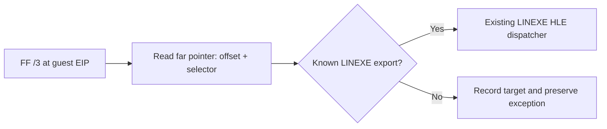

# 간접 원거리 LINEXE 호출 경계 설계 / Indirect Far LINEXE Call Boundary Design

## 목적 / Purpose

실행 관찰에서 object 2의 `FF 1D 90 9C 2D 03`은 32-bit near call이 아니라
`call far m16:32 ptr [0x032D9C90]`입니다. Win32 사용자 모드는 guest selector를
직접 실행할 수 없으므로, 이 전이는 host CPU에 맡기지 않고 HLE 경계에서 해석해야 합니다.

The observed object-2 instruction `FF 1D 90 9C 2D 03` is not a 32-bit near
call; it is `call far m16:32 ptr [0x032D9C90]`. Win32 user mode cannot execute
the guest selector directly, so the HLE boundary must decode this transfer
before handing it to the host CPU.

## 범위와 안전 정책 / Scope and Safety Policy

1. `HandleLinexeFarTransferBoundary`는 기존 `66 EA` immediate far-jump 형식을
   계속 처리합니다.
2. `FF /3`의 absolute-memory (`mod=00`, `r/m=101`) 형식만 추가로 인식합니다.
3. 포인터 메모리가 guest image 안에 있고 읽을 수 있을 때만 4-byte offset과
   2-byte selector를 읽습니다.
4. 해석한 selector:offset이 `LinexeCallGatePlan`의 **확인된 원본 export**일 때만
   확인 여부만 기록합니다. far-call의 push/RETF ABI를 확인하기 전에는 dispatcher를 호출하지 않습니다.
5. 알 수 없는 대상은 host far call로 실행하거나 강제로 건너뛰지 않습니다. 관측값만
   남기고 기존 예외 경로로 돌려보냅니다.

1. `HandleLinexeFarTransferBoundary` continues to handle the existing `66 EA`
   immediate far-jump form.
2. It additionally recognizes only the `FF /3` absolute-memory form
   (`mod=00`, `r/m=101`).
3. It reads the 4-byte offset and 2-byte selector only when the pointer memory
   belongs to readable guest image memory.
4. It dispatches only when selector:offset identifies a **confirmed original
   export** in `LinexeCallGatePlan`.
5. Unknown targets are neither executed as host far calls nor skipped; their
   observation is retained and the pre-existing exception path remains active.

## 검증 / Verification

* Win32 x86 Debug 빌드를 수행합니다.
* 동일 실행에서 far-call observation이 source, pointer address, target offset,
  selector, recognized 여부를 출력하는지 확인합니다.
* 알려지지 않은 대상은 종전과 같이 fail-closed로 남고, 알려진 대상만 기존 HLE ABI를
  통해 진행하는지 확인합니다.

* Build Win32 x86 Debug.
* Confirm the same execution prints source, pointer address, target offset,
  selector, and recognition state for the far call.
* Confirm unknown targets remain fail-closed, while only known targets proceed
  through the existing HLE ABI.
