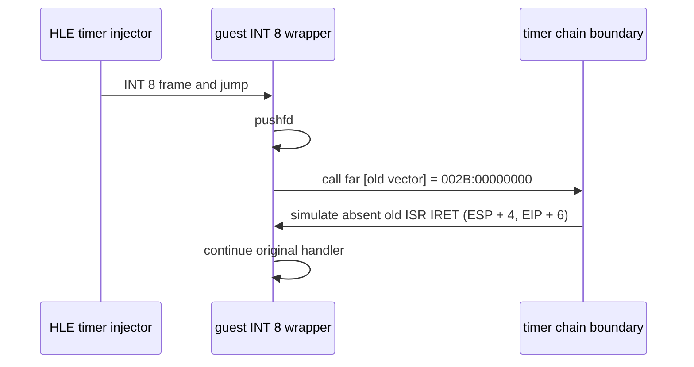

# INT 8 체인 벡터 HLE 설계

## 확인된 사실

직접 `aot-dynamic` loader 실행에서 게임이 DOS `INT 21h AH=25h`로 INT 8 핸들러 `0023:03042EAE`를 설치하고, HLE가 해당 핸들러를 주입한다. 핸들러는 `pushfd; call far [032D9C90h]`를 실행하며, 저장된 이전 벡터는 `002B:00000000`이다. `002B`는 현재 데이터 선택자이므로 이 far call은 접근 위반으로 중단된다.

`CALL FAR` 뒤의 이전 타이머 ISR은 보통 `IRET`로 call이 만든 반환 IP/CS와 앞서 저장한 EFLAGS를 함께 소비한다. 따라서 HLE가 이전 벡터가 없음을 대체할 때에는 call을 건너뛰는 것만으로 충분하지 않으며, 이미 실행된 `pushfd`의 4바이트도 제거해야 한다.

## 설계

Win32 전용 timer-interrupt boundary를 추가한다. 다음 조건을 모두 만족할 때만 HLE no-op ISR 반환을 적용한다.

* 현재 명령이 `FF 1D disp32` (`call far m16:32`)이다.
* 직전 바이트가 `9C` (`pushfd`)이다.
* 대상 far pointer가 `offset=0`, 예외 순간 CPU `SegDs`와 같은 selector를 가진다. (`ThreadContext`의 과거 세그먼트 추적값은 이 판단에 사용하지 않는다.)
* INT 8 protected-mode vector가 게임 핸들러로 설치되어 있다.

처리 시 `ESP += 4`, `EIP += 6`으로 원래 ISR의 `IRET` 완료 상태를 재현한다. 그 외 far call은 처리하지 않아 기존 fail-closed 동작을 유지한다. 진단 카운터와 source/pointer/target을 실행 결과에 기록한다.

## 검증

Win32 x86 debug build를 수행한다. 직접 loader의 `pumpit1` AOT dynamic/timeout-disabled 로그에서 INT 8 chain HLE count가 증가하고, 기존 `0x03042EBE` far call로 인한 즉시 예외가 사라지는지 확인한다.

# INT 8 Chain Vector HLE Design

## Confirmed facts

In a direct `aot-dynamic` loader run, the game installs its INT 8 handler at `0023:03042EAE` via DOS `INT 21h AH=25h`, and the HLE injects that handler. The handler executes `pushfd; call far [032D9C90h]`; the saved previous vector is `002B:00000000`. `002B` is the current data selector, so the far call faults.

The previous timer ISR normally completes with `IRET`, consuming the return IP/CS pushed by the far call and the preceding EFLAGS. A replacement for an absent previous vector must therefore remove the four bytes already pushed by `pushfd`, not merely skip the call.

## Design

Add a Win32-only timer-interrupt boundary. It applies a no-op old-ISR return only when all of the following hold:

* The instruction is `FF 1D disp32` (`call far m16:32`).
* The preceding byte is `9C` (`pushfd`).
* The far target has `offset=0` and a selector equal to the faulting CPU `SegDs`; historical segment-tracking state is not used for this decision.
* The protected-mode INT 8 vector is installed by the game handler.

The handler uses `ESP += 4` and `EIP += 6` to reproduce the completed old ISR `IRET` state. All other far calls remain unhandled, preserving fail-closed behavior. Diagnostics record the count and source/pointer/target.

## Verification

Build Win32 x86 debug. In direct-loader `pumpit1` AOT dynamic, timeout-disabled output, confirm that the INT 8 chain HLE counter advances and that the immediate fault at far call `0x03042EBE` no longer occurs.
