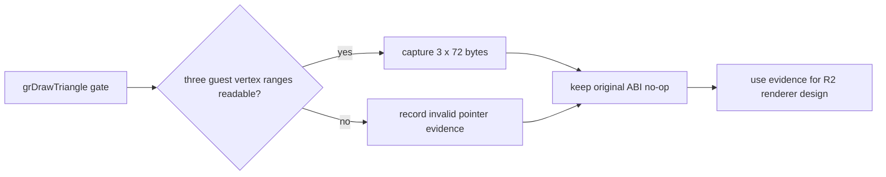

# Glide R2 GrVertex 관측 설계

## 배경

R0/R1 이후 PIU의 97개 Glide API는 ABI 안전망을 갖고 clear/swap은 실제 WGL에 연결되어 있다. 그러나 장시간 관측에서 draw gate가 아직 호출되지 않았으며, `GrVertex`의 72바이트 레이아웃은 Glide 2.4 문서에 근거한 가설일 뿐 이 실행 파일에서 검증되지 않았다.

## 설계

`_GRDRAWTRIANGLE@12` gate가 최초 호출될 때 세 인자 정점 포인터와 각 포인터의 72바이트(18 dword)를 기록한다. 각 포인터는 guest readable 범위를 확인하며, 읽을 수 없는 포인터는 별도 valid flag로 남긴다. 실시간 stderr와 종료 attempt 진단 모두에 노출한다.

이 작업은 draw 호출의 stdcall ABI를 기존과 동일하게 보존하며, 정점을 해석하거나 OpenGL draw를 수행하지 않는다. 캡처된 x/y/z, RGBA, ooz/oow, TMU 좌표 후보를 실제 호출 자료와 대조한 뒤에만 R2 렌더러를 설계한다.

## 검증

Win32 x86 debug build를 수행한다. draw gate가 발생하는 실행에서는 first-draw 로그와 종료 진단의 pointer/dword 내용이 일치해야 한다. draw가 발생하지 않으면 호출 수 0 자체가 게임 상태 전진의 선행 과제라는 증거로 남긴다.

# Glide R2 GrVertex Observation Design

## Background

After R0/R1, all 97 PIU Glide APIs have ABI safety coverage and clear/swap are connected to WGL. Long observations have not yet reached a draw gate, and the 72-byte `GrVertex` layout is only a Glide 2.4-document-based hypothesis, not a verified layout for this executable.

## Design

On the first `_GRDRAWTRIANGLE@12` gate call, record the three vertex argument pointers and 72 bytes (18 dwords) at each pointer. Each guest range is checked for readability and unreadable pointers receive an explicit valid flag. Expose the data in both live stderr and final attempt diagnostics.

This task keeps the current stdcall ABI no-op; it neither interprets vertices nor submits OpenGL draws. R2 rendering is designed only after the captured x/y/z, RGBA, ooz/oow, and TMU-coordinate candidates are compared with actual call data.

## Verification

Build Win32 x86 debug. Where a draw gate occurs, first-draw logging and final attempt diagnostics must agree on pointer/dword data. If no draw occurs, the zero call count is retained as evidence that advancing game state is a prerequisite.

## 2026-07-20 first observation

Direct loader observation reached the first `grDrawTriangle`: pointers `0383C640`, `0383C67C`, and `0383C6F4` were all readable. The next run emits all 18 dwords per vertex before field interpretation.
