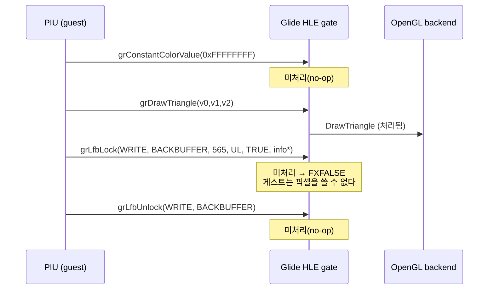
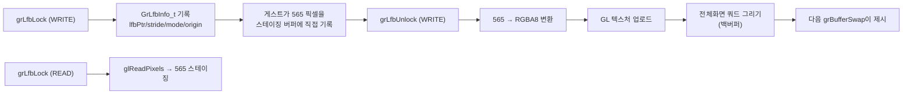

# Glide R4 LFB 경로 설계 — grLfbLock/grLfbUnlock 실동작 / Glide R4 LFB Path Design — Functional grLfbLock/grLfbUnlock

* 작성일 / Date: 2026-07-21 (Task 257)
* 상태 / Status: 설계 (관측 완료, 구현 착수) / Design (observation complete, implementation starting)
* 선행 / Predecessor: `docs/design/20260719-249-glide-render-path-completion.md` §5 R4
* 근거 관측 / Evidence: `aot-dynamic pumpit1` 300초 구동, ordinal별 최초호출 감사(`REPIU_GLIDE_CALL_AUDIT`)

## 1. 문제 정의 / Problem Statement

design 249는 R4(LFB)를 **"실사용이 카운트로 확인될 때 착수"** 로 유보했다. Task 257의
ordinal 감사 구동이 그 조건을 충족시켰다.

**확인됨.** 300초 구동에서 카탈로그 97종 중 39종이 호출됐고, 런타임이 스스로
`unhandled (default)`로 기록한 게이트는 정확히 3개다.

| ordinal | API | 최초 호출 인자 | 현재 결과 |
|---:|---|---|---|
| 92 | `grConstantColorValue@4` | `0xFFFFFFFF` | no-op |
| 112 | `grLfbLock@24` | `1, 1, 0, 0, 1, 0x035D6DB0` | **EAX=0 = FXFALSE (lock 실패)** |
| 113 | `grLfbUnlock@8` | `1, 1` | no-op |

콘텐츠 단계 진입 시퀀스는 다음과 같다.



즉 게임은 첫 삼각형 직후 **LFB로 직접 픽셀을 쓰려 하는데 lock이 실패**한다. 1,400
스왑 전 구간에서 `non-black=0`(완전 검정)이 관측된 것과 정합한다.

**Confirmed.** A 300 s run reached 39 of the 97 cataloged exports; exactly three
gates were logged `unhandled (default)`, and two of them are the LFB pair. The
game attempts a direct write-only lock on the back buffer immediately after its
first triangle, and the default handler returns FXFALSE, so the guest can never
write pixels. This is consistent with the fully black framebuffer observed
across 1,400 swaps.

## 2. 관측된 인자의 의미 / Decoding the Observed Arguments

[Glide 2.4 Reference Manual](https://www.bitsavers.org/components/3dfx/Glide_Reference_Manual_2.4_199707.pdf) 기준:

```c
FxBool grLfbLock(GrLock_t type, GrBuffer_t buffer, GrLfbWriteMode_t writeMode,
                 GrOriginLocation_t origin, FxBool pixelPipeline, GrLfbInfo_t *info);
void   grLfbUnlock(GrLock_t type, GrBuffer_t buffer);
```

| 인자 | 관측값 | 해석 |
|---|---:|---|
| `type` | 1 | `GR_LFB_WRITE_ONLY` |
| `buffer` | 1 | `GR_BUFFER_BACKBUFFER` |
| `writeMode` | 0 | `GR_LFBWRITEMODE_565` (2 byte/texel) |
| `origin` | 0 | `GR_ORIGIN_UPPER_LEFT` (row 0 = 화면 상단) |
| `pixelPipeline` | 1 | `FXTRUE` |
| `info` | `0x035D6DB0` | 게스트 스택 지역변수 |

`GrLfbInfo_t`는 5개 필드 20바이트다. 호출자가 `size`에 `sizeof(GrLfbInfo_t)`를
채워 넘기고 피호출자가 이를 검증한다.

```c
typedef struct {
    int                size;           // 입력: 20
    void              *lfbPtr;         // 출력
    FxU32              strideInBytes;  // 출력
    GrLfbWriteMode_t   writeMode;      // 출력
    GrOriginLocation_t origin;         // 출력
} GrLfbInfo_t;
```

**미확정.** `size` 실측값은 아직 확인되지 않았다. 구현은 방어적으로 `size`를 읽어
20이 아니면 기록만 남기고 진행한다(거부하지 않는다 — 유지 정책).

**주의 (기존 문서와의 불일치).** `docs/analysis/glide2x-ovl-and-opengl-hle.md`는
`grSstWinOpen`의 `origin=1`을 `GR_ORIGIN_UPPER_LEFT`로 기술하나, 표준 enum은
`UPPER_LEFT=0`/`LOWER_LEFT=1`이다. 이번 `grLfbLock`은 `origin=0`을 넘긴다. LFB
구현은 **게이트가 실제로 받은 origin 인자**를 따르고, `grSstWinOpen` 쪽 해석
불일치는 별도 항목으로 남긴다.

## 3. 설계 / Design



### 3.1 스테이징 버퍼 배치 결정 / Staging Buffer Placement

게스트에 넘길 `lfbPtr`은 게스트가 **네이티브 명령으로 직접 기록**하는 주소다.
두 가지 후보를 검토했다.

| 방안 | 장점 | 단점 |
|---|---|---|
| (A) 아레나 내 carve (`BuildLinexeArenaLayout` 확장) | `IsGuestRangeReadable` 등 기존 검사와 정합 | 셀렉터·동적 할당자 경계 등 전역 불변식 변경 → 회귀 위험 |
| **(B) 호스트 전용 커밋 할당 (채택)** | 기존 레이아웃 불변, 되돌리기 쉬움 | 아레나 밖 주소 |

**(B)를 채택한다.** 게스트는 Win32 flat DS로 네이티브 실행되므로 프로세스 내
커밋된 임의 주소에 기록할 수 있고, 이 버퍼는 **우리가 게스트에게 건네는 것**이라
게스트 제공 포인터 검증(`IsGuestRangeReadable`)의 대상이 아니다. 아레나 레이아웃을
건드리지 않아 회귀 위험이 가장 낮다.

**추후 조건.** 게스트가 이 포인터를 DPMI 한계나 셀렉터 기준으로 검증하는 정황이
관측되면 (A)로 전환한다.

### 3.2 계층 분리 / Layer Separation

AGENTS.md의 "거대 파일 금지·하위 시스템 분리" 규칙에 따라 3계층으로 나눈다.

| 파일 | 책임 |
|---|---|
| `include/repiu/hle/glide_lfb.h`, `src/hle/glide_lfb.cpp` (신규) | 플랫폼 공용: 스테이징 버퍼 소유, `GrLfbInfo_t` 직렬화, 565↔RGBA8 변환, lock 상태 |
| `src/platform/win32/glide_opengl_backend.{h,cpp}` | `PresentLfbSurface()`(업로드+전체화면 쿼드), `ReadbackFramebuffer()` |
| `src/platform/win32/boundary/linexe_glide_boundary.cpp` | 게이트 ABI 해석과 위임만 |

### 3.3 상태 격리 / State Isolation for the Blit

전체화면 쿼드는 게임 지오메트리용으로 설정된 현재 GL 상태(깊이 테스트, 블렌드,
combine, 투영)를 그대로 쓰면 안 된다. 블릿 동안 다음을 저장·강제·복원한다.

* `GL_DEPTH_TEST` off, `GL_BLEND` off, `GL_CULL_FACE` off
* 셰이더 텍스처 경로 강제 on → 종료 후 직전 값으로 복원
* 정점 색 흰색(1,1,1,1), 기존 직교 투영 그대로 사용(화면 좌표계 일치)
* `origin`에 따라 텍스처 v 좌표를 뒤집음

### 3.4 pixelPipeline 미지원 / pixelPipeline Not Honored

`pixelPipeline=FXTRUE`는 LFB 쓰기가 크로마키·알파테스트·깊이 파이프라인을 거쳐야
함을 뜻한다. v1은 **직접 블릿**으로 처리하고 이를 한계로 명시한다. 크로마키가
필요하다고 관측되면 R3 크로마키 항목과 함께 셰이더에서 처리한다.

## 4. 구현 범위 / Implementation Scope

**포함:** `grLfbLock@24`(READ/WRITE), `grLfbUnlock@8`, `GR_LFBWRITEMODE_565`,
`GR_BUFFER_BACKBUFFER`, origin 반영, `grConstantColorValue@4` 상태 보존.

**제외 (후속):** `grLfbWriteRegion@32`/`ReadRegion@28`(이번 구동 미호출),
`grLfbConstantAlpha/Depth`, `WriteColorSwizzle`, 565 외 writeMode,
FRONTBUFFER lock, pixelPipeline 시맨틱.

미지원 조합은 **거부하지 않고**(design 237 유지 정책) FXFALSE 또는 무시로 정상
반환하며 계측 로그를 남긴다.

## 5. 검증 전략 / Verification

1. **빌드:** Win32 x86 Debug.
2. **게이트:** `REPIU_GLIDE_CALL_AUDIT=1` 구동에서 112/113이 `unhandled (default)`
   목록에서 사라지고 거부 0건 유지.
3. **픽셀:** `REPIU_GLIDE_PIXEL_DIAG=1`의 non-black 픽셀 수가 lock/unlock 이후
   0에서 증가하면 LFB 경로가 실제로 화면에 도달한 것이다 — 이번 작업의 **1차 성공
   기준**.
4. **회귀:** 삼각형 경로·초기화 시퀀스가 이전과 동일하게 통과하는지 확인.

관측 한계: 콘텐츠 단계가 300초 구동 말미에 겨우 진입하므로, 검증 구동은 300초
이상으로 잡고 진입 이후 구간을 확보한다.

## 6. 참조 / References

* [3Dfx Glide 2.4 Reference Manual](https://www.bitsavers.org/components/3dfx/Glide_Reference_Manual_2.4_199707.pdf) — `grLfbLock`/`grLfbUnlock`, `GrLfbInfo_t`, `GrLfbWriteMode_t`
* `docs/design/20260719-249-glide-render-path-completion.md` §5 R4
* `docs/design/20260719-237-glide-hints-boundary.md` — 미지원 인자 유지 정책
* `docs/analysis/glide2x-ovl-and-opengl-hle.md` — export 인벤토리·관측 이력

---

## English Summary

Design 249 deferred the R4 LFB path until call counts proved actual use; the
Task 257 per-ordinal audit run supplies that proof. Of 97 cataloged exports, 39
were called and exactly three landed on the default handler — `grConstantColorValue`,
`grLfbLock`, and `grLfbUnlock`. The game issues a write-only 565 lock on the back
buffer right after its first triangle, and the default handler answers FXFALSE,
so the guest can never write pixels; the framebuffer stayed black across 1,400
swaps.

The design gives `grLfbLock` a real staging surface described through a 20-byte
`GrLfbInfo_t`, lets the guest write 565 texels natively, and on `grLfbUnlock`
converts to RGBA8, uploads a texture, and blits a full-screen quad into the back
buffer for the next swap. The staging buffer is a host-owned committed allocation
rather than an arena carve, because the guest executes natively under a flat DS
and this avoids perturbing selector and allocator invariants; arena placement
remains the fallback if the guest is ever seen validating the pointer. Work is
split into a platform-neutral `glide_lfb` module, backend blit/readback entry
points, and gate-boundary delegation. `pixelPipeline` semantics, region
read/write, and non-565 modes are explicitly out of scope for v1 and return
gracefully instead of rejecting. Success is measured by the pixel diagnostic
reporting non-black pixels after the LFB sequence.
