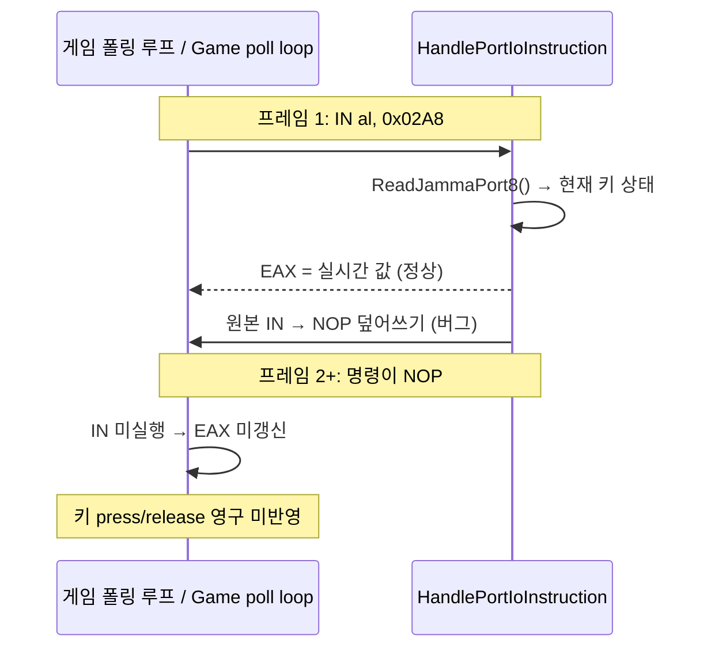

# JAMMA 입력 폴링 EIP 전진 설계 / JAMMA Input Poll EIP-Advance Design

* 작성일 / Date: 2026-07-21 (Task 327)
* 선행 / Predecessor: JAMMA I/O 에뮬레이션(Task 326), EEPROM 구현(20260719-001)
* 상태 / Status: 근인 확인 → 구현 / Root cause confirmed → Implement
* 대상 파일 / Target: `src/platform/win32/io/port_io_emulator.cpp`

## 1. 배경 및 근인 / Background and Root Cause

Task 326에서 JAMMA 입력 포트(`0x02A8` P1, `0x02A9` System, `0x02AA` P2)를
Win32 `GetAsyncKeyState` 폴링으로 매핑했다. 그러나 입력 IN 명령을 처리한 뒤
`apply_nop_patch()`로 **원본 IN 명령을 NOP으로 덮어썼다**. AGENTS.md 및
`docs/analysis/piu-io-port-specification.md`가 규정한 "동적/폴링 레지스터는
NOP 패치 없이 매번 EIP를 전진시켜 재평가한다"는 전략과, 같은 파일의 EEPROM
읽기/쓰기 경로와도 모순된다.

Task 326 mapped the JAMMA input ports to `GetAsyncKeyState` polling but, after
servicing the input IN, overwrote the guest IN instruction with a NOP via
`apply_nop_patch()`. This contradicts both the documented dynamic-register
strategy and the sibling EEPROM read/write paths in the same file, which
advance EIP and re-trap on every access.

### 근인 결과 / Consequence

`WriteGuestBytes` → `NoteSuccessfulAotGuestWrite`는 guest 바이트 수정 시 해당
AOT 페이지를 retire/재변환시키므로 NOP 패치는 실제로 적용된다(그래서 Task 326의
60초 스모크 테스트가 hang 없이 통과). 그 결과 입력은 **최초 1회만** 실제 키보드
상태를 반영하고, 이후 IN 명령이 NOP이 되어 EAX가 다시는 idle(active-low `0xFF`)로
갱신되지 않는다.

* **입력이 없어도 눌린 것처럼 보임**: 첫 폴링 이후 EAX가 idle로 갱신되지
  않아, 첫 순간 눌린 패널이 영구 latch되거나 스테일/가비지 값이 입력으로 오인됨.
* **key press/release 미반영**: 최초 1프레임 외 모든 입력 전이가 무시됨.

## 2. 설계 / Design

입력 branch의 `apply_nop_patch();`를 EEPROM 읽기 경로와 동일한
`win32_context->Eip += instruction_len;`으로 교체한다. 원본 guest 코드를
보존(AGENTS.md 원칙 2)하고, 매 폴링마다 재트랩하여 `ReadJammaPort8`가 실시간
키 상태를 EAX에 채운다. `instruction_len`·`win32_context`는 동일 함수 스코프에
이미 존재하므로 신규 상태 없이 한 줄 교체로 충분하다.

Replace `apply_nop_patch();` in the input branch with
`win32_context->Eip += instruction_len;`, identical to the EEPROM read path.
This preserves the original guest instruction and re-traps on every poll so
`ReadJammaPort8` refreshes EAX with live key state each frame.

| 경로 / Path | 성격 / Nature | 처리 / Handling |
|---|---|---|
| JAMMA 입력 `0x02A8~0x02AA` | 매 프레임 폴링 / polled | **EIP 전진 (변경)** |
| EEPROM 읽기 `0x02AE` | 동적 DO 비트 / dynamic | EIP 전진 (기존) |
| EEPROM 쓰기 `0x02AC` | 상태 갱신 / stateful | EIP 전진 (기존) |
| 초기화/미지원 쓰기 | 1회성 / one-shot | NOP 패치 (유지) |

## 3. 검증 / Verification

* Linux 컨테이너에는 MSVC/Win32 SDK가 없어 전체 Win32 x86 빌드는 불가.
  변경은 동일 함수 내 EEPROM 경로와 같은 변수를 쓰는 한 줄 교체로 컴파일
  리스크가 없다. Windows 환경에서 `build_win32_x86.ps1` 재빌드 후 `pumpit1`
  구동으로 입력 press/release가 프레임 단위로 반영되는지 확인 권장.
* 회귀 관점: `apply_nop_patch` 람다는 쓰기/초기화/deferred 경로에서 계속
  사용되므로 미사용 경고 없음.
