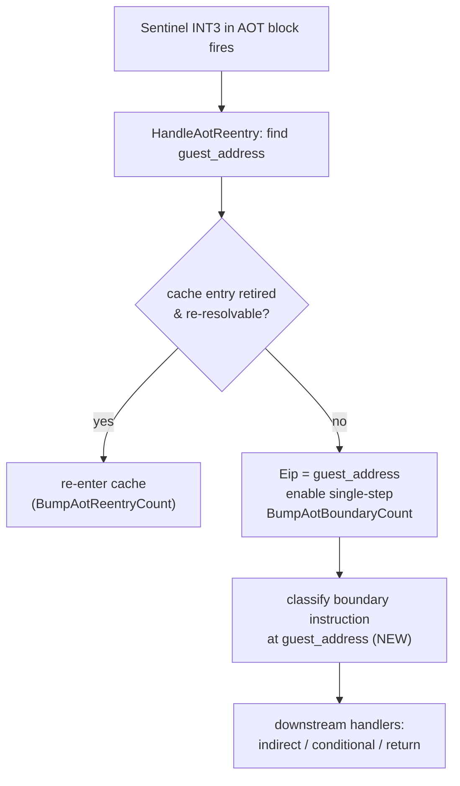

# AOT 경계 이탈 사유별 카운터 설계
# Design: Per-Reason Counters for AOT Boundary Exits

## 1. 배경 (Background)

Task 262 측정에서 `aot-dynamic`은 동일 빌드·동일 대상(`pumpit1`)·동일 120초 시점에서
legacy보다 progress 기준 **14.6배 느리다**(128,455 대 1,876,798). 두 백엔드 모두
단일스텝이 dispatch의 99.9%이고, `aot-dynamic`은 초당 약 1,400회(120초에 170,324회)
번역된 블록을 이탈한다. 번역된 블록에 들어갔다 거의 즉시 튕겨 나오기를 반복하는
"inline-cache churn"이다.

문제는 **계측의 공백**이다. 현재 `aot_boundary_count`는 이탈 횟수의 총합일 뿐,
**어떤 사유로** 이탈하는지 구분하지 못한다. 초당 1,400회가 어느 사유에 몰려 있는지가
개선 방향을 결정하는 핵심 정보인데, 지금은 그 분포를 알 수 없다.

Task 262 measurement showed `aot-dynamic` is 14.6x slower than legacy (progress
128,455 vs 1,876,798) at the same 120 s mark on the same build and target. Both
backends single-step 99.9% of dispatches, and `aot-dynamic` exits translated
blocks ~1,400 times/second (170,324 in 120 s) — an inline-cache churn where it
enters a translated block and bounces out almost immediately. The blocking gap is
instrumentation: `aot_boundary_count` is only a total; it does not distinguish
**why** each exit happens. Which reason the ~1,400/s concentrate in is the key
input for any fix, and today that distribution is unknown.

## 2. 이탈 지점의 구조 (Where boundary exits happen)

`aot_boundary_count`는 코드 전체에서 **단 한 곳**, `HandleAotReentry`
(`aot_runtime_dispatch.cpp`)의 브레이크포인트 경로에서만 증가한다. 번역된 블록 끝의
sentinel(`INT3`) 브레이크포인트가 발생하면 이 핸들러가 게스트 주소를 찾고, 재진입
불가하면 `Eip`를 게스트 원본 명령으로 되돌린 뒤 단일스텝을 켜고 `BumpAotBoundaryCount`를
호출한다. 그 직후 예외 핸들러 체인은 하위 전달 핸들러(indirect/conditional/return)로
계속 내려가 게스트 명령을 직접 해소하려 시도한다.

`aot_boundary_count` is incremented in exactly one place across the whole
codebase — the breakpoint path of `HandleAotReentry`. When a sentinel (`INT3`)
at the end of a translated block fires, the handler resolves the guest address;
if re-entry is impossible it points `Eip` back at the guest instruction, enables
single-step, and calls `BumpAotBoundaryCount`. The exception-handler chain then
continues into the downstream transfer handlers to try to resolve the guest
instruction directly.

**따라서 이탈 사유는 블록이 끝난 지점의 게스트 명령 종류로 결정된다.** 그 명령을
`BumpAotBoundaryCount` 호출 지점에서 디코드하면 사유별 히스토그램을 얻는다.

The boundary reason is therefore determined by the kind of guest instruction the
block ended on. Decoding that instruction at the `BumpAotBoundaryCount` site
yields a per-reason histogram.

## 3. 사유 분류 (Reason taxonomy)

경계 게스트 명령의 선두 opcode(및 `0xFF`의 ModRM `/reg`)만으로 5개 사유로 분류한다.
Task 262 frontier가 나열한 후보와의 대응을 함께 표기한다.

| 사유 (reason) | opcode | frontier 후보 대응 |
|---|---|---|
| `kReturn` | `C3 C2 CB CA` | (호출 규약/스택 경계) |
| `kIndirectBranch` | `FF /2 /3 /4 /5` | 간접 분기(인라인 캐시 미스) |
| `kDirectBranch` | `E8 E9 EB 9A EA` | 경계 밖 타깃 (직접 call/jmp) |
| `kConditionalBranch` | `70..7F` · `0F 80..8F` · `E0..E3` | 조건 분기 |
| `kOther` | 그 외 (비전달 명령·prefix 포함) | 번역 실패 / 미지원 명령 |

We classify from the lead opcode alone (plus the ModRM `/reg` field for `0xFF`)
into five reasons. `kOther` captures a non-transfer instruction the translator
stopped at — the "translation failure / unsupported instruction" bucket — and
also prefixed forms, which are rare at control-transfer boundaries.

게스트 코드 쓰기 무효화(`aot_code_write_count`), 페이지 retire/quarantine
(`aot_page_retire_*`, `aot_quarantine_count`, `aot_retired_entry_trap_count`)는
이미 전용 카운터가 있어 이 분류의 대상이 아니다. 이 분류는 재진입 불가로 단일스텝
경계로 이탈하는 경우의 **명령 종류 분포**만 다룬다.

Guest-code-write invalidation and page retire/quarantine already have dedicated
counters, so they are out of scope here; this classification covers only the
instruction-kind distribution of exits that fall through to the single-step
boundary.

분류기는 게스트/호스트 상태를 만지지 않는 순수 함수이므로 별도 host-neutral 파일
(`aot_boundary_reason.{h,cpp}`)로 분리해 단독 컴파일·단위 검증할 수 있게 한다. (전체
Win32 빌드는 VS 2026 툴체인으로 가능하며 실측까지 수행했다 — 작업 로그 참조.)

The classifier touches no guest or host state, so it is split into a
host-neutral pair (`aot_boundary_reason.{h,cpp}`) that can be compiled and
unit-tested standalone. (The full Win32 build is available via the VS 2026
toolchain and was measured — see the work log.)

## 4. 설계 (Design)

1. **분류기 (host-neutral).** `src/platform/win32/aot/aot_boundary_reason.{h,cpp}`.
   `enum class AotBoundaryReason { kReturn, kIndirectBranch, kDirectBranch,
   kConditionalBranch, kOther }` 와 `ClassifyAotBoundaryInstruction(const
   std::uint8_t* bytes, std::size_t size)` 순수 함수. `<cstdint>`/`<cstddef>`만
   의존.
2. **스레드 카운터.** `ThreadContext`(`thread_context.h`)에 사유별 atomic 5개
   추가(`aot_boundary_return_count` 등). 합은 `aot_boundary_count`와 같다.
3. **미러 헬퍼.** `aot_runtime_dispatch.cpp`에 `BumpAotBoundaryReason(context,
   reason)` 추가 — 기존 `BumpAotBoundaryCount` 패턴대로 로컬 atomic 갱신 +
   `shared_live_telemetry` 미러링. `BumpAotBoundaryCount` 호출 지점에서
   `IsGuestRangeReadable`로 게스트 바이트를 확보한 뒤 분류해 호출.
4. **공유 텔레메트리.** `Win32SharedLiveTelemetry`에 사유별 필드 5개 추가,
   `kWin32LiveTelemetryVersion` 16 → 17. 로더 teardown segfault(Task 235)로 정상
   종료 요약이 안 나올 수 있으므로 supervisor 외부 샘플링 경로로도 관측 가능해야 한다.
5. **요약/외부 출력.** `Win32ExecutionTrampolineAttemptResult`에 사유별 필드 5개
   추가, `live_telemetry_snapshot.cpp`에서 복사, `host/win32/main.cpp` 정상 종료
   요약과 `supervisor_main.cpp` 주기 덤프에 한 줄 출력.
6. **검증.** 분류기 단독 컴파일 + 대표 opcode 테이블 단위 검증. Win32 전 경로 Debug
   빌드(VS 2026) 후 supervisor로 `pumpit1` 120초 aot-dynamic/legacy 실측, 사유 분포와
   합 불변식 확인. 결과는 작업 로그와 frontier에 기록.

## 5. 영향 범위 (Impact Scope)

순수 진단 계측 추가로 게스트 실행 동작을 바꾸지 않는다(분기/레지스터 조작 없음,
텔레메트리 쓰기만 추가). `Win32SharedLiveTelemetry` 레이아웃이 바뀌므로 버전 상수를
함께 올려 이전 빌드의 공유 메모리 매핑과 섞이지 않게 한다. 분류기는 host-neutral이라
플랫폼 종속성을 늘리지 않는다.

Pure diagnostic instrumentation; guest execution behavior is unchanged (no
branch/register manipulation, only telemetry writes). The shared-telemetry
version constant is bumped alongside the layout change so it cannot mix with an
older build's mapping. The classifier is host-neutral and adds no platform
dependency.
