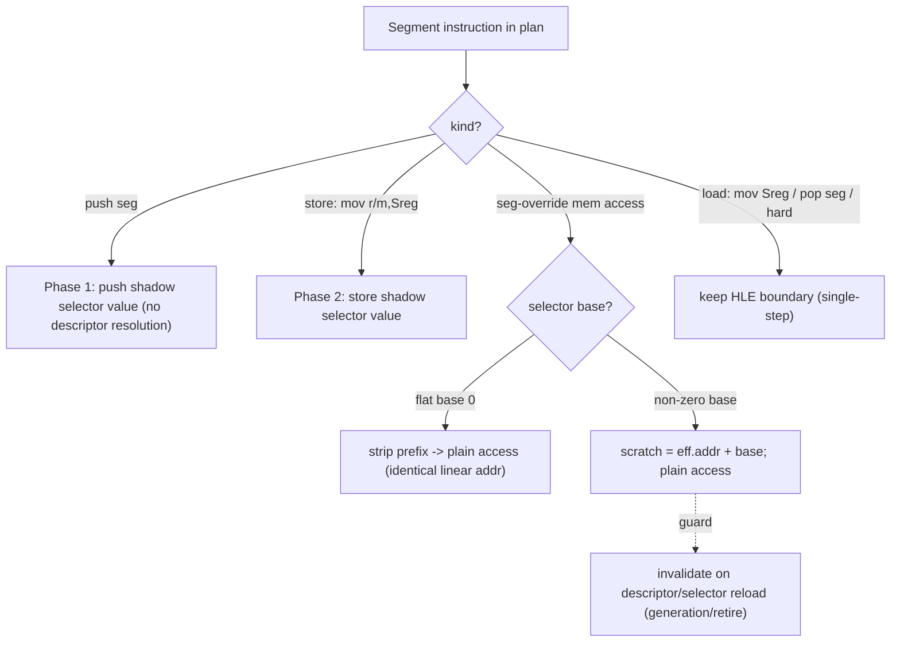

# AOT 세그먼트 명령 번역: selector-shadow 기반 일반화
# Design: General AOT Segment-Instruction Translation via Selector Shadows

## 1. 배경 (Background)

Task 263 실측: aot-dynamic 경계 이탈의 약 75%가 세그먼트 명령이다(GS 프리픽스 55%,
세그먼트 레지스터 push/pop·mov Sreg 등). 이 명령들은 AOT로 번역되지 못하고 각각
sentinel → HLE 단일스텝으로 처리되며, 단일스텝은 Windows 예외 왕복이라 legacy 대비
14.6~20.6배 느림의 지배적 원인이다.

이 결정은 PIU 전용이 아니라 **executable 무관 공용 planner**
[aot_translation_plan.cpp:61-97](../../src/runtime/aot_translation_plan.cpp#L61-L97)의
`IsHleBoundary`에 있다. 세그먼트 오버라이드 프리픽스(`ZYDIS_ATTRIB_HAS_SEGMENT`),
세그먼트 레지스터 피연산자, 카테고리 `SEGOP`/`RDWRFSGS`를 전부 HLE 경계로 표시한다.
따라서 개선도 이 공용 지점에서 이뤄지면 **모든 DOS4GW/DPMI executable에 일반적으로**
적용된다.

Task 263 measured that ~75% of AOT boundary exits are segmentation instructions.
The decision that makes them boundaries lives in the shared, executable-agnostic
planner (`IsHleBoundary`), so translating them natively benefits every executable
this pipeline processes, not just PIU.

## 2. 현재 구조 (Current mechanism, 확인됨)

* **planner:** 세그먼트 관련 명령을 HLE 경계로 표시 → emitter가 sentinel 삽입.
* **단일스텝 경로:** `ResolveSegmentLinearRange`/`TranslateSelectorOffset`
  ([selector_table.h](../../include/repiu/runtime/selector_table.h))로 (selector,
  offset)을 linear 주소로 변환. **flat selector는 identity**(변환 실패 시 `translated
  = offset` fallback, [execution_trampoline.cpp:1626-1654](../../src/platform/win32/execution/execution_trampoline.cpp#L1626-L1654)).
* **shadow selector:** `ThreadContext::guest_ds/es/fs/gs/ss`(16-bit)와
  `selector_table`(descriptor: selector→base/limit/flags).
* **왜 원본 세그먼트 명령을 host에서 그대로 못 돌리나:** host 세그먼트 base가 다르다
  (host FS=TEB, GS≈0). 게스트 `FS:[addr]`/`GS:[addr]` 바이트를 복사해 실행하면 host
  세그먼트 영역을 읽어 틀린다. 그래서 planner가 경계로 격리한다.
* **emitter는 합성/확장 가능:** `AppendRel32`, `EmitIndirectInlineCacheSlot` 등
  가변 길이 대체 시퀀스를 이미 방출한다([aot_code_cache.cpp](../../src/runtime/aot_code_cache.cpp)).
  즉 세그먼트 명령을 다른 명령열로 재작성하는 것이 프레임워크상 가능하다.

## 3. 목표 (Goal)

흔한 세그먼트 명령을 공용 selector shadow를 이용해 **캐시 내 네이티브 코드로 번역**해
예외 왕복을 제거한다. 어렵거나 드문 의미는 단일스텝 fallback으로 남겨 정확성을
보존한다(프로젝트 원칙: 정확성 > 최적화).

## 4. 설계 — 단계적 (Phased design)

### Phase 1 — 세그먼트 레지스터 push (최소·저위험, 먼저 구현)

`push ds/es/ss/cs/fs/gs`(0x1E/0x06/0x16/0x0E, 0F A0/A8)는 **selector 값을 스택에
올릴 뿐** descriptor·base 해석이 필요 없다. 게스트 `push ds`는 host DS가 아니라
**게스트 shadow selector**(`guest_ds`)를 올려야 한다. 번역: shadow selector의
zero-extended 32-bit 값을 원본과 같은 operand-size로 push하는 명령열로 재작성한다
(scratch 레지스터·플래그 훼손 없이 `push [mem]` 형태 활용). 이 단계는 파이프라인
전체(planner가 경계 해제 → emitter가 대체 방출 → 실행)를 end-to-end로 증명하고,
Task 263 카운터로 `boundary_reason(other)` 감소를 직접 측정한다.

### Phase 2 — 세그먼트 레지스터 store

`mov r/m16, Sreg`(0x8C)도 shadow selector 값을 대상에 쓰는 것이라 네이티브 가능.
`push`/`store`는 selector를 **읽기만** 하므로 안전.

### Phase 3 — 세그먼트 오버라이드 메모리 접근 (최대 이득, GS 55%)

`GS:[mem]` 등. 전략:
* 오버라이드 세그먼트의 base가 **flat(0)** 이면(대다수 DOS4GW), 프리픽스를 제거한
  평범한 접근으로 번역 — linear 주소 동일.
* base≠0이면 `scratch = effective_address + base`를 계산한 뒤 평범한 접근.
* selector 재적재로 base가 바뀔 수 있으므로 **무효화로 가드**: 블록이 참조한
  selector descriptor generation에 의존성을 걸고, descriptor가 바뀌면 기존 page-
  retire/generation 기구로 재번역. 또는 emitted code가 안정된 per-selector base
  테이블을 런타임에 읽게 한다.

### 보존되는 fallback

`mov Sreg, r/m`(0x8E)·`pop seg`(selector 적재 = descriptor 재해석 필요),
expand-down/limit 검사 필요, 자기수정 LDT 등 어려운 경우는 **HLE 경계 유지**.

## 5. emitted code의 selector base/값 접근 (공용 계약)

단일 게스트 스레드 전제에서, emitted 네이티브 코드가 읽을 **안정된 절대 주소의 shadow
값**(selector 및 per-selector base)을 유지한다. descriptor 갱신 경로가 이 값을
coherent하게 유지하고, 재적재 시 generation으로 가드한다. 다중 게스트 스레드는 향후
범위(현재 단일 스레드).

## 6. 일반성과 정확성 (Generality & correctness)

* 변경이 공용 planner + emitter + 공용 selector shadow에 있으므로 **모든 executable에
  적용**된다. Charter 목표 #6(다중 게임/런타임 경로 공용 구조)와 부합.
* **정확성:** 번역 결과는 단일스텝 경로와 동등해야 한다. `seg_divergence` 텔레메트리가
  물리/ shadow selector 불일치를 이미 추적하므로 회귀 탐지에 활용. executable별 동등성
  검증.
* **측정:** Task 263 계측으로 개선을 직접 확인 — `boundary_reason(other)`가 번역한
  opcode 카운트만큼 감소, residency/coverage 상승, progress 처리량이 legacy 쪽으로 개선.

## 7. 위험 (Risks)

* 32-bit `push seg`의 상위 워드 의미(0 확장 vs 보존) — 단일스텝 경로와 정확히 일치시켜야
  스택 손상 방지.
* selector 재적재 무효화(Phase 3)의 정확한 가드.
* limit/expand-down 세그먼트의 bounds 의미.
* 절대 주소 shadow 접근의 단일 스레드 전제.

## 8. 영향 범위 (Impact Scope)

planner의 경계 판정 완화와 emitter의 대체 시퀀스 방출. 잘못되면 게스트 상태가
직접 손상되므로(단순 계측과 다름) 각 단계는 단일스텝 동등성으로 검증하고, 확신이 없는
경우는 경계 유지로 보수적으로 처리한다. 단계별로 Task 263 카운터로 이득을 측정한다.

**English.** Translate common segment instructions into native cache code using
the shared selector shadow, removing the exception round-trip, while keeping the
single-step HLE path as the correctness fallback for hard cases. Phases: (1)
segment-register push (reads a shadow selector, no descriptor resolution — safe,
first end-to-end proof), (2) segment-register store (mov r/m,Sreg), (3) the big
win — segment-override memory access, translated as a prefix strip when the
selector is flat base-0 (the common DOS4GW case) or a base-add otherwise, guarded
against selector reload via the existing generation/retire invalidation. Loads
that re-resolve a descriptor (mov Sreg, pop seg) and hard cases stay HLE
boundaries. Because the change lives in the shared planner, emitter, and selector
shadow, it applies to any DOS4GW/DPMI executable. Correctness is checked against
the single-step path (seg_divergence telemetry) and each phase's gain is measured
directly by the Task 263 counters (boundary_reason `other` drop, residency and
coverage rise). Unlike the Task 262/263 diagnostics, a wrong translation corrupts
guest state directly, so each phase is verified for single-step equivalence and
stays conservative (keep the boundary) whenever unsure.
