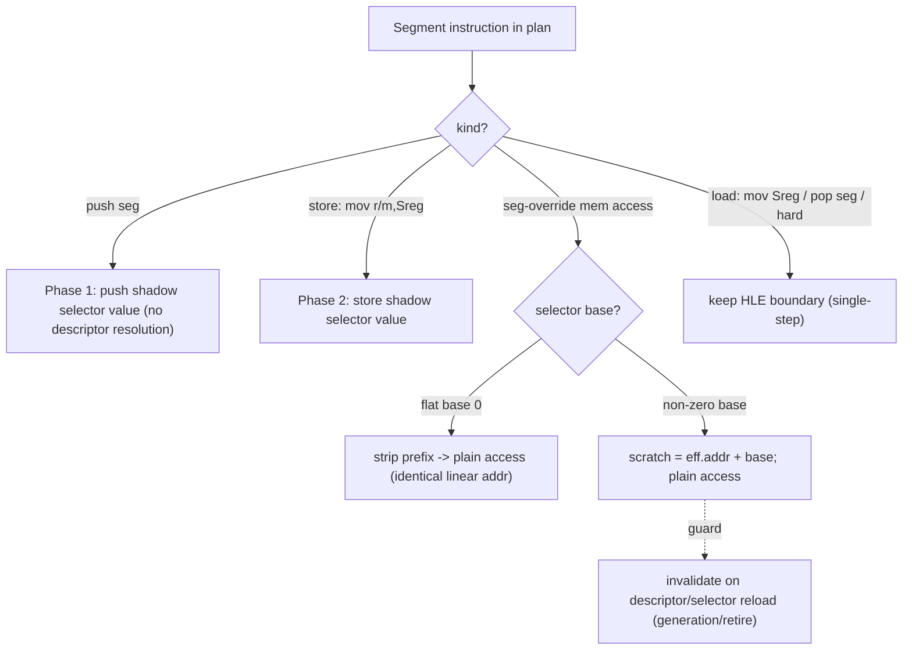

# AOT 세그먼트 명령 번역: selector-shadow 기반 일반화
# Design: General AOT Segment-Instruction Translation via Selector Shadows

## 0. 진행 요약 및 결정 지점 (Status & decision point, 2026-07-22)

* **Phase 1 (push seg): 완료·검증.** kCopy로 네이티브 실행. 경계 −19%, 무회귀. (§9b)
* **Phase 2 (mov store): 반증·되돌림.** 단일스텝이 shadow 값을 반환해 kCopy가 발산,
  게스트 정체. 세그먼트 store는 경계 유지. (§9b)
* **Phase 3 (세그먼트 오버라이드 메모리): 계측 완료 → 결정 필요.** 프로브 결과
  **지배적 GS 오버라이드(0x65, `other`의 55%)는 selector 0x80, base `0x0B5C7000`으로
  non-flat**(nonflat 25,566건). 소수 ES 오버라이드(0x26)만 flat(base 0). 따라서:
  * flat이 아니라 **prefix-strip 불가** → GS:[mem]는 `유효주소 + 0x0B5C7000` **base-add
    codegen** 필요(scratch 레지스터·플래그 보존·모든 addressing mode 처리).
  * base는 selector 0x80의 런타임 descriptor 값 → **재적재 시 무효화 가드** 필요(생성/
    retire 연동) 또는 shadow에서 런타임 read.
  * 이는 **게스트 메모리 접근** codegen이라 Phase 2보다 위험이 크다(오류 시 데이터
    손상·크래시).
  **결정: A 선택·구현 완료.** GS base-add + 정적 site GS-load 재해석. **결과: segovr
  경계 28,769→0, `other` 59,208→26,055(−56%), progress +30%, 무회귀.** 지배적 세그먼트
  비용 제거. 상세는 작업 로그와 §12.

* **Phase 3a + GS 재해석: 완료·검증.** self-correcting 가드 + disp에 base fold +
  세그먼트 로드 HLE 훅에서 재해석(정적 이미지 site를 GS 설정 후 활성화). segovr=0(가드
  실패 0). Task 262→264 완결.

**결정: A 선택(사용자).** GS base-add 구현. 아래 §12에 구현 설계 확정.

## 12. Phase 3a 구현 설계 (GS base-add, 결정 A) / Phase 3a implementation (chosen)

**접근: displacement-bake + self-correcting per-access guard + re-encode-or-boundary
안전망.** GS 재적재(`mov gs`/`pop gs`)는 이미 HLE 경계라 블록 내 GS는 불변이지만,
블록이 다른 GS 값일 때 재진입할 수 있으므로 **접근마다 가드로 self-correct**한다.

세그먼트 오버라이드 명령 `65 <op> <modrm> [sib] [disp] [imm]`을 새 kind
`kSegmentOverrideMem`로 분류하고 다음을 방출한다(번역 시점 Win32가 guest_gs의 selector
S와 base B를 안다):

```
9C                         pushfd
66 81 3D <&guest_seg> <S>  cmp word [shadow guest_seg], S   ; 가드
74 02                      je   do_access
9D CC                      (fallback) popfd; int3            ; 원본 단일스텝
do_access:
9D                         popfd
<op> <modrm'> [sib] <disp32'> [imm]   ; 0x65 제거, disp += B (disp32로 확장)
```

* **정확성:** 가드 불일치 시 원본을 단일스텝(항상 정확). 일치 시 baked B로 네이티브
  접근. 플래그는 pushfd/popfd로 보존(가드의 cmp가 접근 명령의 입력 플래그를 훼손하지
  않음). scratch 레지스터 불필요.
* **re-encode:** 0x65 제거 후 ModRM/SIB를 파싱해 displacement를 disp32로 확장하고
  값=원본 disp. (기존 `EmitIndirectInlineCacheSlot`의 ModRM/SIB 파서 재사용.) **확신이
  없는 addressing 형태나 재디코드 실패는 boundary(0xCC)로 폴백** → 최악의 경우 현재
  동작(무회귀). emitter의 decode 검증이 이를 강제.
* **Win32 patching(site 방식, jump-table 유사):** emitter가 skeleton + site(원본 바이트·
  세그먼트·guard-imm offset·disp32 offset) 기록. Win32 배치가 번역 시점 `context->
  selector_table`에서 guest_seg의 S·B를 구해 guard 즉시값=S, `&shadow guest_seg`,
  disp32 += B를 패치. base 무관 host 상수라 세대와 무관.
* **범위:** 우선 GS(0x65). ES 등 flat(base 0)은 B=0이라 같은 경로가 자동 처리(가드는
  유지, disp 불변). CS(shadow 없음)는 제외.
* **검증:** `boundary_reason(other)`의 0x65 감소, `segovr` 가드 폴백률, 무회귀(EIP·
  Glide 49·fatal 0), progress를 Task 263/264 카운터로 측정. 부분 커버리지도 안전.

**English (§12).** Implement GS base-add as a displacement-bake with a
self-correcting per-access guard and a re-encode-or-boundary safety net. Classify
segment-override memory ops as a new `kSegmentOverrideMem` kind and emit: pushfd;
`cmp word [shadow guest_seg], S`; je do_access; (fallback) popfd + int3 to
single-step the original; do_access: popfd; then the access with the 0x65 prefix
removed and the displacement widened to disp32 and += B. The guard makes it
correct even if the segment register later holds a different selector (falls back
to single-step); flags are preserved via pushfd/popfd; no scratch register is
needed. The prefix-strip/disp-widen re-encode reuses the existing ModRM/SIB
parser, and any form it cannot verify falls back to a boundary (worst case =
current behavior; the emitter's decode check enforces this). A jump-table-style
site lets the Win32 placement patch the guard selector S, the shadow address, and
disp += B from the selector table at translation time. Scope starts with GS
(0x65); flat overrides (ES, base 0) ride the same path with B=0. Verified by the
Task 263/264 counters with no regression.

## 1. 배경 (Background)

Task 263 실측: aot-dynamic 경계 이탈의 약 75%가 세그먼트 명령이다(GS 프리픽스 55%,
세그먼트 레지스터 push/pop·mov Sreg 등). 이 명령들은 AOT로 번역되지 못하고 각각
sentinel → HLE 단일스텝으로 처리되며, 단일스텝은 Windows 예외 왕복이라 legacy 대비
14.6~20.6배 느림의 지배적 원인이다.

이 결정은 PIU 전용이 아니라 **executable 무관 공용 planner**
[aot_translation_plan.cpp:61-97](../../src/runtime/aot_translation_plan.cpp#L61-L97)의
`IsHleBoundary`에 있다. 세그먼트 오버라이드 프리픽스(`ZYDIS_ATTRIB_HAS_SEGMENT`),
세그먼트 레지스터 피연산자, 카테고리 `SEGOP`/`RDWRFSGS`를 전부 HLE 경계로 표시한다.
따라서 개선도 이 공용 지점에서 이뤄지면 **모든 DOS4GW/DPMI executable에 일반적으로**
적용된다.

Task 263 measured that ~75% of AOT boundary exits are segmentation instructions.
The decision that makes them boundaries lives in the shared, executable-agnostic
planner (`IsHleBoundary`), so translating them natively benefits every executable
this pipeline processes, not just PIU.

## 2. 현재 구조 (Current mechanism, 확인됨)

* **planner:** 세그먼트 관련 명령을 HLE 경계로 표시 → emitter가 sentinel 삽입.
* **단일스텝 경로:** `ResolveSegmentLinearRange`/`TranslateSelectorOffset`
  ([selector_table.h](../../include/repiu/runtime/selector_table.h))로 (selector,
  offset)을 linear 주소로 변환. **flat selector는 identity**(변환 실패 시 `translated
  = offset` fallback, [execution_trampoline.cpp:1626-1654](../../src/platform/win32/execution/execution_trampoline.cpp#L1626-L1654)).
* **shadow selector:** `ThreadContext::guest_ds/es/fs/gs/ss`(16-bit)와
  `selector_table`(descriptor: selector→base/limit/flags).
* **왜 원본 세그먼트 명령을 host에서 그대로 못 돌리나:** host 세그먼트 base가 다르다
  (host FS=TEB, GS≈0). 게스트 `FS:[addr]`/`GS:[addr]` 바이트를 복사해 실행하면 host
  세그먼트 영역을 읽어 틀린다. 그래서 planner가 경계로 격리한다.
* **emitter는 합성/확장 가능:** `AppendRel32`, `EmitIndirectInlineCacheSlot` 등
  가변 길이 대체 시퀀스를 이미 방출한다([aot_code_cache.cpp](../../src/runtime/aot_code_cache.cpp)).
  즉 세그먼트 명령을 다른 명령열로 재작성하는 것이 프레임워크상 가능하다.

## 3. 목표 (Goal)

흔한 세그먼트 명령을 공용 selector shadow를 이용해 **캐시 내 네이티브 코드로 번역**해
예외 왕복을 제거한다. 어렵거나 드문 의미는 단일스텝 fallback으로 남겨 정확성을
보존한다(프로젝트 원칙: 정확성 > 최적화).

## 4. 설계 — 단계적 (Phased design)



### Phase 1 — 세그먼트 레지스터 push (최소·저위험, 먼저 구현)

`push ds/es/ss/cs/fs/gs`(0x1E/0x06/0x16/0x0E, 0F A0/A8)는 **selector 값을 스택에
올릴 뿐** descriptor·base 해석이 필요 없다. 게스트 `push ds`는 host DS가 아니라
**게스트 shadow selector**(`guest_ds`)를 올려야 한다. 번역: shadow selector의
zero-extended 32-bit 값을 원본과 같은 operand-size로 push하는 명령열로 재작성한다
(scratch 레지스터·플래그 훼손 없이 `push [mem]` 형태 활용). 이 단계는 파이프라인
전체(planner가 경계 해제 → emitter가 대체 방출 → 실행)를 end-to-end로 증명하고,
Task 263 카운터로 `boundary_reason(other)` 감소를 직접 측정한다.

### Phase 2 — 세그먼트 레지스터 store

`mov r/m16, Sreg`(0x8C)도 shadow selector 값을 대상에 쓰는 것이라 네이티브 가능.
`push`/`store`는 selector를 **읽기만** 하므로 안전.

### Phase 3 — 세그먼트 오버라이드 메모리 접근 (최대 이득, GS 55%)

`GS:[mem]` 등. 전략:
* 오버라이드 세그먼트의 base가 **flat(0)** 이면(대다수 DOS4GW), 프리픽스를 제거한
  평범한 접근으로 번역 — linear 주소 동일.
* base≠0이면 `scratch = effective_address + base`를 계산한 뒤 평범한 접근.
* selector 재적재로 base가 바뀔 수 있으므로 **무효화로 가드**: 블록이 참조한
  selector descriptor generation에 의존성을 걸고, descriptor가 바뀌면 기존 page-
  retire/generation 기구로 재번역. 또는 emitted code가 안정된 per-selector base
  테이블을 런타임에 읽게 한다.

### 보존되는 fallback

`mov Sreg, r/m`(0x8E)·`pop seg`(selector 적재 = descriptor 재해석 필요),
expand-down/limit 검사 필요, 자기수정 LDT 등 어려운 경우는 **HLE 경계 유지**.

## 5. emitted code의 selector base/값 접근 (공용 계약)

단일 게스트 스레드 전제에서, emitted 네이티브 코드가 읽을 **안정된 절대 주소의 shadow
값**(selector 및 per-selector base)을 유지한다. descriptor 갱신 경로가 이 값을
coherent하게 유지하고, 재적재 시 generation으로 가드한다. 다중 게스트 스레드는 향후
범위(현재 단일 스레드).

## 6. 일반성과 정확성 (Generality & correctness)

* 변경이 공용 planner + emitter + 공용 selector shadow에 있으므로 **모든 executable에
  적용**된다. Charter 목표 #6(다중 게임/런타임 경로 공용 구조)와 부합.
* **정확성:** 번역 결과는 단일스텝 경로와 동등해야 한다. `seg_divergence` 텔레메트리가
  물리/ shadow selector 불일치를 이미 추적하므로 회귀 탐지에 활용. executable별 동등성
  검증.
* **측정:** Task 263 계측으로 개선을 직접 확인 — `boundary_reason(other)`가 번역한
  opcode 카운트만큼 감소, residency/coverage 상승, progress 처리량이 legacy 쪽으로 개선.

## 7. 위험 (Risks)

* 32-bit `push seg`의 상위 워드 의미(0 확장 vs 보존) — 단일스텝 경로와 정확히 일치시켜야
  스택 손상 방지.
* selector 재적재 무효화(Phase 3)의 정확한 가드.
* limit/expand-down 세그먼트의 bounds 의미.
* 절대 주소 shadow 접근의 단일 스레드 전제.

## 8. 영향 범위 (Impact Scope)

planner의 경계 판정 완화와 emitter의 대체 시퀀스 방출. 잘못되면 게스트 상태가
직접 손상되므로(단순 계측과 다름) 각 단계는 단일스텝 동등성으로 검증하고, 확신이 없는
경우는 경계 유지로 보수적으로 처리한다. 단계별로 Task 263 카운터로 이득을 측정한다.

## 9b. Phase 1 결과 및 설계 정정 (Result & correction, 확인됨)

**§9-10의 shadow-push 청사진은 프로브로 반증됐다.** Task 264 프로브(안전 계측)로
push-seg 경계에서 host 세그먼트 레지스터 vs shadow selector를 비교한 결과(30초,
4,183건): **host SegDs는 항상 0x2b**(host-flat), shadow `guest_ds`는 0x2b(2,593건
일치)와 실제 selector(1,590건 불일치)가 섞여 있었다. push-seg 전용 HLE 에뮬레이션이
없으므로 **현재 단일스텝 경로는 `push ds`를 네이티브 실행해 항상 host 0x2b를 올린다**
— 그런데 게임은 정상 동작한다. 즉 게임은 push로 올라간 selector 값에 의존하지 않는다.

따라서 올바른 Phase 1은 **shadow를 올리는 것이 아니라(그건 동작을 바꿔 오히려 버그가
됨) push-seg를 그냥 네이티브(kCopy)로 실행**하는 것이다 — 단일스텝이 이미 올리는 host
0x2b와 정확히 동일하며 예외 왕복만 제거한다. 프로브가 shadow-push 구현(§9)이 회귀를
유발했을 상황을 사전에 막았다.

**구현.** `IsHleBoundary`
([aot_translation_plan.cpp:61](../../src/runtime/aot_translation_plan.cpp#L61))
맨 앞에 "push + 세그먼트 레지스터 피연산자 → 경계 아님(false)" 분기를 추가. 이후
plan이 자연히 `kCopy`로 분류해 원본 바이트를 캐시에 그대로 방출한다. emitter/placement
변경 불필요, fixup 불필요.

**검증 (aot-dynamic, 120초, Debug).**

| 지표 | 기준(Task 263) | Phase 1 | Δ |
|---|---:|---:|---:|
| 경계 총합 | 78,701 | 63,712 | **−19%** |
| `other` | 59,208 | 48,712 | **−17.7%** |
| push-seg 경계 | 수천/분 | **0** | 제거 |
| single_step | 786,814 | 747,963 | −4.9% |
| fatal_count | 0 | 0 | ✓ |
| 도달 EIP | 0x30f5520 | 0x30f551f | 동일 프레임 루프 |
| glide gate | 49 | 49 | 동일 렌더 |

동작 동일(같은 EIP·같은 Glide 렌더 활동, 크래시·fatal 0), push-seg 예외 churn 완전
제거. progress −3.9%는 Debug 런간 타이밍 분산(같은 프레임 루프 동일 지점).

**Phase 2 = 반증됨(중요).** `mov r/m,Sreg`(store, 0x8C)를 kCopy로 네이티브 실행하니
**회귀**했다 — 게스트가 fatal-breakpoint 관용구 `0x030F3438`에 정체, 렌더 0, single_step
6배 폭증. 근인:
[instruction_emulation.cpp:699-726](../../src/platform/win32/cpu_emul/instruction_emulation.cpp#L699)
에서 단일스텝 경로가 0x8C를 `ReadGuestSegmentSelector`로 **shadow(논리) selector를
반환**하도록 에뮬레이트한다. 즉 push seg와 달리 mov-store는 **네이티브(host 0x2b)가
아니라 shadow 값**을 준다. 네이티브 store는 host 0x2b를 써서 발산 → 게스트가 자기 DS
selector를 잘못 읽고 assert. **세그먼트 레지스터 store는 경계 유지.**

교훈: 근인을 알아도 **명령별로 단일스텝이 native냐 shadow-emulated냐가 다르다**. push
seg는 native(Phase 1 성공), mov-store는 shadow-emulated(Phase 2 실패). 착수 전 명령별
확인이 필수다.

**Phase 3(GS 메모리) 함의.** GS:[mem]도 단일스텝이 shadow로 주소를 해석하면(base 0면
flat) native flat 접근과 일치하지만, base≠0이거나 GS 재적재가 있으면 발산한다. 따라서
kCopy(prefix-strip)는 **base가 flat(0)임이 확인될 때만** 안전하고, 재적재 무효화 가드가
필요할 수 있다. 이 base 분포를 Phase 3 프로브로 측정한다(§11 결정 지점).

## 9. Phase 1 초기 청사진 (superseded by §9b) — shadow-push 접근, 프로브로 반증됨

emitter/placement 조사로 Phase 1 경로를 확정했다(구현 착수 전 §10 선결 확인 필요).

* **planner** [aot_translation_plan.cpp:432](../../src/runtime/aot_translation_plan.cpp#L432)
  의 `IsHleBoundary` 분기 **직전**에 push-seg 검출을 삽입: mnemonic=PUSH, 피연산자가
  세그먼트 레지스터(ES/SS/DS/FS/GS — **CS 제외**, `ThreadContext`에 `guest_cs`
  shadow 없음), **operand-size 32-bit(0x66 없음)** 인 경우만 새 kind
  `kSegmentPush`로 분류(`record.segment_register`에 인덱스 저장). 나머지는 기존대로
  경계 유지.
* **emitter** [aot_code_cache.cpp](../../src/runtime/aot_code_cache.cpp): `kSegmentPush`는
  레지스터·플래그 비훼손 16바이트 시퀀스를 방출하고 site를 기록한다.
  ```
  50                     push eax
  A1 <abs g_ctx>         mov  eax, [&g_active_thread_context]   ; ctx 포인터
  0F B7 80 <off_seg>     movzx eax, word [eax + offsetof(guest_seg)]
  87 04 24               xchg [esp], eax     ; [esp]=selector(zx32), eax 복원
  ```
  순 효과 = `push <shadow selector>`(32-bit, zero-extend). push/mov/movzx/xchg 모두
  플래그 불변, 게스트 레지스터 불변. decode 검증도 통과(4개 유효 명령).
* **Win32 placement** [aot_code_cache_win32.cpp](../../src/platform/win32/aot_code_cache_win32.cpp):
  jump-table와 동일 패턴으로 `ResolveWin32AotSegmentPushSites`를 추가해 초기 배치
  (`:104`)와 세대 append(`:272`) **양쪽**에서 호출. 각 site의 `A1` 피연산자에
  `(uint32)&g_active_thread_context`(로더 고정 base 0x10000000, ASLR off), `movzx`
  disp32에 세그먼트별 `offsetof(ThreadContext, guest_es/ss/ds/fs/gs)`를 기록한다.
  이 값들은 base 무관 host 상수라 세대와 무관하게 동일. `g_active_thread_context`는
  [execution_trampoline.cpp:78](../../src/platform/win32/execution/execution_trampoline.cpp#L78)
  전역(실행 중 항상 설정)이라 extern 선언만 필요.

## 10. 선결 확인 (Critical prerequisite — 미해결)

**현재 단일스텝 경로가 `push ds`에서 스택에 무엇을 올리는지 확정해야 한다.** 정적
조사 결과 `instruction_emulation.cpp`에 push-seg **전용 에뮬레이션이 없고**, 메모리
접근 핸들러는 `ResolveSegmentLinearRange(context, guest_ds, ...)`로 세그먼트를 **수동**
해석한다(= 게스트가 host-flat 세그먼트로 실행됨을 시사). 그렇다면 native `push ds`는
**host DS(0x2b)** 를 올리게 된다. 반대로 게스트가 실행 중 host 세그먼트 레지스터에
**게스트 selector를 적재**한 채 돈다면 native push는 게스트 selector를 올린다(=본
설계의 shadow push와 일치). `seg_divergence`(물리 vs shadow, 41k회)는 **HLE 핸들러
내부** 측정이라 순수 게스트 실행 구간의 세그먼트 상태를 확정하지 못한다.

이 선결이 미해결인 채 codegen을 넣으면 **게스트 스택을 손상**시킬 수 있다(단순 계측과
질적으로 다른 위험). 따라서 착수 전, **안전한 진단 프로브**(계측 전용, 게스트 상태
불변)로 확정한다: push-seg 경계에서 (a) host CONTEXT의 SegDs/…, (b) shadow
`guest_ds/…`, (c) 단일스텝 직후 `[esp]`에 실제로 올라간 dword를 기록해 비교. 결과가
"host selector"면 설계의 shadow-push는 **현재 동작과 달라지므로** 재검토, "guest
selector"면 그대로 구현.

## 11. 다음 (Immediate next)

1. §10 프로브(안전, Task 262/263식 계측)로 push-seg 실제 semantics 확정.
2. 확정 결과에 따라 Phase 1 codegen(§9) 구현 → 빌드 → `boundary_reason(other)`의
   push ds/es 카운트 감소·회귀 없음·`seg_divergence` 비폭증으로 검증.
3. Phase 2(store)·Phase 3(GS 메모리, 최대 이득) 진행.

**English.** Translate common segment instructions into native cache code using
the shared selector shadow, removing the exception round-trip, while keeping the
single-step HLE path as the correctness fallback for hard cases. Phases: (1)
segment-register push (reads a shadow selector, no descriptor resolution — safe,
first end-to-end proof), (2) segment-register store (mov r/m,Sreg), (3) the big
win — segment-override memory access, translated as a prefix strip when the
selector is flat base-0 (the common DOS4GW case) or a base-add otherwise, guarded
against selector reload via the existing generation/retire invalidation. Loads
that re-resolve a descriptor (mov Sreg, pop seg) and hard cases stay HLE
boundaries. Because the change lives in the shared planner, emitter, and selector
shadow, it applies to any DOS4GW/DPMI executable. Correctness is checked against
the single-step path (seg_divergence telemetry) and each phase's gain is measured
directly by the Task 263 counters (boundary_reason `other` drop, residency and
coverage rise). Unlike the Task 262/263 diagnostics, a wrong translation corrupts
guest state directly, so each phase is verified for single-step equivalence and
stays conservative (keep the boundary) whenever unsure.
