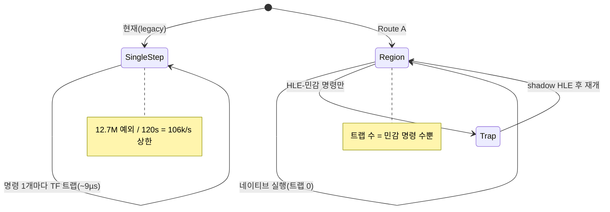

# 20260723-266 네이티브 리전 실행으로 single-step 병목 제거 / Native region execution to remove the single-step bottleneck

## 상태 / Status

설계 단계(Phase 0 완료: 계측·baseline·LDT 스파이크). 사용자 요구 "지금보다 10배 이상
빠르게"에 대한 근본 대응. 방향 A(네이티브 리전 실행)로 사용자 승인됨.

Design stage (Phase 0 done: instrumentation, baseline, LDT spike). Root-cause response
to the user requirement "make it 10x+ faster." User approved direction A (native region
execution).

## 1. 배경: 병목은 "명령마다 Windows 예외" / Background: one Windows exception per instruction

`legacy` 백엔드(렌더링 검증에 쓰인 경로, 기본값)는 **모든 게스트 명령을 single-step**
한다. 실행 시작 트램폴린이 `enable_single_step_trace`일 때 TF(EFLAGS 0x100)를 켜고
([execution_trampoline.cpp:407-411](../../src/platform/win32/execution/execution_trampoline.cpp#L407-L411)),
`AttemptWin32GuestStackTrapExecution`가 그 플래그를 `true`로 넘긴다
([execution_trampoline.cpp:3332-3349](../../src/platform/win32/execution/execution_trampoline.cpp#L3332-L3349)).
명령 1개 = Windows VEH 예외 왕복 1회(~9µs). `aot-dynamic`도 미커버 구간에서 single-step
으로 복귀한다.

v0.0.84 실측(Debug 빌드, 디버거 미부착, `pumpit1`, 120초):

| 지표 | legacy | aot-dynamic | 비 |
|---|---:|---:|---:|
| progress | **1,829,006** | 127,073 | **14.4x** |
| single_step | 12,677,443 (99.97%) | 2,681,101 (99.3%) | — |
| native fast (entry/ret/cancel) | 28,258/28,253/5 | 13,021/13,020/1 | — |

두 백엔드 모두 single-step이 dispatch의 99%+. 처리량 상한 ~106k instr/s(legacy)가 벽이다.
인라인 캐시·프롤로그 등 AOT 점진 튜닝(Task 204→265)이 계속 plateau에 걸린 이유가 이것.



## 2. 근인: 비-flat 세그먼트 셀렉터 / Root cause: non-flat segment selectors

게스트가 세그먼트-집약적이고, 세그먼트 레지스터가 DOS/16M LDT 셀렉터라 호스트에서 그대로
실행할 수 없다. 로더가 시작 시 찍는 셀렉터 바인딩(실측):

| selector | base | limit | 크기 |
|---|---|---|---|
| 0x001C | 0x03000000 | 0x0F | 16B |
| 0x0024 | 0x03010000 | 0xEF0CF | ~980KB (코드, CS) |
| 0x002C | 0x03100000 | 0x47 | 72B |
| 0x0034 | 0x03110000 | 0x4C6E5F | ~5MB (데이터) |

base가 0이 아니고 셀렉터마다 다르다. 단, **평범한(세그먼트 오버라이드 없는) 메모리
접근은 이미 host-flat DS(0x2b, base 0)로 정확히 동작**한다 — 게임이 single-step 중
host-flat 세그먼트로 정상 렌더한다는 사실이 이를 증명한다(포인터가 이미 전체 linear
주소로 relocated됨). 비-flat base가 필요한 것은 **세그먼트 오버라이드 접근과 명시적
세그먼트 로드/저장**뿐이며, 이들이 곧 "HLE-민감" 명령이다.

## 3. 반증된 접근: 실제 LDT 디스크립터 / Ruled out: real LDT descriptors

가장 깨끗한 형태는 이 셀렉터들을 실제 호스트 LDT 디스크립터로 설치해 세그먼트 접근을
네이티브·정확하게 만드는 것이다. 스파이크로 검증했다
([scratchpad/ldt_spike.cpp], 32비트 빌드):

```
NtSetLdtEntries resolved: 77C0B500
  selector=0x001C .. 0x0037 status=0xC0000002 (STATUS_NOT_IMPLEMENTED)  # 전부
RESULT: no LDT selector usable
```

**Win11 x64 WOW64는 LDT를 지원하지 않는다**(NtSetLdtEntries가 전 셀렉터에서
STATUS_NOT_IMPLEMENTED). 따라서 "세그먼트를 실제 디스크립터로 네이티브화"하는 길은 이
플랫폼에서 불가능하다. Route A는 세그먼트 명령을 여전히 shadow로 HLE하되, 그 사이 코드를
네이티브로 돌리는 형태여야 한다.

## 4. 이미 있는 원형: native_fast_path / Existing prototype

[native_fast_path.cpp](../../src/platform/win32/native_fast_path.cpp)는 Route A의 축소판이
이미 작동함을 보여준다: `call rel32`(0xE8)로 함수 진입 시 대상 함수가 "native-safe"인지
[verified_region_analyzer.cpp](../../src/platform/win32/verified_region_analyzer.cpp)로
검증하고, 안전하면 **TF를 끄고 반환주소에 하드웨어 브레이크포인트(Dr0)를 걸어 함수 전체를
네이티브로 실행**한다. 120초에 28,258회 성공.

**한계(정확히 이 지점이 Route A의 잠금 해제 대상):** `IsSensitive`
([verified_region_analyzer.cpp:41-64](../../src/platform/win32/verified_region_analyzer.cpp#L41-L64))가
**세그먼트 op(`HAS_SEGMENT`/`SEGOP`/`RDWRFSGS`)·INT·IO·STRING이 하나라도 있으면 함수
전체를 거부**한다. 세그먼트-집약 게임이라 대부분 함수가 여기서 탈락 → single-step.

## 5. 설계: 선택적 브레이크포인트 리전 실행 / Selective-breakpoint region execution

핵심 전환: **함수를 통째로 거부하지 말고, HLE-민감 명령에만 브레이크포인트를 걸고 나머지는
네이티브로 실행한다.**

1. 리전 진입 시 Zydis로 정적 스캔(직접 분기 추종)해 민감 명령 주소 집합 `S`를 구한다.
2. `S`의 각 주소에 브레이크포인트를 설치하고 TF를 끄고 네이티브 실행.
3. 민감 명령 트랩 시 **기존 shadow HLE 핸들러**(`HandleSegment*`, `HandlePortIo`,
   `HandleDosHle`, …)로 정확히 에뮬레이트한 뒤 네이티브 재개.
4. 리전 이탈(간접 분기/미스캔 타깃/외부 return) 시 single-step 폴백 또는 인접 리전 재진입.

세그먼트 op은 여전히 정확히 HLE되지만(정확성 보존), 그 주변 코드는 네이티브로 흐른다.
간접 분기는 네이티브 `jmp/call reg`가 그대로 다음 리전으로 이어지므로 **AOT의 인라인 캐시
churn(Task 265의 현재 최대 비용)이 원천적으로 사라진다.**

## 6. 상한 근거 (측정) / Ceiling (measured)

상한은 "실행 명령 중 HLE-민감 명령의 동적 비율"이 결정한다(상한 ≈ 총명령/민감명령).
[execution_trampoline.cpp](../../src/platform/win32/execution/execution_trampoline.cpp)의
`HandleSingleStepTrace`에 명령 분류 계측을 추가해 legacy 120초에서 실측했다:

**실측 (v0.0.84 + 계측 빌드, Debug, `pumpit1`, 120초, 확인됨):**

| 지표 | 값 | 전체 대비 |
|---|---:|---:|
| 총 실행 명령 (`single_step`) | 11,581,526 | 100% |
| HLE-민감 (`routea_sensitive`) | **217,529** | **1.88%** |
| 그중 세그먼트 op (`routea_segment`) | 164,499 | 1.42% (민감의 75.6%) |
| 비-세그먼트 민감 (INT/IO/string/priv) | 53,030 | 0.46% |

**실행 명령의 98.1%는 트랩 없이 네이티브 실행 가능하고, 트랩이 필요한 것은 1.9%뿐이다.**
따라서 이론 상한 ≈ 11,581,526 / 217,529 ≈ **53배**. 리전 진입 스캔·이탈 트랩·네이티브
실행 시간을 감안한 **현실 목표는 20~40배**로, 사용자의 10배 요구를 크게 상회한다. 민감의
75.6%가 세그먼트 op이며 이들은 LDT 불가로 shadow HLE를 유지하지만(§3), 164,499 × ~9µs
≈ 1.5초/120초로 무시 가능한 바닥 비용이다. 지배 비용(98%의 네이티브화 가능 명령)이 제거
대상이다.

## 6b. Phase 2 실증 결과 (하드웨어 브레이크포인트 방식) / Phase 2 result (HW breakpoints)

메커니즘을 구현·실증했다. 게스트 바이트를 수정하지 않는 **하드웨어 실행 브레이크포인트**
(Dr1-3 = 민감 명령 ≤3개, Dr0 = 반환)로 리전을 실행하고, 민감 명령 트랩 시 공용 HLE
디스패치로 emulate 후 네이티브 재개.

- **정합성·안전성: 확인됨.** 120초 A/B에서 양쪽 크래시·조기 종료·caught exception 0.
- **속도: +2.6%** (progress 1,613,942 → 1,655,673; single_step 11,663,575 → 11,440,622).
  region 29,811진입/49,358민감히트/144거부.
- **근인(커버리지):** (1) `call rel32` 타깃 진입만, (2) HW-BP 4개 한도로 민감 ≥4 리전 거부
  → 세그먼트-집약 핫 함수가 single-step 유지, (3) 리전이 짧아(평균 ~12명령) 진입/이탈
  예외 비용이 이득 상쇄. 대부분의 single-step을 차지하는 핫 루프가 리전에 진입 못 함.

즉 §6의 상한(~53x)은 유효하나, 실현하려면 커버리지 확대(무제한 브레이크포인트+넓은 진입)가
선결이다. INT3 무제한 패치를 먼저 시도했으나 게스트 코드 수정이 사전 존재 브레이크포인트/
경계 desync로 조기 fatal을 유발해, 코드 미수정 HW-BP로 안전성을 확보하고 무제한화는 남김.

## 7. 구현 단계 / Phases

- **Phase 0 (완료):** 계측(`routea_sensitive`/`routea_segment_sensitive` 카운터,
  [repiu-live] 노출) + v0.0.84 baseline + LDT 스파이크.
- **Phase 1:** `verified_region_analyzer`에 "리전 스캔" 모드 추가 — 함수를 거부하는 대신
  민감 명령 주소 집합을 반환. 직접 분기 그래프 내 도달 명령을 열거.
- **Phase 2:** 리전 실행기 — 브레이크포인트 설치/복원, 민감 명령 트랩 → 기존 HLE → 재개.
  HW BP(Dr0-3, 4개)로 소규모 리전부터 시작하고, 민감 명령이 4개 초과면 INT3 patch로 확장.
- **Phase 3:** SMC 일관성 — INT3를 심는 경우 게스트 코드 쓰기 감시
  (`aot_page_write_watch` 재사용)로 브레이크포인트 바이트 복원/재설치.
- **Phase 4:** 진입 확대 — `call rel32`뿐 아니라 일반 리전 진입(single-step 도중 다음
  민감 명령까지의 직선 구간)으로 확대.
- **Phase 5:** 폴백·이탈 경로 정리, 인접 리전 체이닝.

Task 275에서 Phase 4의 안전한 부분집합을 opt-in으로 구현했습니다. 일반 EIP에서 다음
민감/제어 전이/memory-write 경계 전까지의 직선 span만 Dr0으로 실행하며, guest code
patch와 scan cache는 사용하지 않습니다. 240초 `aot-dynamic` A/B에서 single-step은
30.2% 감소했지만 texture/swap 개선은 아직 확인되지 않아 기본값은 꺼짐입니다.

Task 275 implements a safe opt-in subset of Phase 4: a Dr0-bounded straight-line span from
an ordinary EIP to the next sensitive, control-transfer, or memory-write boundary, without
guest-code patching or a scan cache. A 240-second `aot-dynamic` A/B reduced single steps by
30.2%, but texture/swap improvement remains unconfirmed, so the default stays off.

## 8. 리스크 / Risks

- **브레이크포인트 방식:** HW BP는 4개 제한이라 민감 명령 밀도가 높은 리전엔 INT3 patch가
  필요. INT3는 코드 바이트를 바꾸므로 SMC/복원(Phase 3)이 선결.
- **default 세그먼트 접근:** 비-override 접근이 non-flat DS를 기대하면 native가 틀린다.
  현재 game이 host-flat DS로 정상 동작하므로 위험은 낮다고 보나(§2), Phase 2에서
  세그먼트 상태 불변식으로 재확인.
- **정확성 회귀:** 렌더링(EIP·Glide·fatal)은 aot-dynamic에서 검증되어 왔다. Route A는
  legacy 모델을 확장하므로 legacy 정확성과 aot-dynamic 도달점의 동등성 확인이 필요.

## 9. 검증 / Verification

계측 상한 대비 실제 speedup를 A/B로 측정. 지표: progress 증가, single_step 감소,
`routea` 트랩 수, 무회귀(마지막 EIP·Glide swap·fatal_count=0). 절차는 Task 264와 동일한
통제 A/B.

**English summary.** The wall is the single-step model: legacy traps every guest
instruction via TF (a ~9µs VEH round-trip), reaching only ~106k instr/s; fresh v0.0.84
numbers show legacy at 1.83M progress/120s vs aot-dynamic 127k (14.4x). The clean fix —
real LDT descriptors so the non-flat DOS/16M selectors (0x1C/24/2C/34, bases 0x03000000+)
resolve natively — is impossible here: an NtSetLdtEntries spike returns STATUS_NOT_
IMPLEMENTED for every selector (Win11 x64 WOW64 has no LDT). Route A therefore keeps
segment ops as shadow HLE but runs everything between them natively: statically scan a
region, breakpoint only the HLE-sensitive instructions, clear TF, run native, and on a
sensitive trap reuse the existing shadow handlers. This dissolves indirect-branch inline-
cache churn (the current top AOT cost) for free. The existing native_fast_path proves the
model (28,258 whole-clean-function native runs/120s); the unlock is to stop rejecting a
whole function for one segment op. The speedup ceiling equals total/sensitive dynamic
instructions, measured via new instrumentation (result recorded in §6).
