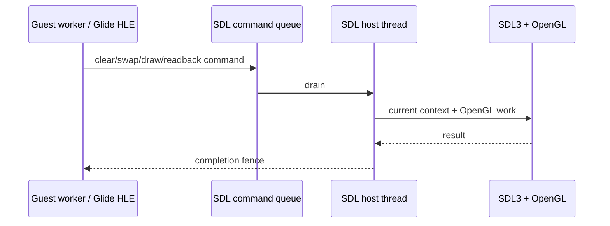
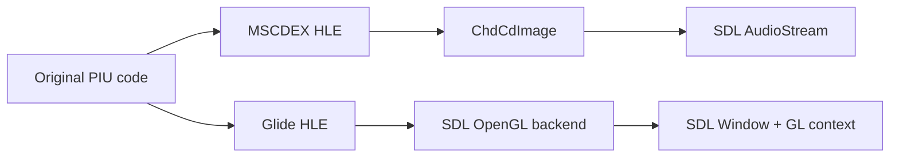

# SDL3 창 및 CD-DA 오디오 전환 설계

## 목표

Win32 WGL 창 처리와 `waveOut` CD-DA 출력을 SDL3로 교체한다. 원본 PIU 실행 파일의 Glide 호출 및 MSCDEX 요청은 변경하지 않으며, SDL3는 HLE가 제공하는 호스트 창·OpenGL 컨텍스트·이벤트·PCM 출력 환경만 담당한다.

## 범위와 비범위

* Glide의 기존 OpenGL 렌더링, GLSL, 텍스처 및 LFB 구현은 유지한다. SDL Renderer 또는 SDL GPU로 재작성하지 않는다.
* `CreateWindowExW`/WGL/message pump를 SDL3 video/OpenGL/event API로, `waveOut`를 SDL3 `SDL_AudioStream`으로 교체한다.
* 원본 MSCDEX `03h`, `84h`, `85h`, `88h` 계약과 CHD raw-sector 해석은 유지한다.
* 키보드·JAMMA 입력 매핑은 이 작업에서 추가하지 않는다. 다만 SDL event queue는 창 응답성을 위해 drain한다.

## 스레드 모델

SDL video, OpenGL context 및 event polling은 SDL을 초기화한 호스트 스레드만 소유한다. 게스트 worker가 Glide gate에서 호출한 backend 메서드는 host command queue로 전달한다. framebuffer readback처럼 반환값이 즉시 필요한 요청은 완료 fence를 기다린다. 따라서 WGL처럼 guest worker가 창/GL context를 직접 소유하지 않는다.

초기 전환에서는 기존 호출 구조의 위험을 줄이기 위해 SDL backend가 만들어진 스레드에서만 모든 video/GL API를 호출한다. 실행 trampoline의 guest worker와 loader host thread가 서로 다름이 확인되면 command queue를 도입하고, 그 전에는 SDL backend 생성·호출을 같은 worker에 유지하지 않는다. SDL의 video API가 main thread 사용을 요구하므로 구현 전 loader 실행 루프의 스레드 관계를 검증한다.

## 구성

* `GlideOpenGlBackend`는 SDL window, SDL GL context와 OpenGL 상태 변환을 소유하도록 이름과 위치를 SDL 계층으로 옮긴다.
* `GlideOpenGlShader`는 `SDL_GL_GetProcAddress`로 GLSL entry point를 해석한다.
* `CdAudioWaveOut`는 `CdAudioSdl`로 대체한다. CHD reader, LBA 및 MSCDEX 상태는 변경하지 않는다.
* CD-DA producer worker는 44.1 kHz, stereo, S16LE PCM을 `SDL_AudioStream`에 queue한다. SDL이 장치 형식 변환 및 재샘플링을 처리한다.

## 오류 및 종료 정책

* SDL window, GL context, shader 또는 audio stream 생성 실패는 원인 문자열을 telemetry에 남긴다.
* 기존 Glide dummy fallback은 유지한다. CD audio 생성 실패는 MSCDEX drive 자체의 가용성을 거짓으로 만들어 play 요청을 명시적으로 실패시킨다.
* 종료 순서는 CD producer 중지 → stream destroy → GL resource/shader 종료 → GL context destroy → window destroy → SDL subsystem 종료이다.
* `SDL_EVENT_QUIT` 및 close event는 초기에는 창 숨김으로 처리해 기존 Win32 window procedure와 guest 실행 의미를 보존한다.

## 검증

1. Win32 x86 Debug configure/build가 SDL3 포함 상태로 성공한다.
2. 실제 `pumpit1` 구동에서 SDL OpenGL 창이 열리고 clear/swap, triangle, texture, LFB readback이 기존과 같은 telemetry 상태를 보인다.
3. CHD의 audio track 재생을 통해 LBA가 진행하고 stop/resume 후 상태가 MSCDEX Q-channel 응답과 일치한다.
4. audio device/window/context 생성 실패 및 supervisor timeout 뒤 worker나 프로세스가 남지 않는다.

## 근거

* SDL3 OpenGL window/context: <https://wiki.libsdl.org/SDL3/SDL_CreateWindow>, <https://wiki.libsdl.org/SDL3/SDL_GL_CreateContext>
* SDL3 event polling: <https://wiki.libsdl.org/SDL3/SDL_PollEvent>
* SDL3 queued audio stream: <https://wiki.libsdl.org/SDL3/SDL_OpenAudioDeviceStream>, <https://wiki.libsdl.org/SDL3/SDL_AudioStream>

# SDL3 Window and CD-DA Audio Migration Design

## Goal

Replace Win32 WGL window handling and `waveOut` CD-DA output with SDL3. The original PIU executable's Glide calls and MSCDEX requests remain unchanged; SDL3 supplies only the host window, OpenGL context, event, and PCM-output environment exposed by HLE.

## Scope

Keep the existing OpenGL Glide renderer, GLSL, textures, and LFB implementation; do not rewrite it for SDL Renderer or SDL GPU. Replace Win32 window/WGL/message-pump and `waveOut` with SDL3 video/OpenGL/events and `SDL_AudioStream`, while retaining CHD decoding and the MSCDEX request contract.

## Ownership

SDL video, OpenGL context, and event polling belong to the thread that initializes SDL. Guest Glide calls are submitted to that owner through a command queue; readback requests use a completion fence. This preserves the guest ABI while avoiding direct guest-worker ownership of host UI resources.

## Validation

Build the Win32 x86 Debug target, verify the real SDL OpenGL rendering path and its existing telemetry with `pumpit1`, verify CD-DA LBA/play/stop/resume behavior from the real CHD, and confirm clean shutdown under failures and supervisor timeout.
