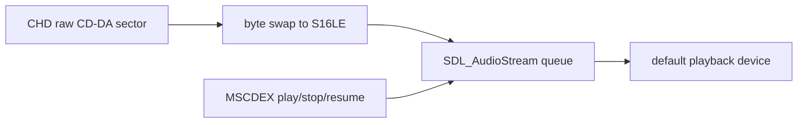

# SDL3 CD-DA 백엔드 설계

`CdAudioWaveOut`의 공개 MSCDEX 재생 계약은 보존하고 내부 PCM sink만 SDL3 `SDL_AudioStream`으로 교체합니다. CHD raw sector(2352 byte) 읽기, 16-bit sample byte-swap, LBA 진행, audio-track 검증은 기존과 동일합니다.

producer worker는 8 sector PCM chunk를 생성하고 stream에 queue합니다. queue가 네 chunk 이상이면 잠시 대기하여 무한 메모리 증가를 막습니다. play는 queue를 비우고 stream device를 resume하며, stop과 close는 queue를 비우고 pause합니다. close는 worker join 후 stream을 destroy하여 SDL audio device를 함께 닫습니다.

`SDL_OpenAudioDeviceStream`은 단일 PCM source에 적합하며, 요청 format은 44.1 kHz, stereo, S16LE이다. SDL은 필요할 때 host device format 변환을 맡는다.

# SDL3 CD-DA Backend Design

Keep the public MSCDEX playback contract and replace only the internal PCM sink with SDL3 `SDL_AudioStream`. The producer reads and byte-swaps CHD CD-DA sectors, bounds queued PCM to four chunks, resumes on play, clears/pauses on stop, and joins before destroying the stream on close.
