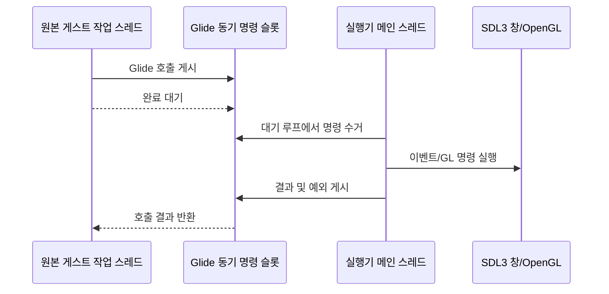

# SDL3 메인 스레드 렌더 명령 큐 설계

## 한국어

### 배경

Win32 실행기는 원본 게스트 코드를 별도 작업 스레드에서 실행합니다. Glide gate도 그 스레드에서 처리되므로, SDL3 전환 직후 `SDL_PollEvent`가 SDL 메인 스레드 제약을 위반했습니다. SDL 창, 이벤트, OpenGL context와 모든 GL 호출은 실행기 메인 스레드가 소유해야 합니다.

### 설계

`GlideOpenGlBackend`는 실행 시작 전에 호스트 메인 스레드에 바인딩됩니다. 게스트 스레드에서 들어온 공개 렌더 API 호출은 단일 슬롯 동기 명령 큐에 넣고 완료될 때까지 기다립니다. 메인 스레드의 기존 `PollThreadUntilExit` 루프가 명령을 꺼내 같은 공개 API를 다시 호출하며, 소유 스레드에서는 즉시 실제 구현을 실행합니다.

단일 게스트 실행 경로이므로 한 슬롯이면 호출 순서와 동기 의미를 보존할 수 있습니다. 포인터 인자는 호출자가 대기하는 동안 유효하며, 반환값·출력 버퍼·오류 메시지는 condition variable의 동기화 경계를 통해 전달됩니다. 명령 실행 중 발생한 C++ 예외도 게스트 호출자에게 다시 전달합니다.

### 종료 정책

게스트 스레드는 SDL/GL 자원을 직접 닫지 않습니다. 정상 종료와 timeout 강제 종료 모두 작업 스레드가 멈춘 뒤 메인 스레드가 backend를 닫습니다. 이로써 생성, 사용, 파괴가 모두 같은 스레드에서 수행됩니다.

### 검증

- Win32 x86 Debug 직렬 빌드
- supervisor 실제 실행에서 SDL main-thread assertion이 재발하지 않는지 확인
- Glide 창 열기와 swap 진행 여부 확인

## English

### Background

The Win32 executor runs the original guest code on a worker thread. Glide gates therefore execute on that worker, and the initial SDL3 conversion caused `SDL_PollEvent` to violate SDL's main-thread requirement. The executor main thread must own the SDL window, events, OpenGL context, and every GL call.

### Design

`GlideOpenGlBackend` is bound to the host main thread before guest execution starts. Public rendering calls arriving from the guest thread are posted to a single-slot synchronous command queue, and the guest waits for completion. The existing main-thread `PollThreadUntilExit` loop takes each command and calls the same public API again; on the owner thread the implementation executes immediately.

The single serialized guest path makes one slot sufficient to preserve ordering and synchronous call semantics. Pointer arguments remain valid while the caller waits, and return values, output buffers, and messages cross the condition-variable synchronization boundary. C++ exceptions raised by command execution are propagated back to the guest caller.

### Shutdown policy

The guest worker never destroys SDL/GL resources. After the worker has stopped, for either normal completion or forced timeout termination, the main thread closes the backend. Creation, use, and destruction therefore occur on one thread.

### Verification

- Serial Win32 x86 Debug build
- Real supervisor run with no recurring SDL main-thread assertion
- Confirm Glide window creation and swap progress
