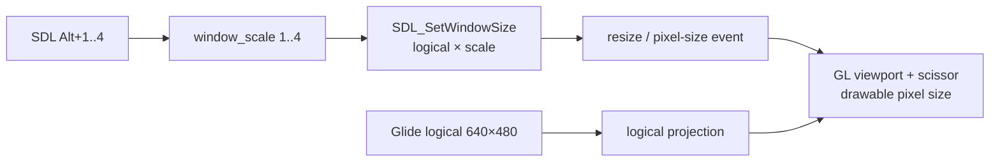

# SDL3 창 배율 단축키 설계

## 한국어

### 목표

Glide 논리 해상도는 변경하지 않고 SDL3 호스트 창의 표시 배율을 1–4배로 전환합니다. 기본 배율은 2배이며 `Alt+1`, `Alt+2`, `Alt+3`, `Alt+4`가 각각 1배, 2배, 3배, 4배를 선택합니다.

### 경계와 상태

- 입력과 창 크기 변경은 SDL video/OpenGL 소유 스레드인 실행기 메인 스레드에서 처리합니다.
- `logical_width_`와 `logical_height_`는 원본 Glide 좌표·clip·LFB 의미를 계속 나타냅니다.
- `window_scale_`은 호스트 창 크기 정책만 나타내며 게스트 상태에 노출하지 않습니다.
- 기본 창 크기는 `logical_width × 2`, `logical_height × 2`입니다.
- 사용자가 일반 창 테두리로 크기를 바꿔도 drawable pixel 크기에 맞춰 viewport와 full-window scissor를 갱신합니다.

### LFB readback

확대된 drawable에서 `glReadPixels`를 논리 크기로 직접 호출하면 화면 일부만 읽게 됩니다. 따라서 실제 drawable 전체를 읽고 위아래 방향을 바로잡은 뒤 요청된 논리 해상도로 최근접 축소합니다. 이렇게 하면 게스트에 보이는 LFB 크기와 row 순서는 기존과 동일합니다.

### 검증

- Win32 x86 Debug 직렬 빌드
- 기본 창 생성 로그에서 2배 크기 확인
- 자동 키 입력 또는 수동 실행으로 `Alt+1..4` 전환 로그와 창 크기 확인
- SDL main-thread assertion 및 guest 교착이 없는지 확인

## English

### Objective

Switch the SDL3 host-window presentation scale from 1× through 4× without changing the Glide logical resolution. The default is 2×, and `Alt+1`, `Alt+2`, `Alt+3`, and `Alt+4` select 1×, 2×, 3×, and 4× respectively.

### Boundary and state

- Input and window resizing execute on the executor main thread that owns SDL video/OpenGL.
- `logical_width_` and `logical_height_` continue to define original Glide coordinates, clipping, and LFB semantics.
- `window_scale_` describes host-window policy only and is not exposed to the guest.
- The default window size is `logical_width × 2` by `logical_height × 2`.
- Ordinary border resizing also updates the viewport and full-window scissor to the drawable pixel size.

### LFB readback

Calling `glReadPixels` with the logical dimensions on an enlarged drawable would read only part of the screen. The backend therefore reads the complete drawable, corrects row orientation, and nearest-neighbor downsamples it to the requested logical dimensions. Guest-visible LFB dimensions and row ordering remain unchanged.

### Verification

- Serial Win32 x86 Debug build
- Confirm the 2× size in the initial window log
- Confirm `Alt+1..4` transition logs and window dimensions through automated input or a manual run
- Confirm no SDL main-thread assertion or guest deadlock
