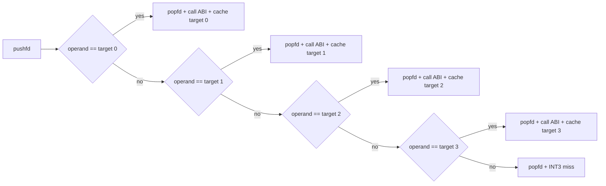

# AOT 간접 call/jmp 다중 슬롯 인라인 캐시 설계

## 한국어

### 1. 배경과 목표

Task 264 이후 120초 `aot-dynamic` 관측에서 AOT 경계 이탈은 `other` 26,055회,
`indirect` 20,076회, `return` 7,294회였습니다. 반환 인라인 캐시는 4개 target을
기억하지만 `FF /2` near indirect call과 `FF /4` near indirect jump는 site마다 target을
하나만 기억합니다. 따라서 같은 source가 여러 target을 번갈아 호출하면 매번
`INT3`/VEH/worker patch 경로로 되돌아갑니다.

목표는 원본 x86 명령과 target 계산을 그대로 보존하면서 간접 call/jmp site가 최근
target 네 개를 기억하도록 확장하는 것입니다. 게임 로직, DOS/DPMI HLE, Glide ABI는
변경하지 않습니다.

### 2. 방출 레이아웃

site 진입에서 `pushfd`를 한 번 실행한 뒤 같은 원본 ModRM/SIB operand를 네 번
비교합니다. 각 슬롯은 target immediate, guard, native cache target `rel32`를
독립적으로 가집니다.

초기 guard는 모두 `E9 miss + NOP`이며, 슬롯이 채워질 때 `JNE`로 활성화됩니다.
활성화된 entry i의 불일치 target은 entry i+1의 compare이고, 마지막 entry는 공통
miss tail로 이동합니다. call hit는 기존과 같이 guest fallthrough 주소를 push한 뒤
native cache target으로 jump합니다. jump hit는 stack을 바꾸지 않습니다. 모든 hit와
miss는 최초 `pushfd`의 EFLAGS를 정확히 한 번 복원합니다.

### 3. 메타데이터와 patch 정책

`AotIndirectInlineCacheSite::entries`를 반환 전용이 아닌 모든 다중 슬롯 site의 공통
표현으로 사용합니다. 기존 단일 슬롯 필드는 entry 0의 offset을 복제해 기존 lookup과
호환성을 유지합니다.

Win32 patch worker의 기존 정책을 그대로 사용합니다.

1. 같은 guest target을 이미 가진 활성 슬롯을 갱신합니다.
2. 없으면 첫 빈 슬롯을 채웁니다.
3. 모두 차 있으면 `replace_cursor`로 round-robin 교체합니다.

patch 순서는 target immediate와 cache `rel32`를 먼저 기록하고 guard를 마지막에
활성화하는 기존 fail-closed 계약을 유지합니다. cache는 평상시 RX이며 worker만
RW로 전환한 뒤 RX 복원과 `FlushInstructionCache`를 수행합니다.

### 4. 일관성과 범위

동적 image append는 모든 `entries` offset을 이미 relocation합니다. guest page retire
경로도 모든 entry를 검사하여 retired target을 가진 guard를 공통 miss tail로
되돌립니다. 따라서 새 layout은 기존 page-generation/SMC 일관성 계약을 재사용합니다.

첫 단계의 슬롯 수는 반환 캐시와 같은 4개로 고정합니다. adaptive slot 수, LRU,
전역 hash dispatch는 이번 범위에 포함하지 않습니다. 지원하지 않는 prefix/address
형식은 계속 기존 sentinel fallback을 사용합니다.

### 5. 검증 전략

- 결정론적 `aot_probe`에서 synthetic `FF /2`와 `FF /4`가 각각 4개 entry를 방출하고,
  compare/guard chain과 entry 0 호환 offset이 올바른지 확인합니다.
- Win32 x86 Debug 전체 빌드를 수행합니다.
- 변경 전후 동일한 120초 `pumpit1` `aot-dynamic` 구동에서
  `boundary_reason(.../indir/...)` 누적량과 Glide window/texture/swap 이정표를
  비교합니다.
- fatal exception, legacy fallback, 기존 return/SMC coherence probe 회귀가 없는지
  확인합니다.

## English

### 1. Background and objective

After Task 264, the 120-second `aot-dynamic` observation recorded 26,055 `other`,
20,076 `indirect`, and 7,294 `return` boundary exits. Return inline caches retain
four targets, while each `FF /2` near indirect call and `FF /4` near indirect jump
site retains only one. A polymorphic source therefore returns to the
`INT3`/VEH/worker patch path whenever targets alternate.

Extend indirect call/jump sites to retain four recent targets while preserving the
original x86 operand and target computation. Game logic, DOS/DPMI HLE, and the Glide
ABI remain unchanged.

### 2. Emitted layout

The site executes one `pushfd`, then compares the same original ModRM/SIB operand in
four independent entries. Each entry owns a target immediate, guard, and native cache
target `rel32`. An installed entry's `JNE` chains to the next compare; the last chains
to the shared `popfd; INT3` miss tail. A call hit preserves the existing guest-return
ABI, a jump hit leaves the stack unchanged, and every path restores the entry EFLAGS
exactly once.

### 3. Metadata and patching

Use `AotIndirectInlineCacheSite::entries` as the common multi-entry representation,
with the legacy single-entry fields mirroring entry zero. Reuse the existing Win32
policy: refresh an existing target, otherwise fill the first empty slot, otherwise
round-robin replace. Preserve fail-closed publication by writing target and `rel32`
before activating the guard, with RX-to-RW-to-RX protection and instruction-cache
flush performed only by the worker.

### 4. Coherency and scope

Dynamic append already relocates every entry offset, and page retirement already
resets every matching entry guard. The new layout therefore reuses the existing SMC
generation contract. This increment fixes the count at four; adaptive sizing, LRU,
and a global hashed dispatcher are out of scope. Unsupported encodings retain the
sentinel fallback.

### 5. Verification

- Add deterministic synthetic `FF /2` and `FF /4` layout checks to `aot_probe`.
- Build the full Win32 x86 Debug target.
- Compare 120-second `pumpit1` `aot-dynamic` runs using indirect boundary misses and
  semantic Glide milestones.
- Confirm no fatal exception, legacy fallback, return-cache regression, or SMC
  coherence regression.
