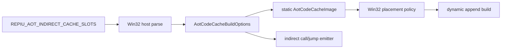

# AOT 간접 인라인 캐시 동일 바이너리 A/B 설계

## 한국어

### 1. 목적

Task 273의 4슬롯 간접 call/jmp 캐시는 이전 빌드의 1슬롯 기준과 비교해 `indir`
boundary를 28.2% 줄였지만, SDL3 전후의 서로 다른 binary라 wall-clock 개선률을 확정할
수 없었습니다. 이번 작업은 같은 실행 파일에서 슬롯 수만 1 또는 4로 바꾸고 실제 게임
진행 이정표를 측정합니다.

### 2. 슬롯 정책 전달

호스트가 `REPIU_AOT_INDIRECT_CACHE_SLOTS`를 읽습니다. 허용값은 `1`과 `4`이고,
미설정 시 기본값은 `4`입니다. 잘못된 값은 조용히 대체하지 않고 실행 오류로 처리합니다.

`AotCodeCacheBuildOptions`는 플랫폼 공용이며 간접 call/jump entry 수만 제어합니다.
return cache는 두 모드 모두 기존 4슬롯을 유지합니다. 생성된 `AotCodeCacheImage`가 정책을
기록하고 Win32 placement가 이를 보존하여 이후 모든 dynamic append에도 같은 값을
사용합니다. 따라서 한 프로세스 안에서 정적·동적 cache layout이 섞이지 않습니다.

### 3. 반복 가능한 실행 상태

EEPROM 내용은 게임 초기 분기와 화면 도달 시각에 영향을 줄 수 있습니다. 기존 기본
경로 `eeprom.dat`는 유지하되 `REPIU_EEPROM_PATH`가 설정되면 해당 사본을 사용합니다.
벤치마크는 매 run마다 같은 fixture를 별도 파일로 복사하므로 사용자 EEPROM과 앞선 run의
쓰기 결과가 다음 run에 영향을 주지 않습니다.

### 4. 이정표와 지표

`scripts/benchmark_aot_inline_cache.ps1`은 supervisor의 1초 snapshot을 읽습니다. 각
Glide API의 기존 first-call 판정 지점에서 shared telemetry milestone을 한 번만 게시하므로
draw/swap 핫패스에 반복 로그나 지속적인 atomic 증가를 추가하지 않습니다.

- `_GRSSTWINOPEN@28` 첫 호출과 `opened=1`
- `_GRTEXDOWNLOADMIPMAPLEVEL@32` 첫 호출
- 최초 `_GRDRAW*` 호출
- `_GRBUFFERSWAP@4` 첫 호출
- 최종 `boundary_reason(ret/indir/direct/cond/other)`
- 전체 AOT boundary/reentry, heartbeat, fatal, legacy fallback

snapshot 기반 이정표의 시간 해상도는 약 1초입니다. 실행 순서는 반복마다 `1→4`, 다음
반복에서 `4→1`로 뒤집어 warm-cache/시간 순서 편향을 줄입니다. 결과와 전체 원문 로그는
`build/benchmarks/aot-inline-cache/<timestamp>/` 아래에 저장합니다.

### 5. 판정

- `indir` 감소는 구현이 작동한다는 내부 증거입니다.
- 창, texture, draw, swap의 중앙값이 실제 게임 진행 성능입니다.
- 표본이 하나뿐이면 예비 결과로만 기록합니다.
- 이정표 개선이 편차보다 작으면 슬롯 확대를 멈추고 다음 병목으로 이동합니다.

## English

### 1. Objective

Task 273 reduced indirect boundaries by 28.2% against an older one-entry build, but
the binaries straddled the SDL3 migration. This task selects one or four indirect
call/jump entries in the same executable and measures semantic game milestones.

### 2. Policy propagation

The Win32 host parses `REPIU_AOT_INDIRECT_CACHE_SLOTS`, accepting only `1` or `4` and
defaulting to `4` when unset. Invalid values fail explicitly. A platform-neutral
`AotCodeCacheBuildOptions` controls only indirect call/jump entries; return caches stay at
four in both modes. The static image records the policy, placement preserves it, and every
dynamic append reuses it, preventing mixed layouts within one process.

### 3. Repeatable state

`REPIU_EEPROM_PATH` overrides the existing default `eeprom.dat`. The benchmark copies the
same fixture into a private file for every run so neither the user's EEPROM nor writes from
an earlier run bias the next one.

### 4. Milestones and metrics

The benchmark reads one-second supervisor snapshots. Existing per-API first-call detection
publishes each shared milestone once, avoiding repeated hot-path logging or atomic increments.
It records window gate/open, first texture download, first draw, first swap, boundary reasons,
total boundary/reentry, heartbeat, fatal, and legacy fallback. Run order alternates `1→4`
and `4→1`; raw logs and CSV output are retained under the benchmark build directory.

### 5. Decision

Indirect-boundary reduction proves the mechanism; median semantic milestone times measure
game progress. A single pair is preliminary. If milestone improvement is smaller than run
variance, stop increasing slots and move to the next bottleneck.
