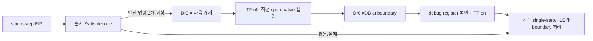

# 20260723-275 네이티브 직선 span 실행 / Native linear-span execution

## 한국어

### 1. 배경과 확인된 병목

Task 266 Phase 2의 함수형 native region은 `call rel32` target에서만 진입하고, Dr0을
반환 주소에 사용한 뒤 Dr1~Dr3 세 개로 함수 전체의 민감 명령을 감시합니다. 정확성은
확인됐지만 민감 명령이 네 개 이상인 함수는 거부되어 120초 성능 개선이 2.6%에
그쳤습니다.

Task 274 이후 현재 `aot-dynamic`, `REPIU_NATIVE_REGION=1`을 30초 관측한 결과도 region
진입 31회, 민감 명령 hit 0회, return 20회, reject 10회였습니다. 반면 11~30초의 hot
구간은 초당 약 9천~12천 single-step을 계속 발생시켰습니다. 함수 전체를 증명하는
방식으로는 이 구간에 진입하지 못합니다.

### 2. 선택한 방식

일반 single-step 지점에서 현재 명령부터 순차 디코드하여 다음 경계 직전까지를 하나의
직선 span으로 정의합니다. 경계는 다음 중 가장 먼저 나타나는 명령입니다.

- HLE 민감 명령: segment, interrupt, I/O, string, privileged/system
- 모든 call, jump, conditional branch, return
- 명시적 memory-write operand를 가진 명령
- 최대 스캔 길이 또는 runtime 범위 끝

경계 전 명령이 두 개 이상일 때만 Dr0 실행 breakpoint를 경계 주소에 설치하고 TF를
끕니다. 경계 breakpoint가 발생하면 debug register를 복원하고 TF를 다시 켠 뒤 기존
single-step/HLE dispatcher가 경계 명령을 그대로 처리합니다.

이 방식은 게스트 코드를 수정하지 않으므로 Task 266에서 실패한 INT3 구분·복원·SMC
문제가 없습니다. call target이나 함수 return도 필요하지 않으며 간접 분기와 loop는
경계 명령 하나만 기존 방식으로 실행한 뒤 실제 target에서 새 span을 시작합니다.

### 3. 정확성 정책

명시적 memory write를 경계로 두는 이유는 span 실행 중 뒤쪽 명령을 self-modify하는
경우를 막기 위해서입니다. store 자체는 TF가 켜진 기존 경로에서 실행되고, 다음
exception에서 변경된 바이트를 다시 스캔합니다. 초기 구현은 분석 결과를 cache하지 않아
코드 변경 뒤 stale span을 재사용하지 않습니다.

예상하지 않은 access violation이나 debug event가 발생하면 span을 취소하고 debug
register와 TF를 복원한 뒤 기존 exception chain으로 넘깁니다. scanner가 실패하거나
두 명령 미만이면 기존 single-step을 유지합니다.

### 4. 정책과 계측

새 `REPIU_NATIVE_LINEAR_SPAN=1`은 직선 span만 독립적으로 활성화합니다. 기존
`REPIU_NATIVE_REGION`을 켠 경우에는 함수형 region이 먼저 시도되고, 기본 경로에서는
기존 clean-function fast path가 먼저 시도됩니다. 선택된 기존 fast path가 거부한 일반
지점에서 span을 시도하므로 동일 binary에서 기능만 A/B할 수 있습니다. 실제
`aot-dynamic` 성능 판정은 `REPIU_NATIVE_REGION`을 끈 현재 기본 경로를 기준으로 합니다.

다음 누적값을 기록합니다.

- span 진입 횟수
- 정상 boundary 도달 및 예외 취소 횟수
- 네이티브 실행으로 건너뛴 TF 대상 명령 수
- 짧거나 디코드 실패한 span 거부 횟수

### 5. 검증

1. synthetic scanner probe로 제어 전이, segment 민감 명령, memory write 경계를 검증합니다.
2. Win32 x86 Debug 전체 빌드와 기존 AOT/coherence probe를 통과합니다.
3. 동일 binary, 동일 EEPROM 사본, 교차 순서로 linear span off/on을 비교합니다.
4. `single_step`, 전체 dispatch, 의미 기반 Glide milestone, fatal/fallback을 함께 봅니다.

## English

### 1. Background

Task 266 Phase 2 enters a function region only at a direct-call target. Dr0 guards the
return address and Dr1-Dr3 guard at most three sensitive instructions. It proved correct,
but functions with four or more sensitive sites are rejected and the measured gain was
only 2.6%. A current 30-second `aot-dynamic` observation likewise produced 31 entries,
zero sensitive hits, 20 returns, and 10 rejects while the hot phase continued to generate
roughly 9k-12k single steps per second.

### 2. Design

At any ordinary single-step EIP, sequentially decode a straight-line span up to the first
HLE-sensitive instruction, control transfer, explicit memory write, scan limit, or runtime
boundary. If at least two safe instructions precede that boundary, place one Dr0 execute
breakpoint at the boundary, clear TF, and run the span natively. At the boundary #DB,
restore the debug registers and TF, then let the existing single-step/HLE chain process
the boundary unchanged.

No guest byte is modified, so this avoids the INT3 ownership, restoration, and SMC hazards
seen in Task 266. Calls, returns, loops, and indirect branches remain ordinary boundaries;
execution starts a fresh span at the actual successor.

### 3. Correctness

Explicit memory writes terminate a span so a store executes under the existing TF path
before the next bytes are rescanned. The initial implementation does not cache scan
results, avoiding stale decoded spans after self-modification. Unexpected exceptions
cancel the span, restore debug state and TF, and fall through to the existing exception
chain. Short or undecodable spans remain single-stepped.

### 4. Policy and verification

`REPIU_NATIVE_LINEAR_SPAN=1` independently enables the new path. It runs after whichever
existing policy is selected: the clean-function fast path by default, or the experimental
function-region path when `REPIU_NATIVE_REGION` is enabled. The production comparison keeps
`REPIU_NATIVE_REGION` off and changes only the span variable. Counters record entry,
boundary, cancellation, skipped TF instructions, and rejection. Verification covers a
synthetic scanner probe, the full Win32 x86 Debug build, existing AOT/coherence probes, and
a same-binary isolated-EEPROM off/on benchmark using throughput and semantic milestones.

## Task 287 후속 정책 / Task 287 follow-up policy

Task 275의 초기 opt-in 결론은 `aot-dynamic` 두 표본이 texture/swap 전에 검열된
결과였습니다. Task 287은 최신 `aot-dbt`에서 supervisor와 직접 loader를 각각 3쌍
교차 실행해 progress, single-step과 draw/swap 개선을 모두 반복 확인했습니다.
따라서 환경 변수 미지정 시 `aot-dbt`만 span 기본 ON으로 승격했습니다. 다른 backend는
계속 기본 OFF이며 `0|off|false`로 명시적 비활성화할 수 있습니다. scanner/executor와
정확성 정책은 Task 275 설계 그대로입니다.

Task 275's initial opt-in conclusion came from two `aot-dynamic` samples censored before
texture and swap. Task 287 ran three alternating pairs under both the supervisor and direct
loader on current `aot-dbt`, repeatedly confirming progress, single-step, draw, and swap
improvements. Therefore only `aot-dbt` now defaults spans ON when the environment is unset.
Other backends remain default OFF, and `0|off|false` explicitly disables the path. Scanner,
executor, and correctness semantics remain exactly as designed in Task 275.
