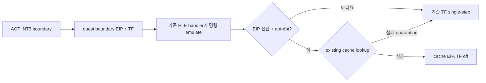

# 20260723-276 AOT-DBT 기반과 HLE 후 즉시 복귀 / AOT-DBT foundation and immediate post-HLE re-entry

## 한국어

### 1. 목표와 경계

`aot-dynamic`의 정확성 기준선과 코드 캐시·동적 번역·SMC 일관성·HLE 구현은
그대로 공유하면서, Windows 예외와 single-step에 의존하는 실행 정책을 점진적으로
교체할 수 있는 `aot-dbt` backend를 추가합니다. 별도 실행기나 게임 로직 재구현을
만들지 않습니다.

첫 구현 단위는 AOT HLE boundary 처리 뒤 발생하는 불필요한 TF 한 명령을 제거합니다.
현재 경로는 cache의 `INT3` sentinel을 guest 주소로 되돌리고, HLE handler가 해당 명령을
완전히 에뮬레이션하여 EIP를 전진시킨 뒤에도 TF를 유지합니다. 그 결과 다음 일반 guest
명령 하나가 원본 위치에서 실행되고 `EXCEPTION_SINGLE_STEP`이 발생한 뒤에야
`ResolveAotTransferTarget`이 cache로 복귀시킵니다.

### 2. backend 정책

플랫폼 공용 `runtime::ExecutionBackend` 정책을 추가합니다.

| 값 | 정적 AOT cache | 동적 append | HLE 후 즉시 복귀 |
|---|---:|---:|---:|
| `legacy` | 아니요 | 아니요 | 아니요 |
| `aot` | 예 | 아니요 | 아니요 |
| `aot-dynamic` | 예 | 예 | 아니요 |
| `aot-dbt` | 예 | 예 | 예 |

환경 변수 문자열 해석, 표시 이름, AOT/dynamic/DBT capability 판정은 이 공용 정책에
모읍니다. Win32 host와 trampoline이 서로 다른 문자열 비교로 정책을 추론하지 않도록
합니다.

### 3. HLE 후 즉시 복귀

`aot-dbt`에서만 `DispatchGuestHleHandlers`가 성공하고 EIP를 실제로 변경한 직후 다음
주소의 **기존 cache entry**를 찾습니다. 성공하면 cache 주소로 EIP를 바꾸고 TF를
지우며 기존 AOT re-entry 상태를 종료합니다. 첫 구현에서는 이 지점의 cache miss를
즉시 동적 번역하지 않습니다. miss는 기존 TF 경로로 한 명령 진행한 뒤 통상적인
re-entry와 동적 번역 정책을 따릅니다.

기존 entry가 있어도 현재 guest 주소부터 첫 control transfer까지 최대 64개 명령을
Zydis로 사전 검사합니다. 이 직선 구간 안에 등록된 HLE boundary가 있거나 decode/read
실패 또는 상한 도달이 있으면 즉시 복귀를 거부합니다. 이는 entry 앞부분의 일반 명령
뒤에 selector-override HLE가 포함된 cache block으로 진입하는 것을 막습니다.

또한 방금 HLE로 처리한 명령이 segment register를 쓴 경우에는 즉시 복귀를 금지합니다.
selector 변경 직후에는 다음 segment 사용 명령이 기존 HLE 경계를 거치도록 TF bridge가
필요하기 때문입니다.

다음 조건에서는 기존 경로를 그대로 유지합니다.

- HLE handler가 현재 EIP를 바꾸지 않은 경우
- 새 EIP가 guest runtime 주소가 아닌 경우
- 대상 page가 quarantine된 경우
- 기존 cache entry가 없는 경우
- 첫 control transfer 전 직선 구간에 HLE boundary가 있는 경우
- 사전 decode/read 실패 또는 64명령 상한 도달
- 방금 처리한 HLE 명령이 segment register를 쓴 경우

따라서 최적화 실패는 실행 실패가 아니며, 기존 원본 명령 single-step이 정확성
fallback으로 남습니다.

### 4. 관측성과 호환성

`aot-dbt` HLE 후 즉시 복귀 시도/성공 횟수를 실행 결과에 기록합니다. backend 이름도
실제 정책 값으로 출력합니다. 기존 `aot`, `aot-dynamic`, `legacy`의 정책은 변경하지
않습니다.

이 단계는 일반 control-transfer sentinel을 모두 host jump dispatcher로 바꾸는 완전한
DBT가 아닙니다. 다만 backend 정책과 즉시 dispatch 경계를 분리하여 이후 작업에서
return, indirect miss, untranslated fallback을 순서대로 예외 없는 dispatch로 교체할
수 있게 합니다.

### 5. 검증

1. backend parser/capability synthetic probe로 네 값을 검증합니다.
2. HLE 후 즉시 복귀 helper가 DBT 정책에서만 cache로 복귀하고, 실패 시 기존 TF 상태를
   보존하는지 코드 수준과 실행 계측으로 확인합니다.
3. Win32 x86 Debug 전체 빌드와 기존 AOT/inline-cache/SMC probe를 실행합니다.
4. 동일 binary와 격리 EEPROM으로 `aot-dynamic`/`aot-dbt`를 교차 비교합니다.
5. single-step, DBT 시도/성공, progress와 의미 기반 Glide milestone, fatal/fallback을
   함께 판정합니다.

## English

### 1. Goal and boundary

Add an `aot-dbt` backend that shares the established `aot-dynamic` correctness
baseline, code cache, dynamic translation, SMC coherency, and HLE implementation,
while providing a policy boundary where exception- and single-step-based dispatch
can be replaced incrementally. This is not a separate executor and does not
reimplement game logic.

The first increment removes one unnecessary TF-executed instruction after a
successfully emulated AOT HLE boundary. Today the cache `INT3` maps back to the
guest boundary, the HLE handler fully emulates it and advances EIP, but TF remains
set. One following ordinary guest instruction therefore executes before
`EXCEPTION_SINGLE_STEP` re-enters the cache.

### 2. Policy and immediate re-entry

A platform-neutral `runtime::ExecutionBackend` owns parsing, display names, and
AOT/dynamic/DBT capabilities for `legacy`, `aot`, `aot-dynamic`, and `aot-dbt`.
Only `aot-dbt` attempts immediate lookup of an existing cache entry after an HLE
handler succeeds and changes EIP. Success redirects EIP to the cache and clears
TF. An unchanged/non-guest EIP, quarantine, or cache miss preserves the existing
single-step fallback. The normal re-entry path may still perform shared dynamic
translation after that conservative bridge instruction.

Even for an existing entry, Zydis preflights up to 64 straight-line instructions
through the first control transfer. A registered HLE boundary, decode/read
failure, or cap exhaustion rejects immediate re-entry. This prevents entering a
cache block whose ordinary prefix is followed internally by a selector-override
HLE boundary.

Immediate re-entry is also prohibited when the just-emulated HLE instruction
writes a segment register. The TF bridge must expose the following segment use to
the established HLE boundary after a selector change.

Counters record immediate post-HLE attempts and successes, and execution output
reports the actual backend policy. Existing backend behavior remains unchanged.
This increment is not yet a complete exception-free DBT; it establishes the
shared policy and dispatch boundary for later return, indirect-miss, and
untranslated-fallback work.

### 3. Verification

Verify all parser/capability combinations with a synthetic probe, build Win32 x86
Debug, run the existing AOT/inline-cache/SMC probes, and compare isolated-EEPROM
`aot-dynamic` and `aot-dbt` runs using single-step counts, DBT attempt/success
counters, progress, semantic Glide milestones, fatal state, and fallback state.
