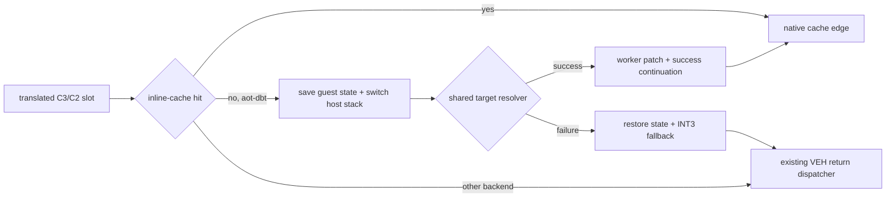

# 20260723-277 AOT-DBT return miss host dispatch / AOT-DBT return-miss host dispatch

## 한국어

### 1. 목표와 범위

Task 276의 `aot-dbt` 정책 경계를 확장해, 번역된 `C3`/`C2 iw` return inline cache가
miss했을 때 `INT3`와 Win32 VEH를 거치지 않고 정상 host 호출로 기존 target resolver와
serialized patch worker를 호출합니다. 원본 return 의미, guest stack, EFLAGS,
SMC generation, quarantine, dynamic translation과 inline-cache publication 정책은
바꾸지 않습니다.

첫 증분은 return miss만 다룹니다. indirect call/jump miss, HLE boundary, 미번역
fallthrough와 일반 sentinel은 기존 경로를 유지합니다. 기존 `legacy`, `aot`,
`aot-dynamic` image layout과 실행 의미도 바꾸지 않습니다.

### 2. 플랫폼 공용 image와 Win32 연결

`AotCodeCacheBuildOptions`는 DBT return miss slot 사용 여부를 명시합니다. 활성화된
return slot의 miss tail은 다음 메타데이터를 stack에 push하고 Win32가 배치 시 연결할
host thunk로 이동합니다.

1. 성공 continuation
2. fail-closed continuation
3. 현재 miss cache 주소
4. guest return instruction 주소

플랫폼 공용 image는 host 함수 주소를 알지 못합니다. 따라서 return DBT site metadata에
image-relative patch offset과 continuation offset만 기록합니다. Win32 placement와
dynamic append가 RW 구간에서 절대 cache 주소와 host thunk `rel32`를 해결합니다.

### 3. host-stack thunk ABI

host thunk는 guest register와 EFLAGS를 `pushad`/`pushfd`로 저장한 뒤
`StackSwitchCallState`에 보존된 host ESP와 TEB stack base/limit로 전환합니다.
그 다음 기존 C++ target resolver와 worker request를 호출합니다. C++ 코드는 guest
stack에서 실행하지 않습니다.

resolver 성공 시 저장 프레임의 continuation을 성공 경로로 바꾸고, 다음 stack slot에
cache target을 기록합니다. thunk가 guest stack과 TEB limit를 복원하고 register/flags를
되돌린 뒤 `ret`하면 성공 continuation은 `ret imm16`으로 원본 `C3`/`C2` stack pop을
정확히 재현하면서 cache target으로 이동합니다.

실패 시 fail-closed continuation이 DBT 메타데이터만 `LEA ESP`로 제거한 뒤 `INT3`를
발생시킵니다. 기존 cache-to-guest provenance가 같은 return 주소를 복원하고,
`HandleAotReturnTransfer`가 현재 검증된 VEH 경로를 수행합니다. `LEA`와 `RET`은
guest EFLAGS를 바꾸지 않습니다.

### 4. 안전 조건

- Win32 x86 MSVC stack-switch 실행에서만 host thunk를 연결합니다.
- 활성 `ThreadContext`, `StackSwitchCallState`, host ESP와 stack bounds가 모두
  유효해야 합니다.
- return target은 guest-readable stack에서 읽고 기존 `ResolveAotTransferTarget`으로만
  해석합니다.
- 성공한 miss는 기존 `RequestAotInlineCachePatch` worker protocol을 사용합니다.
- target resolution, dynamic append, patch 또는 ABI 검증 실패는 모두 기존
  `INT3`/VEH 경로로 돌아갑니다.
- code cache는 기존과 같이 RX이며 placement/worker의 제한된 RW 구간 외에는 쓰지
  않습니다.

### 5. 검증

1. synthetic emitter probe에서 DBT off layout이 기존 `popfd; INT3`와 동일한지 확인합니다.
2. DBT on return slot의 metadata, placement patch와 `C3`/`C2` pop 크기를 확인합니다.
3. Win32 x86 Debug 전체 빌드와 기존 AOT/inline-cache/SMC probe를 실행합니다.
4. 격리 EEPROM으로 `aot-dynamic`과 `aot-dbt`를 실행해 fatal, legacy fallback,
   progress, return dispatcher, DBT return attempt/success/fallback과 EEPROM hash를
   비교합니다.

## English

### Goal and boundary

Extend the Task 276 `aot-dbt` policy so a translated `C3`/`C2 iw` return
inline-cache miss invokes the established target resolver and serialized patch
worker through a normal host call instead of `INT3` and Win32 VEH. Preserve the
original return semantics, guest stack, EFLAGS, SMC generations, quarantine,
dynamic translation, and cache publication policy.

This increment covers return misses only. Indirect call/jump misses, HLE
boundaries, untranslated fallthrough, and all other sentinels retain the
established path. `legacy`, `aot`, and `aot-dynamic` keep their current image
layout and behavior.

### Image and thunk ABI

A platform-neutral build option selects the DBT return-miss layout. Metadata
records image-relative continuation and patch offsets; Win32 placement and
dynamic append resolve cache absolute addresses and the host-thunk `rel32` while
the image is writable.

The naked x86 thunk saves guest registers and EFLAGS, switches to the host ESP
and TEB stack bounds retained by `StackSwitchCallState`, and only then calls C++.
On success, a stack continuation uses `ret imm16` to reproduce the original
`C3`/`C2` pop while jumping to the resolved cache target. On failure, `LEA ESP`
removes only DBT metadata and an `INT3` returns to the existing provenance-aware
VEH return dispatcher. Neither continuation changes guest EFLAGS.

All validation or resolution failures fail closed. Verification covers both
layouts, placement patching, full Win32 x86 Debug and existing probes, then an
isolated-EEPROM `aot-dynamic`/`aot-dbt` runtime comparison.
