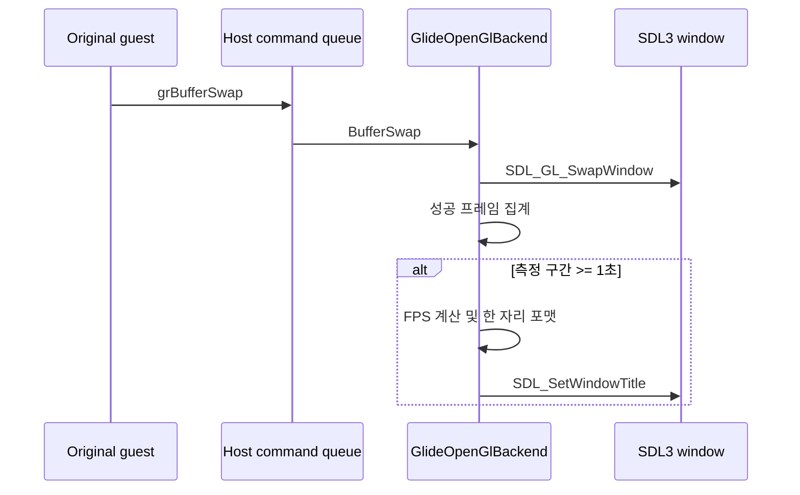

# 창 제목 실행 backend·FPS 표시 설계

## 한국어

### 목표

SDL3 Glide 창 제목 끝에 현재 실행 backend와 실측 frame rate를 다음 형식으로 표시합니다.

```text
rePIU v<version> - Build <date> - Glide 2 OpenGL [aot-dynamic] - FPS : 60.0
```

### 상태 전달

플랫폼 공용 `ExecutionBackend` 값은 실행 컨텍스트를 만들 때 이미 확정됩니다. 실행 orchestration은 이 값을 `GlideOpenGlBackend`에 명시적으로 전달하고, 창 backend는 공용 `ExecutionBackendName`을 사용해 표시 문자열을 만듭니다. 환경 변수를 다시 읽거나 backend 이름을 별도로 추론하지 않습니다.

### FPS 측정

- 성공한 `grBufferSwap`의 SDL/OpenGL swap을 한 프레임으로 집계합니다.
- `std::chrono::steady_clock`의 단조 시간을 사용합니다.
- 첫 실제 프레임부터 약 1초 이상 지난 시점에 `frame_intervals / elapsed_seconds`를 계산합니다.
- 계산값은 소수점 한 자리로 표시하고, 다음 측정 구간을 새로 시작합니다.
- 창 생성 직후에는 측정 표본이 없으므로 `FPS : 0.0`을 표시합니다.
- 창을 닫거나 다시 열면 측정 구간을 초기화합니다.

초기 framebuffer clear를 위한 내부 swap은 guest가 제출한 프레임이 아니므로 집계하지 않습니다.

### 스레드 소유권

guest worker의 `BufferSwap` 호출은 기존 동기 명령 큐를 통해 실행기 메인 스레드에서 처리됩니다. FPS 계산과 `SDL_SetWindowTitle`도 그 처리 경로 안에서 수행하여 SDL window 소유 규칙을 유지합니다.



### 검증

- Win32 x86 Debug 전체 빌드
- 실제 `aot-dynamic` 실행에서 창 제목의 backend 이름 확인
- 1초 이상 실행 후 제목의 FPS가 `0.0`이 아닌 한 자리 소수로 갱신되는지 확인
- 기존 live telemetry 진행성과 fatal/legacy fallback 부재 확인

## English

### Objective

Append the active execution backend and measured frame rate to the SDL3 Glide window title:

```text
rePIU v<version> - Build <date> - Glide 2 OpenGL [aot-dynamic] - FPS : 60.0
```

### State propagation

The platform-neutral `ExecutionBackend` is already selected when the execution context is created. Execution orchestration explicitly passes it to `GlideOpenGlBackend`, which uses the shared `ExecutionBackendName` function for display. The window backend neither rereads the environment nor infers a separate backend name.

### FPS measurement

- Count each successful SDL/OpenGL swap caused by `grBufferSwap` as one frame.
- Use the monotonic `std::chrono::steady_clock`.
- Once at least about one second has elapsed from the first real frame, calculate `frame_intervals / elapsed_seconds`.
- Display one decimal place and begin a new measurement interval.
- Show `FPS : 0.0` immediately after window creation because no sample exists yet.
- Reset the measurement interval whenever the window closes or reopens.

The internal initial-clear swap is not guest-submitted work and is excluded.

### Thread ownership

The existing synchronous command queue executes guest-worker `BufferSwap` calls on the executor main thread. FPS calculation and `SDL_SetWindowTitle` remain inside that path, preserving SDL window ownership.

### Verification

- Full Win32 x86 Debug build
- Confirm the backend name in a real `aot-dynamic` window title
- After more than one second, confirm that FPS changes from `0.0` to a one-decimal value
- Confirm continued live-telemetry progress with no fatal or legacy fallback
