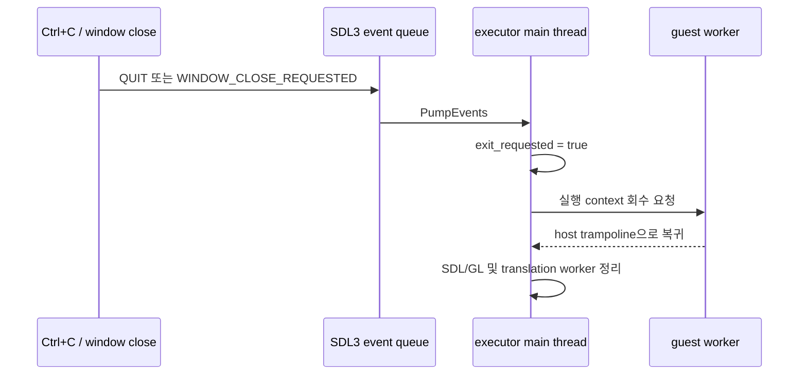

# SDL quit·창 닫기 안전 종료 설계

## 한국어

### 배경

SDL3 event subsystem은 기본적으로 `SIGINT`와 `SIGTERM` handler를 설치하고 신호를
`SDL_EVENT_QUIT`으로 변환합니다. 따라서 Windows 콘솔의 `Ctrl+C`도 SDL event queue로
전달됩니다.

현재 `GlideOpenGlBackend::PumpEvents`는 `SDL_EVENT_QUIT`과
`SDL_EVENT_WINDOW_CLOSE_REQUESTED`를 모두 `SDL_HideWindow`로 처리합니다. 이 정책은
guest 실행을 보존하지만, SDL 전환 전의 `Ctrl+C` 프로세스 종료 동작까지 막습니다.

### 목표

두 event를 모두 host 종료 요청으로 처리하고 다음 순서로 안전하게 종료합니다.

### 상태와 소유권

- `GlideOpenGlBackend`가 host main-thread 전용 종료 요청 상태를 소유합니다.
- event handler는 `exit()`나 SDL resource 파괴를 직접 수행하지 않습니다.
- `PollThreadUntilExit`는 host 명령과 event를 pump한 직후 종료 요청을 확인하고 전용
  wait result를 반환합니다.
- execution trampoline은 timeout과 동일한 suspend/context-recovery 안전 중단 절차를
  사용하되, 결과에는 timeout과 구분되는 `quit_requested` 상태와 정상 종료 메시지를
  기록합니다.
- guest worker가 멈춘 뒤 main thread가 SDL/OpenGL과 translation worker를 정리합니다.

### 실패 시 정책

guest 또는 AOT cache 주소에서 context를 회수할 수 없으면 기존 timeout teardown과
같이 worker 강제 종료를 마지막 수단으로 사용합니다. 이 경우에도 SDL resource는
worker가 멈춘 뒤 main thread에서 닫습니다.

### 검증

- Win32 x86 Debug 전체 빌드
- 실제 SDL 창 close 요청 뒤 loader가 제한 시간 없이 자발적으로 종료되는지 확인
- 종료 결과에서 `quit_requested=true`, `timed_out=false`, exception/fatal 부재 확인
- `SDL_EVENT_QUIT`과 window close가 같은 요청 상태를 설정하는지 코드 수준 확인

## English

### Background

The SDL3 event subsystem installs `SIGINT` and `SIGTERM` handlers by default and
translates those signals into `SDL_EVENT_QUIT`. Windows console `Ctrl+C`
therefore reaches the SDL event queue.

`GlideOpenGlBackend::PumpEvents` currently handles both `SDL_EVENT_QUIT` and
`SDL_EVENT_WINDOW_CLOSE_REQUESTED` by hiding the window. That preserves guest
execution but also suppresses the pre-SDL `Ctrl+C` termination behavior.

### Goal

Treat both events as host shutdown requests. The event handler only records the
request. `PollThreadUntilExit` detects it after pumping host commands/events, and
the execution trampoline reuses the established timeout context-recovery path.
The guest worker stops before the main thread destroys SDL/OpenGL resources and
joins the translation worker.

### State and ownership

- `GlideOpenGlBackend` owns a main-thread-only exit-request state.
- Event handling never calls `exit()` or destroys SDL resources directly.
- `PollThreadUntilExit` returns a dedicated wait result for a host exit request.
- The attempt records `quit_requested` separately from `timed_out`.
- Context recovery failure retains forced worker termination as the final
  fail-closed option.

### Verification

- Full Win32 x86 Debug build
- Close a real SDL window and confirm the loader exits without a timeout
- Confirm `quit_requested=true`, `timed_out=false`, and no exception/fatal state
- Confirm in code that SDL quit and window close set the same request state
